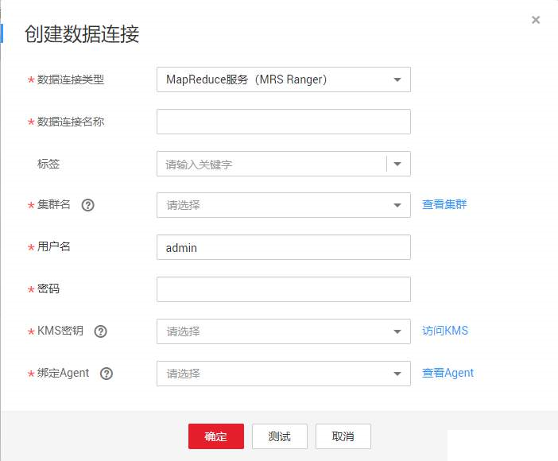
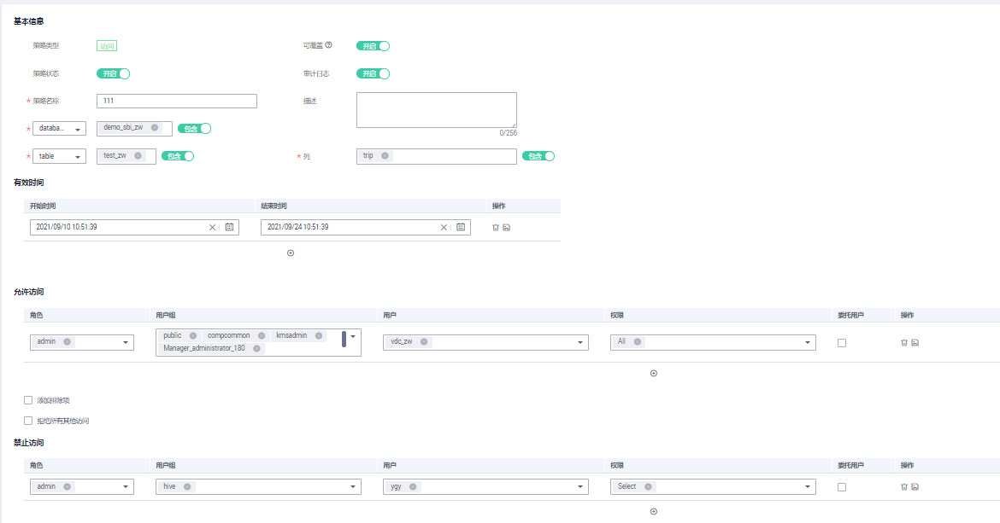
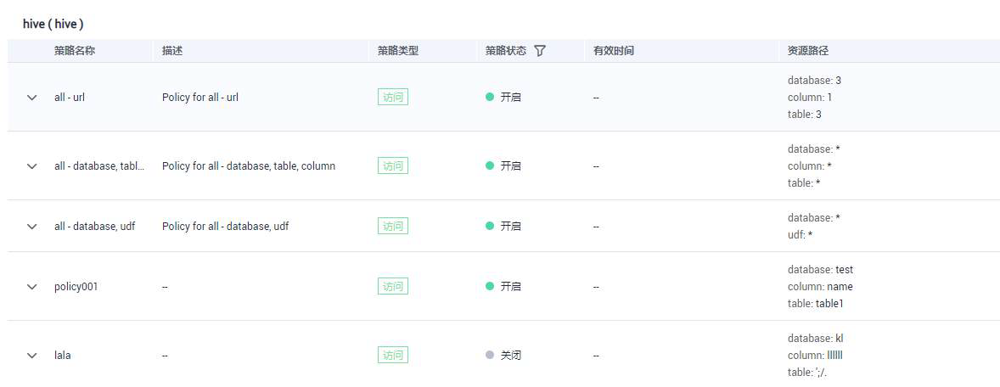

# 进行数据访问权限控制

通过本章掌握如何通过配置数据源和数据权限，来控制数据的访问。

## 案例教程

本示例讲解如何进行数据访问权限控制。

1.  创建数据连接。
    1.  进入DGC控制台首页的管理中心模块。
    2.  单击页面上方的“创建数据连接”。
    3.  配置数据连接信息，如下图所示。

        

    4.  单击“测试”，提示连接成功。
    5.  单击“确定”，完成数据连接的创建。

2.  配置资源权限。
    1.  进入DGC控制台首页的数据安全模块。
    2.  单击左侧导航“访问权限管理”-\>“资源权限配置”。
    3.  单击待创建权限策略Hive组件的“配置“  ，进入配置界面选择“访问“页签。
    4.  单击“创建“，新建权限策略，如下图所示。

        

    5.  单击“确定”，完成资源权限的配置。

3.  查看权限报告。

    单击左侧导航的“权限报告”，查看已配置的权限策略，如下图所示。

    

