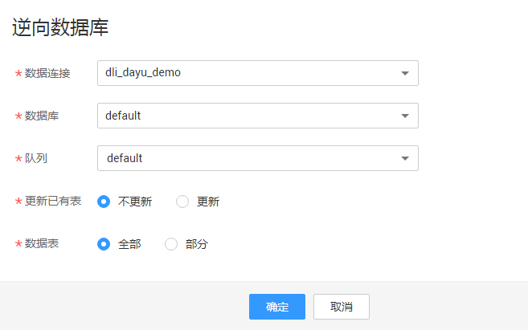
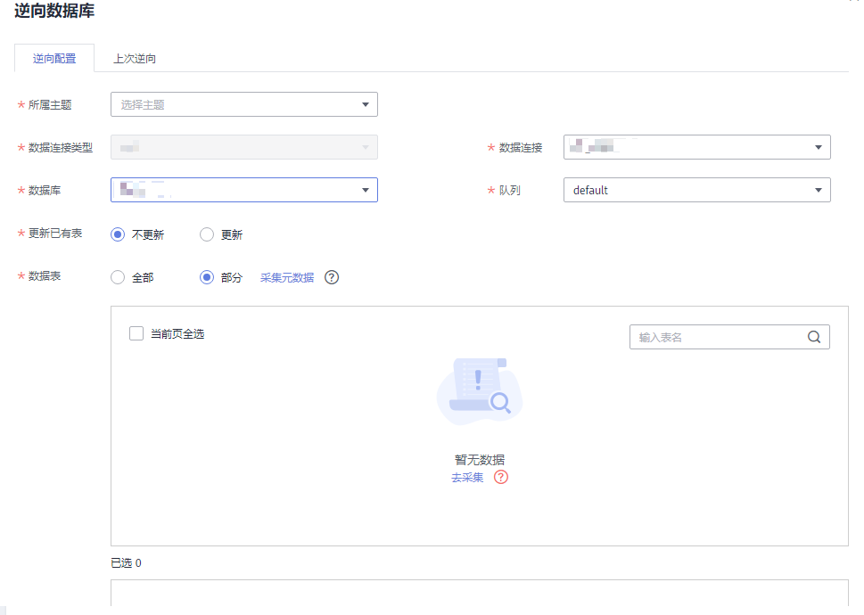

# 逆向数据库（关系建模）

通过逆向数据库，您可以将其他数据源的数据库中的表导入到指定的关系模型中。

## 前提条件

在逆向数据库之前，请先在DGC数据资产模块中对数据库进行数据资产采集，以便同步数据资产时可以同步成功，否则同步数据资产将执行失败。有关数据资产采集的具体操作，请参见[任务管理](任务管理.md)。

## 逆向数据库导入表到模型中

1.  在DGC规范设计控制台，单击左侧导航栏的“关系建模“进入关系建模页面。
2.  在模型总览中找到所需要执行逆向数据库导入的模型，单击卡片进入模型，单击上方的“逆向数据库“。

    **图 1**  逆向数据库  
    

3.  在“逆向数据库“对话框中配置如下参数。

    **图 2**  配置逆向数据库参数  
    

    **表 1**  逆向数据库

    
    <table><thead align="left"><tr id="zh-cn_topic_0189641497_row1480573818596"><th class="cellrowborder" valign="top" width="17.41%" id="mcps1.2.3.1.1">
参数名称

    </th>
    <th class="cellrowborder" valign="top" width="82.59%" id="mcps1.2.3.1.2">
说明

    </th>
    </tr>
    </thead>
    <tbody><tr id="row1455314718"><td class="cellrowborder" valign="top" width="17.41%" headers="mcps1.2.3.1.1 ">
所属主题

    </td>
    <td class="cellrowborder" valign="top" width="82.59%" headers="mcps1.2.3.1.2 ">
单击“选择主题”按钮选择所属的主题信息。

    </td>
    </tr>
    <tr id="row201514431285"><td class="cellrowborder" valign="top" width="17.41%" headers="mcps1.2.3.1.1 ">
数据连接类型

    </td>
    <td class="cellrowborder" valign="top" width="82.59%" headers="mcps1.2.3.1.2 ">
如果逆向到逻辑模型，请在下拉列表中选择所需要的连接类型。

    
如果逆向到物理模型，将显示当前模型的连接类型。

    </td>
    </tr>
    <tr id="zh-cn_topic_0189641497_row3806338165915"><td class="cellrowborder" valign="top" width="17.41%" headers="mcps1.2.3.1.1 ">
数据连接

    </td>
    <td class="cellrowborder" valign="top" width="82.59%" headers="mcps1.2.3.1.2 ">
选择所需要的数据连接。

    
如需从其他数据源逆向数据库到关系模型中，需要先在DGC管理中心创建一个数据连接，以便连接数据源。创建数据连接的操作，请参见<a href="创建数据连接.md">创建数据连接</a>。

    </td>
    </tr>
    <tr id="zh-cn_topic_0189641497_row17806133845919"><td class="cellrowborder" valign="top" width="17.41%" headers="mcps1.2.3.1.1 ">
数据库

    </td>
    <td class="cellrowborder" valign="top" width="82.59%" headers="mcps1.2.3.1.2 ">
选择数据库。

    </td>
    </tr>
    <tr id="zh-cn_topic_0189641497_row7806138105918"><td class="cellrowborder" valign="top" width="17.41%" headers="mcps1.2.3.1.1 ">
队列

    </td>
    <td class="cellrowborder" valign="top" width="82.59%" headers="mcps1.2.3.1.2 ">
仅限DLI连接类型，需选择DLI队列。

    </td>
    </tr>
    <tr id="row1725228414"><td class="cellrowborder" valign="top" width="17.41%" headers="mcps1.2.3.1.1 ">
schema

    </td>
    <td class="cellrowborder" valign="top" width="82.59%" headers="mcps1.2.3.1.2 ">
仅限DWS连接类型，需设置DWS模式。

    </td>
    </tr>
    <tr id="row1718213134156"><td class="cellrowborder" valign="top" width="17.41%" headers="mcps1.2.3.1.1 ">
更新已有表

    </td>
    <td class="cellrowborder" valign="top" width="82.59%" headers="mcps1.2.3.1.2 ">
在导入时，如果所要导入的表在关系模型中已存在，是否更新已有的表。在导入时，系统将按表编码进行判断将要导入的表在当前的关系模型中是否已存在。在导入时，只有创建或更新操作，不会删除已有的表。

    <ul id="ul2569935600"><li><strong id="b195691335105">不更新</strong>：如果表已存在，将直接跳过，不更新。</li><li><strong id="b1056919351201">更新</strong>：如果表已存在，更新已有的表信息。如果表处于“已发布”状态，表更新后，您需要重新发布表，才能使更新后的表生效。</li></ul>
    </td>
    </tr>
    <tr id="zh-cn_topic_0189641497_row188066381596"><td class="cellrowborder" valign="top" width="17.41%" headers="mcps1.2.3.1.1 ">
数据表

    </td>
    <td class="cellrowborder" valign="top" width="82.59%" headers="mcps1.2.3.1.2 ">
选择“全部”时，将数据库中的所有的表都导入关系模型中。

    
选择“部分”时，请选择需要导入关系模型的表。

    </td>
    </tr>
    </tbody>
    </table>

4.  单击“确定“开始执行逆向数据库操作。

