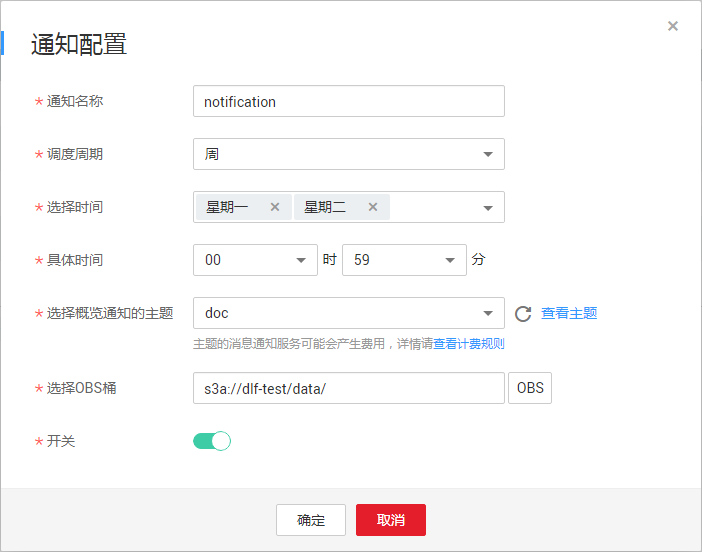

# 通知周期概览

## 操作场景

用户可以按照天/周/月为调度周期配置通知任务，向相关人员发送通知。让相关人员可以定期跟踪作业的调度情况（作业调度成功数量，作业调度失败异常数量以及作业失败详情）。

## 约束限制

该功能依赖于OBS服务。

## 前提条件

-   已开通消息通知服务并配置主题，为主题添加订阅。
-   已提交作业，且作业不是“未启动“状态。
-   已开通对象存储服务，并在OBS中创建文件夹。

## 配置通知

1.  登录DGC控制台。选择对应工作空间的“数据开发“模块，进入数据开发页面。

    **图 1**  选择数据开发  
    

2.  在数据开发主界面的左侧导航栏，选择“运维调度  \>  通知管理“。
3.  在页面右侧的“周期概览“页签，单击“通知配置“，弹出“通知配置“页面，配置如[表1](#zh-cn_topic_0169701967_table63861718143217)所示的参数。

    **图 2**  通知配置  
    

    **表 1**  通知参数

    
    <table><thead align="left"><tr id="zh-cn_topic_0169701967_row338615185328"><th class="cellrowborder" valign="top" width="25%" id="mcps1.2.4.1.1">
参数

    </th>
    <th class="cellrowborder" valign="top" width="12%" id="mcps1.2.4.1.2">
是否必选

    </th>
    <th class="cellrowborder" valign="top" width="63%" id="mcps1.2.4.1.3">
说明

    </th>
    </tr>
    </thead>
    <tbody><tr id="zh-cn_topic_0169701967_row1338613183323"><td class="cellrowborder" valign="top" width="25%" headers="mcps1.2.4.1.1 ">
通知名称

    </td>
    <td class="cellrowborder" valign="top" width="12%" headers="mcps1.2.4.1.2 ">
是

    </td>
    <td class="cellrowborder" valign="top" width="63%" headers="mcps1.2.4.1.3 ">
设置发送的通知名称。

    </td>
    </tr>
    <tr id="zh-cn_topic_0169701967_row10414124017452"><td class="cellrowborder" valign="top" width="25%" headers="mcps1.2.4.1.1 ">
调度周期

    </td>
    <td class="cellrowborder" valign="top" width="12%" headers="mcps1.2.4.1.2 ">
是

    </td>
    <td class="cellrowborder" valign="top" width="63%" headers="mcps1.2.4.1.3 ">
选择通知发送的调度周期，可以设置为按“天”、“周”或“月”发送。

    
 说明： 

按天发送，通知记录为以发送时间往前推24小时时间段的数据；按周发送，通知记录为往前推七天时间段的数据；按月发送，通知记录为往前推30天时间段的数据

    

    </td>
    </tr>
    <tr id="zh-cn_topic_0169701967_row4620174420133"><td class="cellrowborder" valign="top" width="25%" headers="mcps1.2.4.1.1 ">
选择时间

    </td>
    <td class="cellrowborder" valign="top" width="12%" headers="mcps1.2.4.1.2 ">
是

    </td>
    <td class="cellrowborder" valign="top" width="63%" headers="mcps1.2.4.1.3 ">
设置通知发送的具体日期。

    <ul id="zh-cn_topic_0169701967_ul12869135381920"><li>当调度周期为周时，可设置为一周中星期一至星期日的某一天或某几天。</li><li>当调度周期为月时，可设置为一月中每月1号至每月31号的某一天或某几天。</li></ul>
    </td>
    </tr>
    <tr id="zh-cn_topic_0169701967_row731724911453"><td class="cellrowborder" valign="top" width="25%" headers="mcps1.2.4.1.1 ">
具体时间

    </td>
    <td class="cellrowborder" valign="top" width="12%" headers="mcps1.2.4.1.2 ">
是

    </td>
    <td class="cellrowborder" valign="top" width="63%" headers="mcps1.2.4.1.3 ">
设置通知发送的具体时间点，可以精确设置到小时和分钟。

    </td>
    </tr>
    <tr id="zh-cn_topic_0169701967_row19221159134513"><td class="cellrowborder" valign="top" width="25%" headers="mcps1.2.4.1.1 ">
选择概览通知的主题

    </td>
    <td class="cellrowborder" valign="top" width="12%" headers="mcps1.2.4.1.2 ">
是

    </td>
    <td class="cellrowborder" valign="top" width="63%" headers="mcps1.2.4.1.3 ">
单击下拉选项，设置通知发送的主题。

    </td>
    </tr>
    <tr id="zh-cn_topic_0169701967_row83611613466"><td class="cellrowborder" valign="top" width="25%" headers="mcps1.2.4.1.1 ">
选择OBS桶

    </td>
    <td class="cellrowborder" valign="top" width="12%" headers="mcps1.2.4.1.2 ">
是

    </td>
    <td class="cellrowborder" valign="top" width="63%" headers="mcps1.2.4.1.3 ">
单击“OBS”设置通知记录数据存储的位置。

    </td>
    </tr>
    <tr id="zh-cn_topic_0169701967_row96362401469"><td class="cellrowborder" valign="top" width="25%" headers="mcps1.2.4.1.1 ">
开关

    </td>
    <td class="cellrowborder" valign="top" width="12%" headers="mcps1.2.4.1.2 ">
是

    </td>
    <td class="cellrowborder" valign="top" width="63%" headers="mcps1.2.4.1.3 ">
是否开启通知，默认开启。

    </td>
    </tr>
    </tbody>
    </table>

4.  单击“确定“。

    > **说明：** 
    >数据开发模块的通知管理功能是通过消息通知服务来发送消息，消息通知服务的使用可能会产生费用，具体请咨询消息通知服务。

5.  通知配置完成后，您可以在通知的“操作“列进行如下操作。
    -   单击“编辑“，打开“通知配置“页面，可以重新编辑通知。编辑完成后选择“确定“，保存修改。
    -   单击“记录“，打开“查看记录“页面，可以查看作业的调度情况。
    -   单击“删除“，打开“删除通知“页面，选择“确定“，删除通知。

