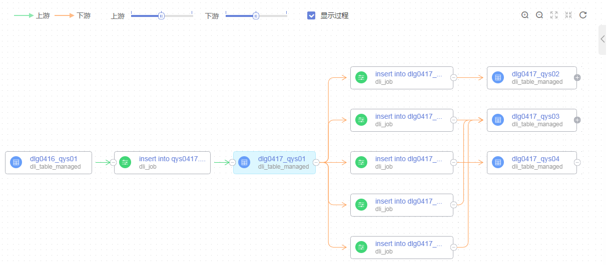
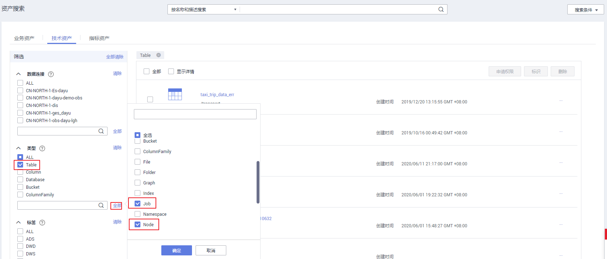
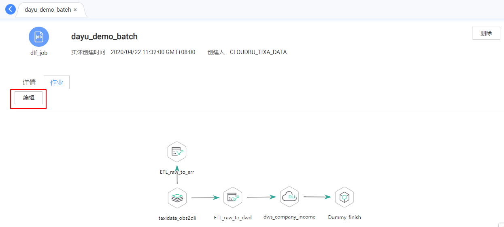
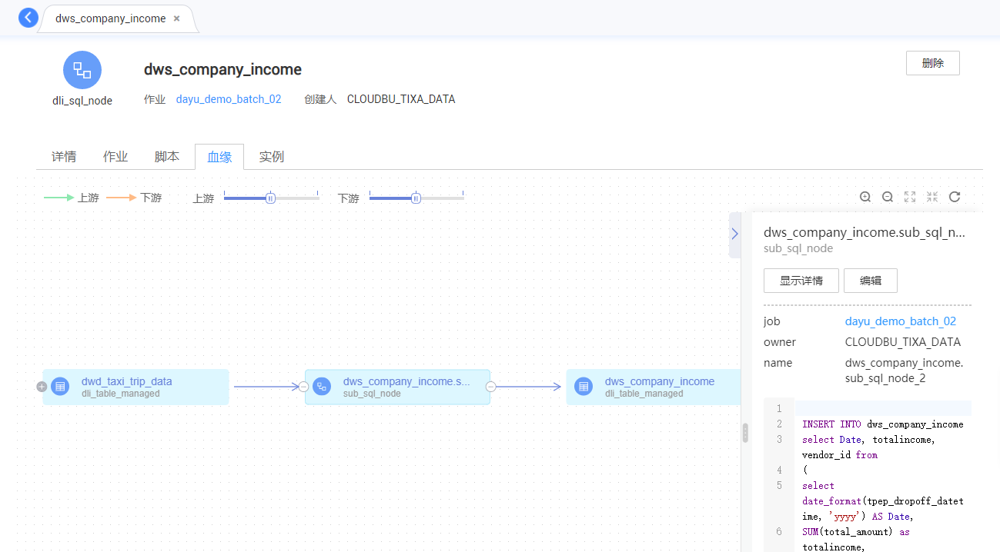
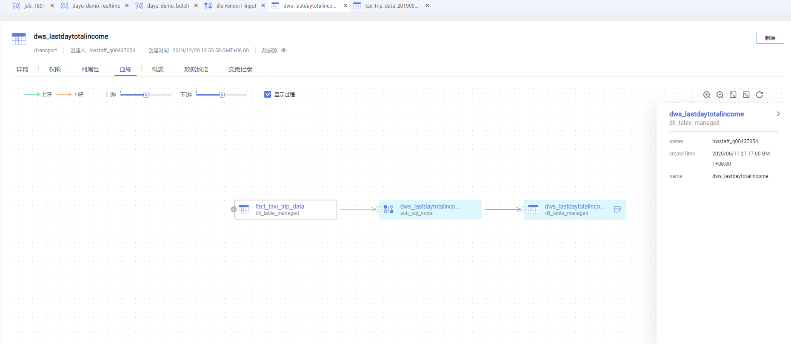

# 通过数据地图查看数据血缘关系

## 什么是数据血缘

大数据时代，数据爆发性增长，海量的、各种类型的数据在快速产生。这些庞大复杂的数据信息，通过联姻融合、转换变换、流转流通，又生成新的数据，汇聚成数据的海洋。

数据的产生、加工融合、流转流通，到最终消亡，数据之间自然会形成一种关系。我们借鉴人类社会中类似的一种关系来表达数据之间的这种关系，称之为数据的血缘关系。与人类社会中的血缘关系不同，数据的血缘关系还包含了一些特有的特征：

-   **归属性**：一般来说，特定的数据归属特定的组织或者个人，数据具有归属性。
-   **多源性**：同一个数据可以有多个来源（多个父亲）。一个数据可以是多个数据经过加工而生成的，而且这种加工过程可以是多个。
-   **可追溯性**：数据的血缘关系，体现了数据的生命周期，体现了数据从产生到消亡的整个过程，具备可追溯性。
-   **层次性**：数据的血缘关系是有层次的。对数据的分类、归纳、总结等对数据进行的描述信息又形成了新的数据，不同程度的描述信息形成了数据的层次。

**图 1**  数据血缘关系示例  

## DGC数据血缘实现方案

-   数据血缘的产生：

    在DGC平台中，自动分析血缘是通过在数据开发模块中配置数据处理迁移类型的节点产生的，当前支持采集节点静态配置产生的血缘和部分节点实例上的血缘。详情请参见[自动分析血缘](配置数据血缘.md#section12458162215283)。

    另外，DGC平台还支持手动配置血缘方式，当用户手动配置血缘时，自动分析血缘将不生效。详情请参见[手动配置血缘](配置数据血缘.md#section123831529241)。

-   数据血缘的展示：

    当数据开发模块中的作业已完成血缘关系配置后，启动作业调度，并在数据资产模块在进行元数据采集任务，则可以在数据资产模块可视化查看数据血缘关系。

## 查看数据血缘关系

完成以下任务后，您可以参考本步骤，可视化查看数据血缘关系。

-   已完成[自动分析血缘](配置数据血缘.md#section12458162215283)或[手动配置血缘](配置数据血缘.md#section123831529241)。
-   已在数据开发模块[启动作业调度](查看数据血缘.md#section16491984232)。
-   已在数据资产模块[新建元数据采集任务](查看数据血缘.md#section1719117162820)。

1.  在DGC控制台首页，选择对应工作空间的“数据资产“模块，进入数据资产页面。

    **图 2**  选择数据资产  
    

2.  在“数据目录 \> 技术资产“页面，可以对数据开发的作业、节点、表进行查询。

    在“类型“筛选区域，单击“全部“按钮并勾选“Job“、“Node“和“Table“类型，然后单击“确定“。数据开发中的作业对应于Job类型，节点对应于Node类型，表对应于Table类型。

    > **说明：** 
    >数据开发中的作业信息不属于任何一个数据连接，故如果在搜索条件中勾选数据连接，则查询不到结果。

    **图 3**  选择类型  
    

3.  在数据资产搜索结果中，类型名称末尾带“\_job“的数据资产为作业，单击某一作业名称，可以查看该作业的详情。在作业的详情页面进入“作业“Tab页，单击“编辑“可跳转到数据开发的作业编辑页面。

    **图 4**  查看作业  
    

4.  在数据资产搜索结果中，类型名称末尾带“\_node“的数据资产为节点，单击某一节点名称，可以查看节点的详情。在节点（需是支持血缘的节点类型）详情页面，可以查看节点的血缘信息。

    -   单击血缘图中节点左右两端“+”、“-”图标，可以进一步展开查看血缘的上下链路。
    -   单击血缘图中的某一个节点，可以查看该节点的详情。
    -   进入“作业“Tab页，单击“编辑“可跳转到数据开发的作业编辑页面。

    **图 5**  查看节点血缘  
    

5.  在数据资产搜索结果中，图标为表格的数据资产为表，单击某一表名称，可以查看表的详情。在详情页面，可以查看表的血缘信息。

    -   单击血缘图中表左右两端“+”、“-”图标，可以进一步展开查看血缘的上下链路。
    -   单击血缘图中的某一个表，可以查看该表的详情。

    **图 6**  查看表血缘  
    

