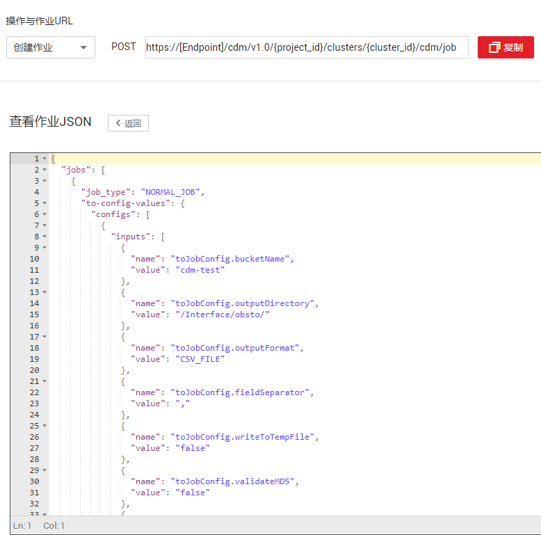
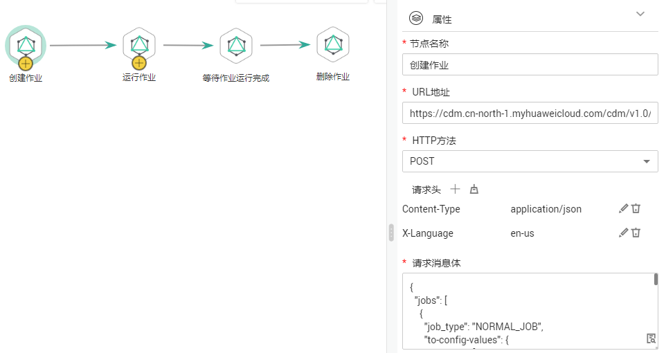
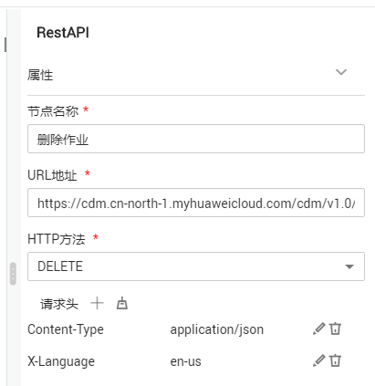

# 通过数据开发实现数据增量迁移<a name="dayu_01_0097"></a>

CDM本身已支持增量迁移，详细可参见[文件增量迁移](文件增量迁移.md)、[关系数据库增量迁移](关系数据库增量迁移.md)、[HBase/CloudTable增量迁移](HBase-CloudTable增量迁移.md)、[使用时间宏变量完成增量同步](使用时间宏变量完成增量同步.md)。

数据湖工厂（Data Lake Factory，简称DLF）提供了一站式的大数据协同开发平台，借助DLF的在线脚本编辑、周期调度CDM的迁移作业，也可以实现增量数据迁移。

这里以DWS导入到OBS为例，介绍DLF配合CDM实现增量迁移的流程：

1.  [获取CDM作业的JSON](#zh-cn_topic_0141821195_section957164554017)
2.  [修改JSON](#zh-cn_topic_0141821195_section1067612504338)
3.  [DLF上创建并运行CDM作业](#zh-cn_topic_0141821195_section1045721991012)
4.  [等待CDM作业运行完成](#zh-cn_topic_0141821195_section96980431819)
5.  [删除作业（可选）](#zh-cn_topic_0141821195_section124451922163716)
6.  [DLF作业参数配置](#zh-cn_topic_0141821195_section204663195820)

## 获取CDM作业的JSON<a name="zh-cn_topic_0141821195_section957164554017"></a>

1.  创建一个DWS到OBS的表/文件迁移作业。
2.  在CDM“作业管理“界面的“表/文件迁移“页签下，找到您刚创建的作业，单击作业操作列的“更多  \>  查看作业JSON“，如[图1](#zh-cn_topic_0141821195_fig381822501218)所示。

    您也可以使用其它已创建好的CDM作业JSON。

    **图 1**  查看作业JSON<a name="zh-cn_topic_0141821195_fig381822501218"></a>  
    

3.  作业JSON就是创建CDM作业的请求消息体模板，URL地址中\[Endpoint\]、\{project\_id\}、\{cluster\_id\}需要替换为您实际的信息：
    -   \[Endpoint\]：从[地区和终端节点](https://developer.huaweicloud.com/endpoint?CDM)获取，例如“cdm.cn-north-1.myhuaweicloud.com“。
    -   \{project\_id\}：项目ID，在[“我的凭证”](https://console.huaweicloud.com/iam/#/myCredential)界面的项目列表中查看。
    -   \{cluster\_id\}：集群ID，可在CDM集管理界面，单击集群名称查看。


## 修改JSON<a name="zh-cn_topic_0141821195_section1067612504338"></a>

根据您的业务需要，可以修改JSON Body。这里以1天为周期，where子句作为抽取数据时的判断条件（一般使用时间字段来作为增量迁移时的判断条件），每天迁移昨天新增的数据。

1.  修改where子句，增量某个时间段的数据：

    ```
         {
            "name": "fromJobConfig.whereClause",
            "value": "_timestamp >= '${startTime}' and _timestamp < '${currentTime}'"
         }
    ```

    > **说明：**   
    >-   源端数据库是数据仓库服务DWS或者MySQL时，对于时间的判断可以写成以下两种：  
    >    ```  
    >    _timestamp >= '2018-10-10 00:00:00' and _timestamp < '2018-10-11 00:00:00'  
    >    或者  
    >    _timestamp between '2018-10-10 00:00:00' and '2018-10-11 00:00:00'  
    >    ```  
    >-   如果源端数据库是Oracle，where子句应该写成：  
    >    ```  
    >    _timestamp >= to_date (2018-10-10 00:00:00' , 'yyyy-mm-dd hh24:mi:ss' ) and _timestamp < to_date (2018-10-10 00:00:00' , 'yyyy-mm-dd hh24:mi:ss' )  
    >    ```  

2.  每个周期的增量数据导入到不同的目录：

    ```
         {
            "name": "toJobConfig.outputDirectory",
            "value": "dws2obs/${currentTime}"
         }
    ```

3.  作业名改成动态的，否则会因为作业重名而无法创建：

    ```
        "to-connector-name": "obs-connector",
        "from-link-name": "dws_link",
        "name": "dws2obs-${currentTime}"
    ```


如果需要修改更多参数，请参见《[云数据迁移API参考](https://support.huaweicloud.com/api-cdm/cdm_02_0010.html)》，这里修改后的JSON样例如下：

```
{
  "jobs": [
    {
      "job_type": "NORMAL_JOB",
      "to-config-values": {
        "configs": [
          {
            "inputs": [
              {
                "name": "toJobConfig.bucketName",
                "value": "cdm-test"
              },
              {
                "name": "toJobConfig.outputDirectory",
                "value": "dws2obs/${currentTime}"
              },
              {
                "name": "toJobConfig.outputFormat",
                "value": "CSV_FILE"
              },
              {
                "name": "toJobConfig.fieldSeparator",
                "value": ","
              },
              {
                "name": "toJobConfig.writeToTempFile",
                "value": "false"
              },
              {
                "name": "toJobConfig.validateMD5",
                "value": "false"
              },
              {
                "name": "toJobConfig.encodeType",
                "value": "UTF-8"
              },
              {
                "name": "toJobConfig.duplicateFileOpType",
                "value": "REPLACE"
              },
              {
                "name": "toJobConfig.kmsEncryption",
                "value": "false"
              }
            ],
            "name": "toJobConfig"
          }
        ]
      },
      "from-config-values": {
        "configs": [
          {
            "inputs": [
              {
                "name": "fromJobConfig.schemaName",
                "value": "dws_database"
              },
              {
                "name": "fromJobConfig.tableName",
                "value": "dws_from"
              },
              {
                "name": "fromJobConfig.whereClause",
                "value": "_timestamp >= '${startTime}' and _timestamp < '${currentTime}'"
              },
              {
                "name": "fromJobConfig.columnList",
                "value": "_tiny&_small&_int&_integer&_bigint&_float&_double&_date&_timestamp&_char&_varchar&_text"
              }
            ],
            "name": "fromJobConfig"
          }
        ]
      },
      "from-connector-name": "generic-jdbc-connector",
      "to-link-name": "obs_link",
      "driver-config-values": {
        "configs": [
          {
            "inputs": [
              {
                "name": "throttlingConfig.numExtractors",
                "value": "1"
              },
              {
                "name": "throttlingConfig.submitToCluster",
                "value": "false"
              },
              {
                "name": "throttlingConfig.numLoaders",
                "value": "1"
              },
              {
                "name": "throttlingConfig.recordDirtyData",
                "value": "false"
              },
              {
                "name": "throttlingConfig.writeToLink",
                "value": "obs_link"
              }
            ],
            "name": "throttlingConfig"
          },
          {
            "inputs": [],
            "name": "jarConfig"
          },
          {
            "inputs": [],
            "name": "schedulerConfig"
          },
          {
            "inputs": [],
            "name": "transformConfig"
          },
          {
            "inputs": [],
            "name": "smnConfig"
          },
          {
            "inputs": [],
            "name": "retryJobConfig"
          }
        ]
      },
      "to-connector-name": "obs-connector",
      "from-link-name": "dws_link",
      "name": "dws2obs-${currentTime}"
    }
  ]
}
```

## DLF上创建并运行CDM作业<a name="zh-cn_topic_0141821195_section1045721991012"></a>

1.  DLF创建作业的详细操作，请参见《数据湖工厂用户指南》的“新建作业“章节。
2.  DLF作业创建完成后，双击作业名称，进入作业开发界面，DLF通过RestAPI算子调用REST接口创建CDM迁移作业。
3.  <a name="zh-cn_topic_0141821195_li9275205283511"></a>配置RestAPI算子的属性：

    1.  节点名称：您自定义名称，例如“创建CDM作业“。注意区分：在DLF作业中，CDM的迁移作业只是作为节点运行。
    2.  URL地址：配置为[获取CDM作业的JSON](#zh-cn_topic_0141821195_section957164554017)中获取的URL，例如“https://cdm.cn-north-1.myhuaweicloud.com/cdm/v1.0/1551c7f6c808414d8e9f3c514a170f2e/clusters/6ec9a0a4-76be-4262-8697-e7af1fac7920/cdm/job“。
    3.  HTTP方法：创建CDM作业的HTTP请求方法为“POST“。
    4.  添加如下两个请求头：
        -   Content-Type = application/json
        -   X-Language = en-us

    5.  请求消息体：输入[修改JSON](#zh-cn_topic_0141821195_section1067612504338)里面修改完成后的CDM作业JSON。

    **图 2**  创建CDM作业的算子属性<a name="zh-cn_topic_0141821195_fig1192342815716"></a>  
    

4.  创建CDM作业的算子配置完后，还需要在后面添加运行CDM作业的REST算子，具体参见《云数据迁移API参考》中的[启动作业](https://support.huaweicloud.com/api-cdm/cdm_02_0062.html)。

    -   节点名称：运行作业。
    -   URL地址：其中project\_id、cluster\_id和[创建CDM作业](#zh-cn_topic_0141821195_li9275205283511)中的保持一致，任务名需要配置为“dws2obs-$\{currentTime\}“。

        例如“https://cdm.cn-north-1.myhuaweicloud.com/cdm/v1.0/1551c7f6c808414d8e9f3c514a170f2e/clusters/6ec9a0a4-76be-4262-8697-e7af1fac7920/cdm/job/dws2obs-$\{currentTime\}/start“。

    -   HTTP方法：运行CDM作业的HTTP请求方法为“PUT“。
    -   请求头：
        -   Content-Type = application/json
        -   X-Language = en-us

    **图 3**  运行CDM作业的算子属性<a name="zh-cn_topic_0141821195_fig972401481615"></a>  
    


## 等待CDM作业运行完成<a name="zh-cn_topic_0141821195_section96980431819"></a>

由于CDM作业是异步运行的，运行作业的REST请求返回200，不代表数据已经迁移成功。如果后续有计算作业依赖CDM的迁移作业的话，需要一个RestAPI算子去周期判断迁移是否成功，如果CDM迁移成功，再去做计算操作。

1.  查询CDM迁移是否成功的API，具体请参见《云数据迁移API参考》中[查询作业状态](https://support.huaweicloud.com/zh-cn/api-cdm/cdm_02_0064.html)。
2.  运行CDM作业的REST算子配置完成后，添加等待CDM作业完成算子，算子属性为：
    -   节点名称：等待作业运行完成。
    -   URL地址：例如“https://cdm.cn-north-1.myhuaweicloud.com/cdm/v1.0/1551c7f6c808414d8e9f3c514a170f2e/clusters/6ec9a0a4-76be-4262-8697-e7af1fac7920/cdm/job/dws2obs-$\{currentTime\}/status“。
    -   HTTP方法：查询CDM作业状态的HTTP请求方法为“GET“。
    -   请求头：
        -   Content-Type = application/json
        -   X-Language = en-us

    -   是否需要判断返回值：选择“YES“。
    -   返回值字段路径：配置为submissions\[0\].status。
    -   请求成功标志位：配置为SUCCEEDED。
    -   其他参数保持默认即可。


## 删除作业（可选）<a name="zh-cn_topic_0141821195_section124451922163716"></a>

如果需要在迁移完后进行计算操作，可在后续添加各种计算算子，完成数据计算。

这里的删除作业可根据实际需要选择。由于DLF是通过周期创建CDM作业来实现增量迁移，因此会累积大量的作业在CDM集群上。所以可在迁移成功后，删除已经运行成功的作业。

如果你需要删除，在查询CDM作业状态的算子后面，添加删除CDM作业的RestAPI算子即可，DLF会调用《云数据迁移API参考》中的[删除作业](https://support.huaweicloud.com/zh-cn/api-cdm/cdm_02_0066.html)接口。

删除CDM作业的算子属性为：

-   节点名称：删除作业。
-   URL地址：例如“https://cdm.cn-north-1.myhuaweicloud.com/cdm/v1.0/1551c7f6c808414d8e9f3c514a170f2e/clusters/6ec9a0a4-76be-4262-8697-e7af1fac7920/cdm/job/dws2obs-$\{currentTime\}“。
-   HTTP方法：删除CDM作业的HTTP请求方法为“DELETE“。
-   请求头：
    -   Content-Type = application/json
    -   X-Language = en-us

-   其他参数保持默认即可。

**图 4**  删除CDM作业算子配置<a name="zh-cn_topic_0141821195_fig128016110541"></a>  


## DLF作业参数配置<a name="zh-cn_topic_0141821195_section204663195820"></a>

1.  配置DLF作业参数，如[图5](#zh-cn_topic_0141821195_fig348885894816)所示。

    -   startTime = $getTaskPlanTime\(plantime,@@yyyyMMddHHmmss@@,-24\*60\*60\)
    -   currentTime = $getTaskPlanTime\(plantime,@@yyyyMMdd-HHmm@@,0\)

    **图 5**  DLF作业参数配置<a name="zh-cn_topic_0141821195_fig348885894816"></a>  
    

2.  保存DLF作业后，选择“调度配置  \>  周期调度“，调度周期配置为1天。

    这样，DLF配合CDM就实现了每天迁移昨天新增的数据。


