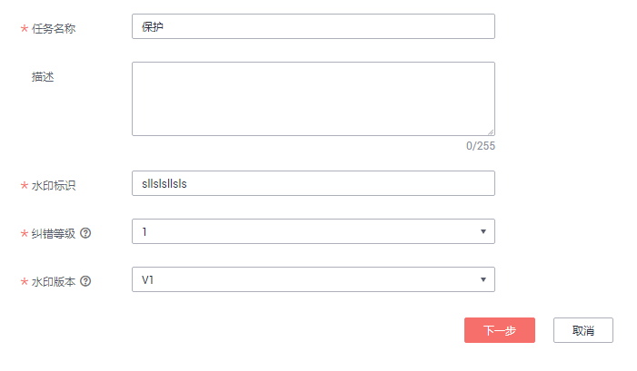
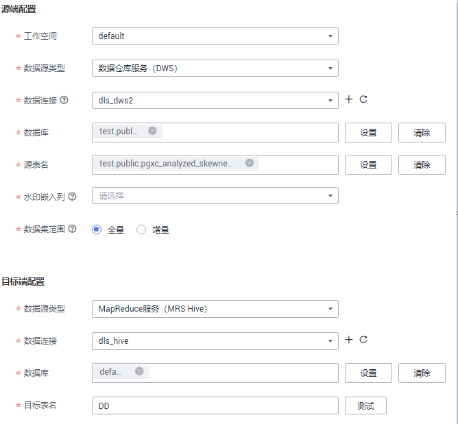
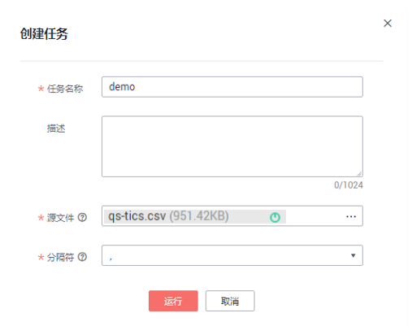

# 通过数据水印对安全事件进行定位

本章节介绍如何通过数据水印对安全事件进行定位。

## 场景说明

通过对泄露数据文件解封，根据数据文件的完整度和水印信息痕迹来检测水印是否存在，快速识别水印标记信息，对泄露数据进行溯源（数据源地址、分发单位、负责人、分发时间等），从而对安全事件精准定位追责。

## 创建水印嵌入任务

在数据开放前，对待开放的敏感数据，嵌入水印。

1.  进入DGC控制台首页的数据安全模块。
2.  创建水印嵌入任务。
    1.  单击左侧导航菜单的“数据水印嵌入”。
    2.  单击页面上方的“新建”。
    3.  配置基本信息，水印标识建议按照按照如下图所示。

        

    4.  单击“下一步”，配置源端和目标端数据，如下图所示。

        

    5.  单击“下一步”，配置调度信息，单击“提交”，完成任务创建。

3.  运行数据水印嵌入任务。

    在数据水印嵌入列表中，单击“运行”或“启动调度”，即可调度运行数据水印嵌入任务。

## 水印溯源

数据泄露后，根据泄露的数据进行溯源。

1.  获得泄露的数据后，转换为CSV格式文件，保存到本地。

    > **说明：** 
    >-   文件需要转换为CSV格式。
    >-   文件大小不能超过20M。

2.  创建数据水印溯源任务。
    1.  单击左侧导航菜单的“数据水印朔源”。
    2.  单击页面上方的“新建”。
    3.  输入任务信息，如下图所示。

        

    4.  单击“运行”，完成溯源任务创建。

3.  查看溯源结果。

    在数据水印溯源任务列表中单击“查看结果”，查看溯源信息，如下图所示。

    

