# 逻辑模型设计

逻辑模型是利用实体及相互之间的关系，准确描述业务规则的实体关系图。逻辑模型要保证业务所需数据结构的正确性及一致性，使用一系列标准的规则将各种对象的特征体现出来，并对各实体之间的关系进行准确定义。

同时，逻辑模型也为构建物理模型提供了有力的参考依据，并支持转换为物理模型，是最终成功设计数据库过程中必不可少的一个阶段。

本章节主要介绍以下内容：

-   [逻辑模型设计注意事项](#section19641112791911)
-   [新建逻辑模型](#section8714193117169)
-   [新建逻辑表并发布](#section16901155832117)
-   [逻辑模型转换为物理模型](#section1570216131915)

## 逻辑模型设计注意事项

-   不只针对当前业务现状，还要考虑业务将来的发展计划。
-   必须有熟知业务的人员参与建模，将实际业务所需内容充分反映在模型中。
-   必须要考虑设计的逻辑模型在向物理模型转换时具有较高的效率。
-   物理特性放在物理建模阶段考虑。
-   各个实体、属性、关系等必须要与实际业务中的信息能够对应。

## 新建逻辑模型

1.  在DGC控制台首页，选择对应工作空间的“规范设计“模块，进入规范设计页面。

    **图 1**  选择规范设计  
    

1.  在规范设计控制台，单击左侧导航树中的“关系建模“。
2.  在“关系建模“页面，如果当前未创建过关系模型，系统会弹出“新建分层治理模型“提示框。如果不是首次创建，单击按钮新建模型。

    **图 2**  新建分层治理模型  
    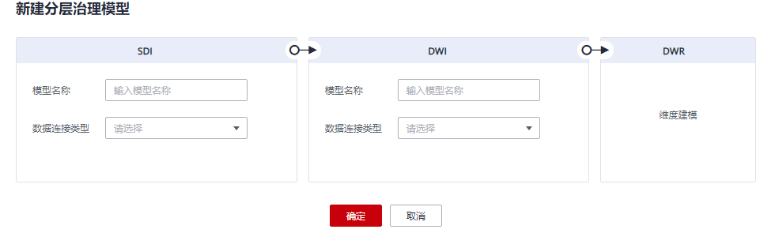

    **图 3**  关系建模页面  
    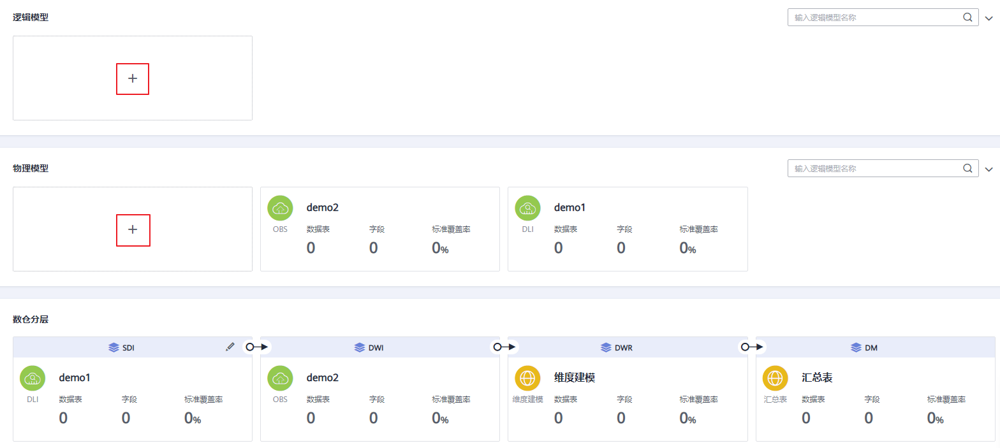

3.  在弹出窗口中配置如下参数，然后单击“确定“。

    **图 4**  新建逻辑模型  
    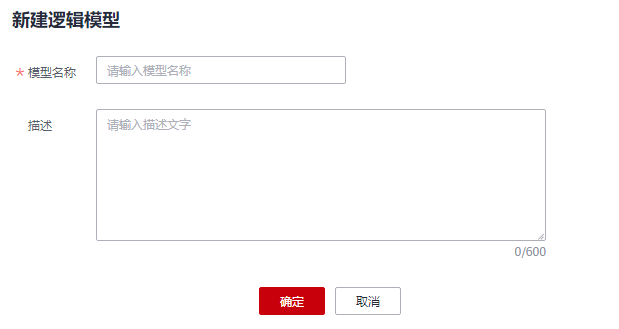

    **表 1**  参数描述

    
    <table><thead align="left"><tr id="row69531423390"><th class="cellrowborder" valign="top" width="19.96%" id="mcps1.2.3.1.1">
参数名称

    </th>
    <th class="cellrowborder" valign="top" width="80.04%" id="mcps1.2.3.1.2">
说明

    </th>
    </tr>
    </thead>
    <tbody><tr id="row1695342143918"><td class="cellrowborder" valign="top" width="19.96%" headers="mcps1.2.3.1.1 ">
模型名称

    </td>
    <td class="cellrowborder" valign="top" width="80.04%" headers="mcps1.2.3.1.2 ">
只能包含中文、英文字母、数字和下划线。

    </td>
    </tr>
    <tr id="row267518332531"><td class="cellrowborder" valign="top" width="19.96%" headers="mcps1.2.3.1.1 ">
描述

    </td>
    <td class="cellrowborder" valign="top" width="80.04%" headers="mcps1.2.3.1.2 ">
逻辑模型的描述信息。

    </td>
    </tr>
    </tbody>
    </table>

## 新建逻辑表并发布

当您完成逻辑模型的创建之后，您就可以在逻辑模型中新建表。

1.  在DGC规范设计控制台，单击左侧导航栏的“关系建模“进入关系建模页面。
2.  在关系模型中选择所需要的逻辑模型，单击该模型进入管理页面，然后单击“新建“按钮新建一个表。
3.  在“新建表“页面，根据页面提示完成建表的配置。
    1.  填写基本配置参数：

        **图 5**  基本配置 - 逻辑表  
        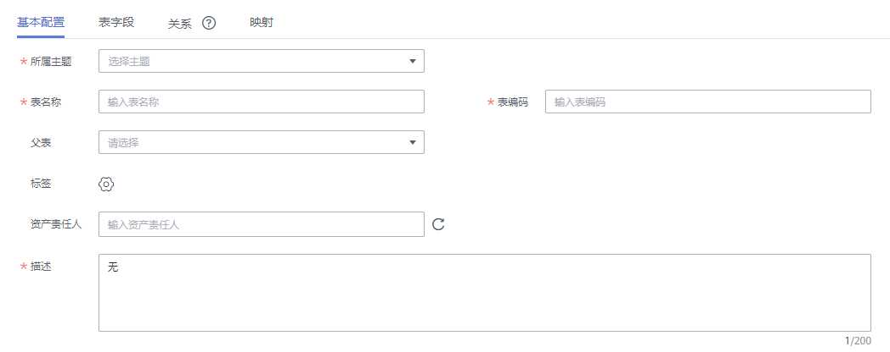

        **表 2**  基本配置

        
        <table><thead align="left"><tr id="zh-cn_topic_0189641497_row197762036123115"><th class="cellrowborder" valign="top" width="17.83%" id="mcps1.2.3.1.1">
参数名称

        </th>
        <th class="cellrowborder" valign="top" width="82.17%" id="mcps1.2.3.1.2">
说明

        </th>
        </tr>
        </thead>
        <tbody><tr id="zh-cn_topic_0189641497_row145391351185512"><td class="cellrowborder" valign="top" width="17.83%" headers="mcps1.2.3.1.1 ">
所属主题

        </td>
        <td class="cellrowborder" valign="top" width="82.17%" headers="mcps1.2.3.1.2 ">
单击“选择主题”选择所属的主题信息。

        </td>
        </tr>
        <tr id="row204336210584"><td class="cellrowborder" valign="top" width="17.83%" headers="mcps1.2.3.1.1 ">
表名称

        </td>
        <td class="cellrowborder" valign="top" width="82.17%" headers="mcps1.2.3.1.2 ">
表的名称。只能包含中文、英文字母、数字、左右括号、中划线和下划线，且以中文或英文字母开头。

        </td>
        </tr>
        <tr id="zh-cn_topic_0189641497_row1930014104575"><td class="cellrowborder" valign="top" width="17.83%" headers="mcps1.2.3.1.1 ">
表编码

        </td>
        <td class="cellrowborder" valign="top" width="82.17%" headers="mcps1.2.3.1.2 ">
表的英文名称。只能包含英文字母、数字、下划线、$、{、}，且不能以数字开头。

        </td>
        </tr>
        <tr id="zh-cn_topic_0189641497_row57638353551"><td class="cellrowborder" valign="top" width="17.83%" headers="mcps1.2.3.1.1 ">
父表

        </td>
        <td class="cellrowborder" valign="top" width="82.17%" headers="mcps1.2.3.1.2 ">
设置一个父表。本模块的父表、子表表示一个继承的概念，公共使用的表及字段在逻辑上可以提炼为一张表的就是父表,  子表是在父表的基础上增加了特有字段，父表字段的修改会影响所有继承它的子表。

        </td>
        </tr>
        <tr id="zh-cn_topic_0189641497_row1933134645915"><td class="cellrowborder" valign="top" width="17.83%" headers="mcps1.2.3.1.1 ">
标签

        </td>
        <td class="cellrowborder" valign="top" width="82.17%" headers="mcps1.2.3.1.2 ">
标签是用户自定义的标识，它可以帮助用户对数据资产进行分类和搜索。添加标签后，您就可以在DGC数据资产模块中通过标签搜索相关的数据资产。

        
单击按钮可以为表添加标签，在弹出框中可以选择一个或多个已有的标签，或者输入一个新的标签名称后按回车键。您也可以前往DGC数据资产模块的“标签管理”页面添加新的标签，详情请参见<a href="标签管理.md">标签管理</a>，然后再返回此页面，就可以在标签的下拉列表中选择新添加的标签。

        </td>
        </tr>
        <tr id="zh-cn_topic_0189641497_row13813437599"><td class="cellrowborder" valign="top" width="17.83%" headers="mcps1.2.3.1.1 ">
资产责任人

        </td>
        <td class="cellrowborder" valign="top" width="82.17%" headers="mcps1.2.3.1.2 ">
在下拉列表中选择用户。只有工作空间管理员或开发者、运维者角色的用户才可以设置为责任人。

        </td>
        </tr>
        <tr id="zh-cn_topic_0189641497_row1578653953215"><td class="cellrowborder" valign="top" width="17.83%" headers="mcps1.2.3.1.1 ">
描述

        </td>
        <td class="cellrowborder" valign="top" width="82.17%" headers="mcps1.2.3.1.2 ">
描述信息。支持的长度0~200字符。

        </td>
        </tr>
        </tbody>
        </table>

    2.  在“表字段“页面添加所需要的字段，字段参数说明参考[表3](#table115287125449)。

        **图 6**  添加表字段  
        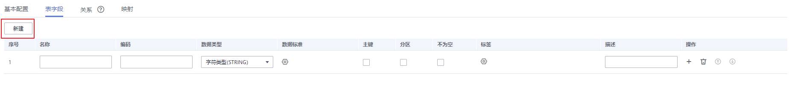

        **表 3**  表字段参数

        
        <table><thead align="left"><tr id="dgc_01_0606_zh-cn_topic_0171848092_row1732122114214"><th class="cellrowborder" valign="top" width="15.76%" id="mcps1.2.3.1.1">
参数名称

        </th>
        <th class="cellrowborder" valign="top" width="84.24000000000001%" id="mcps1.2.3.1.2">
说明

        </th>
        </tr>
        </thead>
        <tbody><tr id="dgc_01_0606_zh-cn_topic_0171848092_row1332222132111"><td class="cellrowborder" valign="top" width="15.76%" headers="mcps1.2.3.1.1 ">
名称

        </td>
        <td class="cellrowborder" valign="top" width="84.24000000000001%" headers="mcps1.2.3.1.2 ">
只能包含中文、英文字母、数字、左右括号、中划线和下划线，且以中文或英文字母开头。

        </td>
        </tr>
        <tr id="dgc_01_0606_zh-cn_topic_0171848092_row1132216217214"><td class="cellrowborder" valign="top" width="15.76%" headers="mcps1.2.3.1.1 ">
编码

        </td>
        <td class="cellrowborder" valign="top" width="84.24000000000001%" headers="mcps1.2.3.1.2 ">
只能包含英文字母、数字、下划线，且以英文字母开头。

        </td>
        </tr>
        <tr id="dgc_01_0606_zh-cn_topic_0171848092_row7322142172113"><td class="cellrowborder" valign="top" width="15.76%" headers="mcps1.2.3.1.1 ">
数据类型

        </td>
        <td class="cellrowborder" valign="top" width="84.24000000000001%" headers="mcps1.2.3.1.2 ">
设置字段的数据类型。如果在下拉列表中未找到所需要的数据类型，您可以参考<a href="配置中心.md#section06381835171">字段类型管理</a>添加数据类型。

        </td>
        </tr>
        <tr id="dgc_01_0606_row8101540162211"><td class="cellrowborder" valign="top" width="15.76%" headers="mcps1.2.3.1.1 ">
数据标准

        </td>
        <td class="cellrowborder" valign="top" width="84.24000000000001%" headers="mcps1.2.3.1.2 ">
如果您已创建数据标准，单击按钮可以选择一个数据标准与字段相关联。在“配置中心 &gt; 功能配置”页面中的“模型设计业务流程步骤 &gt; 创建质量作业”勾选的情况下，将字段关联数据标准后，表发布上线后，就会自动生成一个质量作业，每个关联了数据标准的字段会生成一个质量规则，基于数据标准对字段进行质量监控，您可以前往DGC数据质量模块的“质量作业”页面进行查看。

        
如果您还未创建数据标准，请参见<a href="新建数据标准.md">新建数据标准</a>进行创建。

        </td>
        </tr>
        <tr id="dgc_01_0606_zh-cn_topic_0171848092_row4322202117216"><td class="cellrowborder" valign="top" width="15.76%" headers="mcps1.2.3.1.1 ">
主键

        </td>
        <td class="cellrowborder" valign="top" width="84.24000000000001%" headers="mcps1.2.3.1.2 ">
选中时为主键。

        </td>
        </tr>
        <tr id="dgc_01_0606_zh-cn_topic_0171848092_row133221321182116"><td class="cellrowborder" valign="top" width="15.76%" headers="mcps1.2.3.1.1 ">
分区

        </td>
        <td class="cellrowborder" valign="top" width="84.24000000000001%" headers="mcps1.2.3.1.2 ">
选中时为分区字段。

        </td>
        </tr>
        <tr id="dgc_01_0606_row115321184595"><td class="cellrowborder" valign="top" width="15.76%" headers="mcps1.2.3.1.1 ">
不为空

        </td>
        <td class="cellrowborder" valign="top" width="84.24000000000001%" headers="mcps1.2.3.1.2 ">
是否限制该字段不为空。

        </td>
        </tr>
        <tr id="dgc_01_0606_row41151946154516"><td class="cellrowborder" valign="top" width="15.76%" headers="mcps1.2.3.1.1 ">
标签

        </td>
        <td class="cellrowborder" valign="top" width="84.24000000000001%" headers="mcps1.2.3.1.2 ">
单击按钮可以为表字段添加标签。

        <ul id="dgc_01_0606_ul67081852103216"><li>在弹出框中可以选择一个或多个已有的标签。如果尚未添加标签，您也可以前往DGC数据资产模块的“标签管理”页面添加新的标签，详情请参见<a href="标签管理.md">标签管理</a>。</li><li>在弹出框中，您也可以输入一个新的标签名称然后按回车键。标签名称只能包含中文、英文字母、数字和下划线，且不能以下划线开头。</li></ul>
        </td>
        </tr>
        <tr id="dgc_01_0606_zh-cn_topic_0171848092_row8322122112116"><td class="cellrowborder" valign="top" width="15.76%" headers="mcps1.2.3.1.1 ">
描述

        </td>
        <td class="cellrowborder" valign="top" width="84.24000000000001%" headers="mcps1.2.3.1.2 ">
描述信息。

        </td>
        </tr>
        </tbody>
        </table>

    3.  在“关系”页面，单击“新建“新建关系。

        关系是指两个实体之间的逻辑关系，即描述实体与实体是以何种形态关联在一起，或者描述一个实体本身的行为会对另外一个实体产生何种影响。数据模型内实体之间的关系尤为重要，必须要对其准确定义。否则，无法在数据模型中准确描述实际的业务规则，而且很大程度上破坏数据的一致性。

        **图 7**  新建关系  
        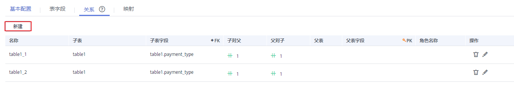

        **表 4**  新建关系参数说明

        
        <table><thead align="left"><tr id="row14727104641918"><th class="cellrowborder" valign="top" width="17.41%" id="mcps1.2.3.1.1">
参数名称

        </th>
        <th class="cellrowborder" valign="top" width="82.59%" id="mcps1.2.3.1.2">
说明

        </th>
        </tr>
        </thead>
        <tbody><tr id="row1372734617198"><td class="cellrowborder" valign="top" width="17.41%" headers="mcps1.2.3.1.1 ">
名称

        </td>
        <td class="cellrowborder" valign="top" width="82.59%" headers="mcps1.2.3.1.2 ">
每个关系有一个名称来描述关系的功能。

        </td>
        </tr>
        <tr id="row10728134619198"><td class="cellrowborder" valign="top" width="17.41%" headers="mcps1.2.3.1.1 ">
子表

        </td>
        <td class="cellrowborder" valign="top" width="82.59%" headers="mcps1.2.3.1.2 ">
单击该字段可在下拉列表中选择表。单击可设置当前表为子表。

        </td>
        </tr>
        <tr id="row932185162616"><td class="cellrowborder" valign="top" width="17.41%" headers="mcps1.2.3.1.1 ">
子表字段

        </td>
        <td class="cellrowborder" valign="top" width="82.59%" headers="mcps1.2.3.1.2 ">
选择子表的字段。

        </td>
        </tr>
        <tr id="row207281246171913"><td class="cellrowborder" valign="top" width="17.41%" headers="mcps1.2.3.1.1 ">
子对父

        </td>
        <td class="cellrowborder" valign="top" width="82.59%" headers="mcps1.2.3.1.2 ">
：表示每条子表数据在父表中有且只有一条数据与之对应。

        
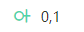：表示每条子表数据在父表中最多有一条数据与之对应。

        
：表示每条子表数据在父表中可能有多条数据与之对应。

        
：表示每条子表数据在父表中至少有一条数据与之对应。

        </td>
        </tr>
        <tr id="row107285462198"><td class="cellrowborder" valign="top" width="17.41%" headers="mcps1.2.3.1.1 ">
父对子

        </td>
        <td class="cellrowborder" valign="top" width="82.59%" headers="mcps1.2.3.1.2 ">
：表示每条父表数据在子表中有且只有一条数据与之对应。

        
：表示每条父表数据在子表中最多有一条数据与之对应。

        
：表示每条父表数据在子表中可能有多条数据与之对应。

        
：表示每条父表数据在子表中至少有一条数据与之对应。

        </td>
        </tr>
        <tr id="row3523141332713"><td class="cellrowborder" valign="top" width="17.41%" headers="mcps1.2.3.1.1 ">
父表

        </td>
        <td class="cellrowborder" valign="top" width="82.59%" headers="mcps1.2.3.1.2 ">
选择与所选子表有逻辑关系的表。

        </td>
        </tr>
        <tr id="row19310734102711"><td class="cellrowborder" valign="top" width="17.41%" headers="mcps1.2.3.1.1 ">
父表字段

        </td>
        <td class="cellrowborder" valign="top" width="82.59%" headers="mcps1.2.3.1.2 ">
选择父表的字段。

        </td>
        </tr>
        <tr id="row87472016122713"><td class="cellrowborder" valign="top" width="17.41%" headers="mcps1.2.3.1.1 ">
角色名称

        </td>
        <td class="cellrowborder" valign="top" width="82.59%" headers="mcps1.2.3.1.2 ">
可以自定义一个角色名称，用于标识该关系。

        </td>
        </tr>
        <tr id="row572814611914"><td class="cellrowborder" valign="top" width="17.41%" headers="mcps1.2.3.1.1 ">
操作

        </td>
        <td class="cellrowborder" valign="top" width="82.59%" headers="mcps1.2.3.1.2 ">
单击可删除一条关系。单击可编辑关系。

        </td>
        </tr>
        </tbody>
        </table>

    4.  在“映射”页面，单击“新建“新建映射，创建完成后单击“保存“。映射指的是给两个数据表（源表和目的表）建立起字段的对应关系。

        **图 8**  新建映射  
        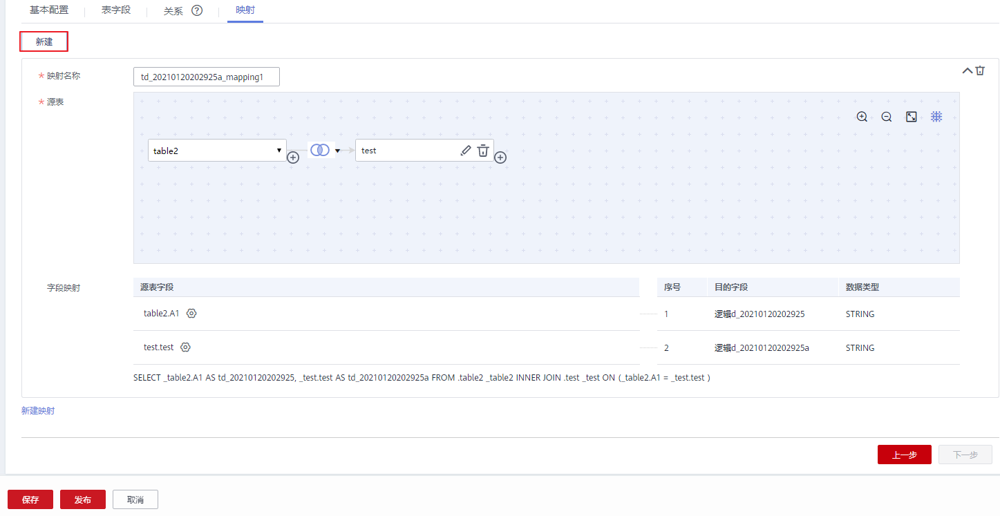

        -   **映射名称**：新建映射时会自动生成，用户可以手动修改。
        -   **源表**：如果数据来源于一个模型中的多个表，可以单击表名后的按钮为该表和其他表之间设置JOIN。

            **图 9**  设置源表JOIN条件  
            

            **表 5**  JOIN条件参数说明

            
            <table><thead align="left"><tr id="row492025715122"><th class="cellrowborder" valign="top" width="19.86%" id="mcps1.2.3.1.1">
参数名

            </th>
            <th class="cellrowborder" valign="top" width="80.14%" id="mcps1.2.3.1.2">
参数说明

            </th>
            </tr>
            </thead>
            <tbody><tr id="row692025751216"><td class="cellrowborder" valign="top" width="19.86%" headers="mcps1.2.3.1.1 ">
JOIN表

            </td>
            <td class="cellrowborder" valign="top" width="80.14%" headers="mcps1.2.3.1.2 ">
下拉选择需要和源表建立JOIN关系的表。

            </td>
            </tr>
            <tr id="row139201057181210"><td class="cellrowborder" valign="top" width="19.86%" headers="mcps1.2.3.1.1 ">
JOIN方式

            </td>
            <td class="cellrowborder" valign="top" width="80.14%" headers="mcps1.2.3.1.2 ">
从左到右依次表示left JOIN、right JOIN、inner JOIN、outer JOIN。

            </td>
            </tr>
            <tr id="row129207570128"><td class="cellrowborder" valign="top" width="19.86%" headers="mcps1.2.3.1.1 ">
JOIN字段

            </td>
            <td class="cellrowborder" valign="top" width="80.14%" headers="mcps1.2.3.1.2 ">
JOIN字段一般选择源表和JOIN表中含义相同的字段，单击或按钮增加或删除JOIN字段。JOIN字段之间是and的关系。

            </td>
            </tr>
            </tbody>
            </table>

        -   **字段映射：**为来源于当前映射的字段，依次选择一个含义相同的源字段。

4.  单击“发布“，选择审核人，再单击“确认提交”提交审核。

    等待审核人员审核，审核通过后，返回模型页面，在列表中可以查看建好的表。

## 逻辑模型转换为物理模型

完成逻辑模型的创建后，您可以将逻辑模型转换为物理模型，支持转换为新的物理模型或已有的物理模型。

1.  在DGC控制台首页，选择对应工作空间的“规范设计“模块，进入规范设计页面。

    **图 10**  选择规范设计  
    

1.  在规范设计控制台，单击左侧导航树中的“关系建模“。
2.  在总览图中找到所需要的逻辑模型，将光标移动到该卡片上，单击该模型的转换按钮。

    **图 11**  逻辑模型转换  
    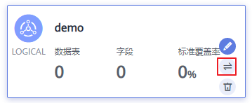

3.  在“转换为物理模型“对话框中，配置如下参数，然后单击“确定“。

    **图 12**  转换为物理模型  
    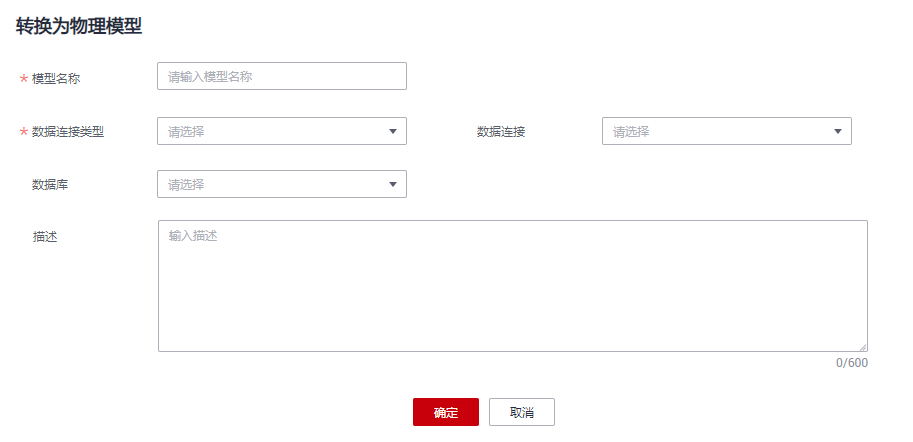

    **表 6**  参数描述

    
    <table><thead align="left"><tr id="zh-cn_topic_0189641497_row1667010516314"><th class="cellrowborder" valign="top" width="19.67%" id="mcps1.2.3.1.1">
参数名称

    </th>
    <th class="cellrowborder" valign="top" width="80.33%" id="mcps1.2.3.1.2">
说明

    </th>
    </tr>
    </thead>
    <tbody><tr id="zh-cn_topic_0189641497_row76702511632"><td class="cellrowborder" valign="top" width="19.67%" headers="mcps1.2.3.1.1 ">
模型名称

    </td>
    <td class="cellrowborder" valign="top" width="80.33%" headers="mcps1.2.3.1.2 ">
逻辑模型所需转换的物理模型的名称。您可以输入一个新的模型名称，系统会创建该新模型，也可以在下拉列表中选择一个已有的模型。

    
模型名称只能包含中文、英文字母、数字和下划线。

    </td>
    </tr>
    <tr id="zh-cn_topic_0189641497_row773411477438"><td class="cellrowborder" valign="top" width="19.67%" headers="mcps1.2.3.1.1 ">
数据连接类型

    </td>
    <td class="cellrowborder" valign="top" width="80.33%" headers="mcps1.2.3.1.2 ">
在下拉列表中选择数据连接类型。

    </td>
    </tr>
    <tr id="zh-cn_topic_0189641497_row189791893448"><td class="cellrowborder" valign="top" width="19.67%" headers="mcps1.2.3.1.1 ">
数据连接

    </td>
    <td class="cellrowborder" valign="top" width="80.33%" headers="mcps1.2.3.1.2 ">
选择所需要的数据连接。同一个关系模型一般建议使用统一的数据连接。

    
如果您还未创建与数据源之间的数据连接，请前往DGC管理中心控制台进行创建，详情请参见<a href="创建数据连接.md">创建数据连接</a>。

    </td>
    </tr>
    <tr id="row146210418275"><td class="cellrowborder" valign="top" width="19.67%" headers="mcps1.2.3.1.1 ">
数据库

    </td>
    <td class="cellrowborder" valign="top" width="80.33%" headers="mcps1.2.3.1.2 ">
选择数据库。如果您还未创建数据库，可以前往DGC数据开发控制台进行创建，详情请参见<a href="新建数据库.md">新建数据库</a>。

    </td>
    </tr>
    <tr id="row13836162232713"><td class="cellrowborder" valign="top" width="19.67%" headers="mcps1.2.3.1.1 ">
队列

    </td>
    <td class="cellrowborder" valign="top" width="80.33%" headers="mcps1.2.3.1.2 ">
DLI队列。该参数仅DLI连接类型有效。

    </td>
    </tr>
    <tr id="row01101937142714"><td class="cellrowborder" valign="top" width="19.67%" headers="mcps1.2.3.1.1 ">
Schema

    </td>
    <td class="cellrowborder" valign="top" width="80.33%" headers="mcps1.2.3.1.2 ">
DWS的模式。该参数仅支持DWS连接类型。

    </td>
    </tr>
    <tr id="zh-cn_topic_0189641497_row7670195110319"><td class="cellrowborder" valign="top" width="19.67%" headers="mcps1.2.3.1.1 ">
描述

    </td>
    <td class="cellrowborder" valign="top" width="80.33%" headers="mcps1.2.3.1.2 ">
描述信息。支持的长度为0~600个字符。

    </td>
    </tr>
    </tbody>
    </table>

4.  转换为物理模型后，您可以为该物理模型设置分层，您可以选择SDI层或DWI层。如[图13](#fig1150710347237)，在物理模型中找到转换后的物理模型，将光标移动到该卡片上，单击该模型的编辑按钮，进入“编辑物理模型”弹窗。

    **图 13**  设置物理模型分层  
    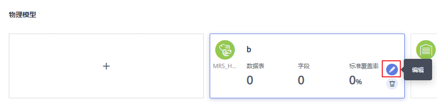

    进入“编辑物理模型”弹窗后，选择“数仓分层”，下拉选择SDI或DWI分层。

    -   **SDI**：Source Data Integration，又称贴源数据层。SDI是源系统数据的简单落地。
    -   **DWI**：Data Warehouse Integration，又称数据整合层。DWI整合多个源系统数据，对源系统进来的数据进行整合、清洗，并基于三范式进行关系建模。

    **图 14**  编辑物理模型  
    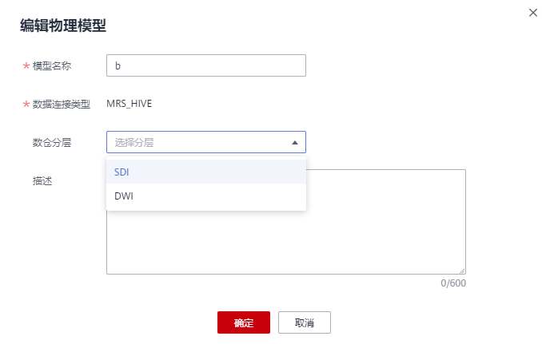

