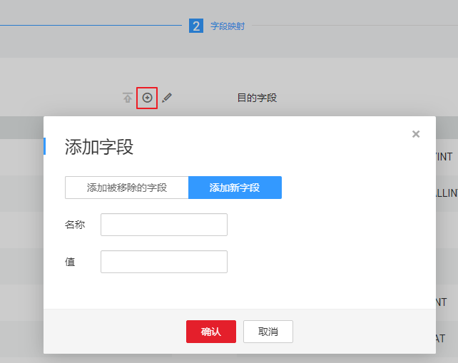

# 配置Elasticsearch或云搜索服务源端参数

作业中源连接为[配置Elasticsearch/云搜索服务（CSS）连接](配置Elasticsearch-云搜索服务（CSS）连接.md#dgc_01_0035)时，源端作业参数如[表1](#zh-cn_topic_0108275408_table5046103815165)所示。

**表 1**  Elasticsearch作为源端时的作业参数

<table><thead align="left"><tr id="zh-cn_topic_0108275408_row585315215165"><th class="cellrowborder" valign="top" width="17.948205179482052%" id="mcps1.2.4.1.1">
参数名

</th>
<th class="cellrowborder" valign="top" width="63.313668633136686%" id="mcps1.2.4.1.2">
说明

</th>
<th class="cellrowborder" valign="top" width="18.738126187381262%" id="mcps1.2.4.1.3">
取值样例

</th>
</tr>
</thead>
<tbody><tr id="zh-cn_topic_0108275408_row4012116315165"><td class="cellrowborder" valign="top" width="17.948205179482052%" headers="mcps1.2.4.1.1 ">
索引

</td>
<td class="cellrowborder" valign="top" width="63.313668633136686%" headers="mcps1.2.4.1.2 ">
Elasticsearch的索引，类似关系数据库中的数据库名称。索引名称只能全部小写，不能有大写。

</td>
<td class="cellrowborder" valign="top" width="18.738126187381262%" headers="mcps1.2.4.1.3 ">
index

</td>
</tr>
<tr id="zh-cn_topic_0108275408_row1497845915165"><td class="cellrowborder" valign="top" width="17.948205179482052%" headers="mcps1.2.4.1.1 ">
类型

</td>
<td class="cellrowborder" valign="top" width="63.313668633136686%" headers="mcps1.2.4.1.2 ">
Elasticsearch的类型，类似关系数据库中的表名称。类型名称只能全部小写，不能有大写。

</td>
<td class="cellrowborder" valign="top" width="18.738126187381262%" headers="mcps1.2.4.1.3 ">
type

</td>
</tr>
<tr id="zh-cn_topic_0108275408_row15286142463917"><td class="cellrowborder" valign="top" width="17.948205179482052%" headers="mcps1.2.4.1.1 ">
拆分nested类型字段

</td>
<td class="cellrowborder" valign="top" width="63.313668633136686%" headers="mcps1.2.4.1.2 ">
可选参数，选择是否将nested字段的json内容拆分，例如：将“a:{ b:{ c:1, d:{ e:2, f:3 } } }”拆成三个字段“a.b.c”、“a.b.d.e”、“a.b.d.f”。

</td>
<td class="cellrowborder" valign="top" width="18.738126187381262%" headers="mcps1.2.4.1.3 ">
否

</td>
</tr>
<tr id="zh-cn_topic_0108275408_row4983279398"><td class="cellrowborder" valign="top" width="17.948205179482052%" headers="mcps1.2.4.1.1 ">
过滤条件

</td>
<td class="cellrowborder" valign="top" width="63.313668633136686%" headers="mcps1.2.4.1.2 ">
可选参数，使用Elasticsearch的查询字符串（query string）对源数据进行过滤，CDM只迁移满足过滤条件的数据。

多条查询条件可以用大写“AND”分隔，且AND前后要有空格，例如：“last_name:Smith AND last_name:John”

</td>
<td class="cellrowborder" valign="top" width="18.738126187381262%" headers="mcps1.2.4.1.3 ">
last_name:Smith

</td>
</tr>
<tr id="zh-cn_topic_0108275408_row1969518119321"><td class="cellrowborder" valign="top" width="17.948205179482052%" headers="mcps1.2.4.1.1 ">
抽取元字段

</td>
<td class="cellrowborder" valign="top" width="63.313668633136686%" headers="mcps1.2.4.1.2 ">
表示是否抽取索引的元字段，目前只支持（_index、_type、_id、_score）例如：_index、_type、_id、_score

</td>
<td class="cellrowborder" valign="top" width="18.738126187381262%" headers="mcps1.2.4.1.3 ">
是

</td>
</tr>
</tbody>
</table>

在下一步的字段映射中，源端和目的端均支持配置自定义字段。

**图 1**  配置自定义字段  

