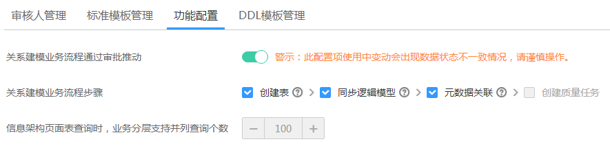
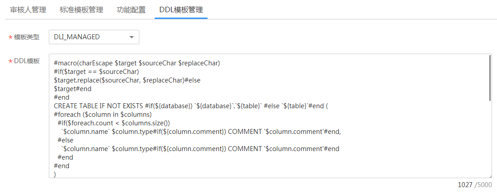

# 配置中心

## 配置数据标准模板

1.  [登录DAYU控制台](https://console.huaweicloud.com/dayu/)，找到所需要的DAYU实例，单击实例卡片上的“进入控制台”，进入概览页面。

    选择“空间管理”页签，完成工作空间的创建。

    在工作空间列表中，找到所需要的工作空间。

1.  单击相应工作空间的“规范设计“。

    系统跳转至规范设计页面。

1.  在规范设计页面，单击左侧导航树中的“配置中心“，进入相应页面后再单击“标准模板管理“。
2.  如下图所示，在“可选项”中勾选所需要的选项，单击按钮可以添加自定义项，完成后单击“确定“。

    **图 1**  数据标准模板1  
    

    保存模板后，在新建数据标准时，将需要设置此处模板中选中的选项。

## 配置关系建模业务流程

1.  在规范设计页面，单击左侧导航树中的“配置中心“，进入相应页面后再单击“功能配置“。
2.  如下图所示，配置如下参数，然后单击“确定“。如果单击“恢复默认”可恢复默认设置。

    -   **关系建模业务流程通过审批推动**：默认为开启。开启时，关系建模的业务流程，都需要经过审核人审批。关闭该配置项时，则不需要审批。

        > **说明：**   
        >-   在使用过程中，如果变更此配置项，可能会出现数据状态不一致情况，请谨慎操作。  

    -   **关系建模业务流程步骤**：在关系建模业务流程过程中，所选的流程系统会自动完成。
    -   **信息架构页面表查询时，业务分层支持并列查询个数**：默认为1个，暂不支持设置。

    **图 2**  数据标准模板2  
    

## DDL模板管理

1.  在规范设计页面，单击左侧导航树中的“配置中心“，进入相应页面后再单击“DDL模板管理“。
2.  如下图所示，配置如下参数，然后单击“确定“。如果单击“恢复默认”可恢复默认设置。

    **图 3**  数据标准模板3  
    

