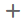
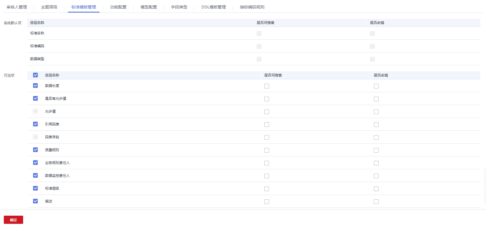
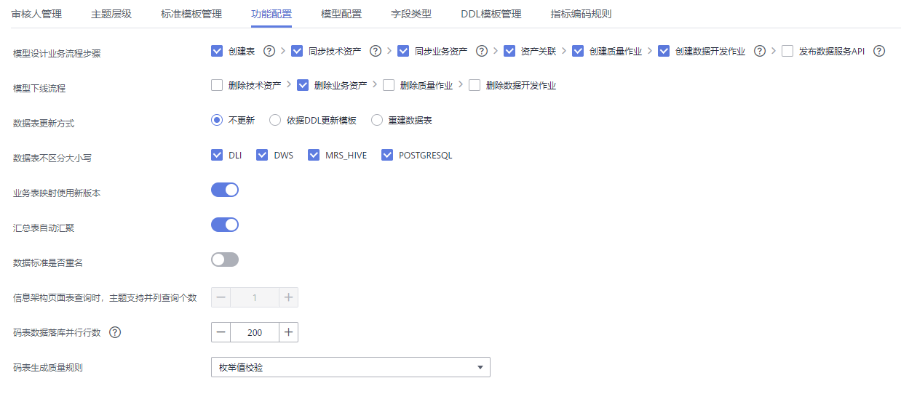
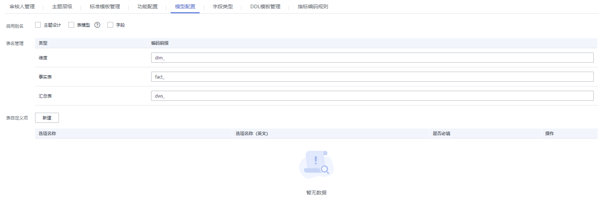
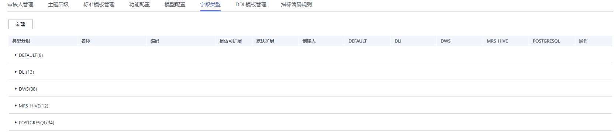
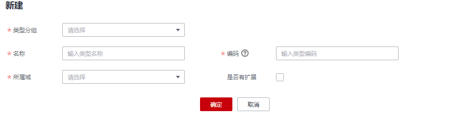
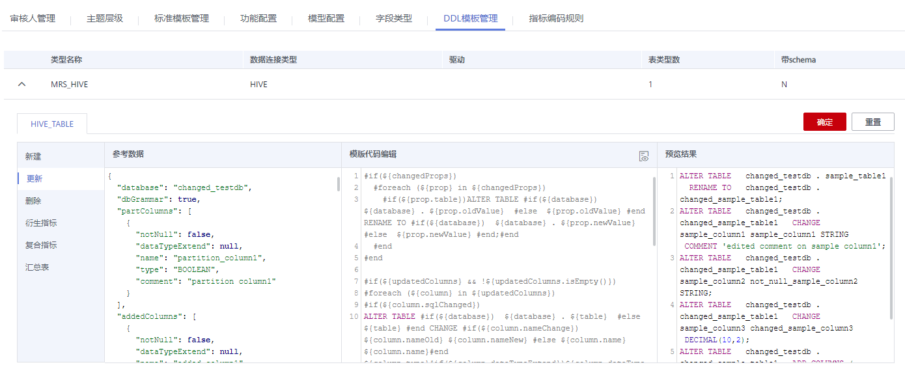

# 配置中心

## 主题层级

主题层级配置用于自定义主题设计中的主题层级。系统默认有三个层级，从上到下分别命名为主题域分组（L1）、主题域（L2）、业务对象（L3）。您可以自定义的主题层级限制在最大7层，最少2层。

1.  在DGC控制台首页，选择对应工作空间的“规范设计“模块，进入规范设计页面。

    **图 1**  选择规范设计  
    

2.  在规范设计控制台，单击左侧导航树中的“配置中心“，进入相应页面后再单击“主题层级“。
3.  在“操作”栏中单击按钮可以添加自定义主题层级项，完成后单击“确定“。
4.  在“操作”栏中单击按钮可以删除主题层级项，完成后单击“确定“。
5.  除最后一层业务对象外，其它层级均可以通过单击对应的层级名称实现“编辑“操作。

## 标准模板管理

标准模板管理用于自定义数据标准的默认选项。首次进入规范设计的数据标准页面，也会显示制定数据标准模板的页面。

1.  在DGC控制台首页，选择对应工作空间的“规范设计“模块，进入规范设计页面。

    **图 2**  选择规范设计  
    

1.  在规范设计控制台，单击左侧导航树中的“配置中心“，进入相应页面后再单击“标准模板管理“。
2.  如下图所示，在“可选项”中勾选所需要的选项，单击“新建“按钮可以添加自定义项，完成后单击“确定“。

    > **说明：** 
    >-   标准模板支持“是否可搜索“、“是否必填“。
    >-   保存模板后，那么在新建数据标准时，需要用户设置此处模板中选中的选项的参数值。

    **图 3**  标准模板管理  
    

## 功能配置

功能配置用于自定义规范设计中的各项功能。

1.  在DGC控制台首页，选择对应工作空间的“规范设计“模块，进入规范设计页面。

    **图 4**  选择规范设计  
    

2.  在规范设计控制台，单击左侧导航树中的“配置中心“，进入相应页面后再单击“功能配置“。
3.  在功能配置页面，可根据用户具体的功能需求配置参数，然后单击“确定“。如果单击“重置”可恢复默认设置。

    **图 5**  功能配置  
    

    -   **模型设计业务流程步骤**：此处勾选的流程，在关系建模或维度建模的对象发布上线时，系统会依次自动执行。一般建议全部勾选。
        -   **创建表**：当规范设计中的表发布并通过审核后，系统将自动在对应的数据源中创建相应的物理表。在表删除时，系统也会自动删除物理表。
        -   **同步技术资产**：关系建模或维度建模中的表发布后，同步表到数据资产模块作为技术资产，同时同步标签到对应技术资产。

            > **说明：** 
            >若开启“同步技术资产“功能，您必须预先在DGC数据资产模块中对表所属的数据库创建数据资产采集任务并采集成功，否则同步技术资产将会执行失败。

        -   **同步业务资产**：同步逻辑模型到数据资产，作为业务资产，同时同步标签到对应业务资产。
        -   **资产关联**：实现业务资产与技术资产的关联。业务资产与技术资产同步完成后，在数据资产模块中查看对应的业务资产或技术资产详情时，可以看到相关联的技术资产或业务资产。该功能要求表信息中含有数据源信息。
        -   **创建质量作业**：当关系建模或维度建模中的表发布并通过审核后，对于关联数据标准（包含数据长度或允许值）或关联质量规则的表，系统将自动在DGC数据质量模块中创建一个质量作业。
        -   **创建数据开发作业**：汇总表发布后，自动生成端到端的全流程数据开发作业。
        -   **发布数据服务API**：汇总表发布后，自动生成数据服务API，此功能仅当数据服务支持汇总表的数据连接时生效。
        -   **数据落库**：码表维度发布后，会自动将码表的数值填入维度表中。

    -   **模型下线流程**：选择当模型下线时，是否同步删除技术资产、业务资产、质量作业、数据开发作业。
    -   **数据表更新方式**：当规范设计中的表在发布后进行了修改，是否同时更新数据库中的表。默认为“不更新“，但在配置中心可以依据自己的需求设置更新动作。依据DDL模板, 在模板里面配置对应的更新语句即可。
        -   **不更新**：不更新数据库中的表。
        -   **依据DDL更新模板**：依据[DDL模板管理](#zh-cn_topic_0189687297_section216611014612)中配置的DDL更新模板，更新数据库中的表，但能否更新成功是由底层数仓引擎的支持情况决定的。由于不同类型的数仓支持的更新表的能力不同，在规范设计控制台中所做的表更新操作，如果数仓不支持，则无法确保数据库中的表和规范设计中的表是一致的。例如，DLI类型的表更新操作不支持删除表字段，如果在规范设计的表中删除了表字段，则无法在数据库中相应的删除表字段。

            如果线下数据库支持更新表架构语法，可以在DDL模板配置对应语法,  之后更新操作就可以通过DGC管控；如果线下数据库不支持更新, 那只有通过重建这种方式更新。

        -   **重建数据表**：先删除数据库中已有的表，再重新创建表。选择该选项可以确保数据库中的表和规范设计中的表是一致的，但是由于会先删除表，因此一般建议只在开发设计阶段或测试阶段使用该选项，产品上线后不推荐使用该选项。

    -   **数据表不区分大小写**：对于选中的连接类型，在发布相应类型的表时，同步技术资产时名称将不区分大小写，找到相同的即认为已存在。
    -   **业务表映射使用新版本**：系统默认为新版本映射。新版本映射功能支持join等操作，推荐使用新版本映射。
    -   **汇总表自动汇聚**：发布衍生指标或复合指标时，系统支持自动生成汇总表，一个统计维度对应一个汇总表。自动生成的汇总表可在汇总表页面下选择“自动汇聚“页签查看。
    -   **数据标准是否重名**：默认打开，打开后数据标准可以重名。
    -   **信息架构页面表查询时，主题支持并列查询个数**：默认为1个，暂不支持设置。
    -   **码表数据落库并行行数**：码表维度发布后，设置将码表的数值填入维度表中时的并行操作行数。当码表数值较多时，会导致落库失败，可以适当调小该参数。
    -   **码表生成质量规则**：下拉选择即可。当码表的数据量较小时，选择“枚举值校验“即可；否则选择字段一致性校验。
    -   **生成数据服务API**：下拉选择即可。根据实际业务需要选择按汇总表指标生成一个或多个API。

## 模型配置

当您在主题设计、模型设计等过程中，如果需要进行如下操作，您可以通过本页面进行配置：

-   增加主题别名、表模型别名、字段别名。
-   设置维度（维度表）、事实表、汇总表的默认表编码前缀。
-   增加表的自定义字段。

**图 6**  模型配置  

在规范设计控制台，单击左侧导航树中的“配置中心“，进入相应页面后再单击“模型配置“Tab页。

-   启用别名。在“模型配置“页面，您可以增加别名。
    -   选项说明如下：
        -   主题设计：选择之后，在新建、编辑主题时，必须输入别名。
        -   表模型：选择之后，在新建、编辑表时，必须输入别名。会影响业务表、维度（维度表）、事实表和汇总表等。
        -   字段：选择之后，在新建、编辑表字段时，必须输入别名。

-   表名管理。设置维度（维度表）、事实表和汇总表的默认表编码前缀。
-   表自定义项。在新建、编辑表时，可以在表的基本设置中设置自定义的字段。会影响业务表、维度（维度表）、事实表和汇总表等。

## 字段类型管理

当您执行新建表、逆向数据库或模型转换等操作时，如果系统默认的数据类型或不同数据源之间的数据类型映射关系无法满足需求，您可以增加、删除或修改数据类型。系统默认的数据类型不支持删除。

1.  在规范设计控制台，单击左侧导航树中的“配置中心“，进入相应页面后再单击“字段类型“Tab页。
2.  在“字段类型“页面，您可以查看数据类型及不同数据源之间的数据类型映射关系，其中“创建人“为SYSTEM的类型为系统默认的字段类型。

    类型分组说明如下：

    -   DEFAULT：通用数据类型，未指定数据源类型时建表所用的字段类型。例如，新建逻辑模型的表时，就是使用DEFAULT分组中的数据类型。
    -   DLI：DLI连接类型的表的数据类型。
    -   DWS：DWS连接类型的表的数据类型。
    -   MRS\_HIVE：MRS\_HIVE连接类型的表的数据类型。
    -   POSTGRESQL：POSTGRESQL连接类型的表的数据类型。

    **图 7**  字段类型  
    

3.  管理字段类型。
    -   **新建类型**

        如果要增加数据类型，单击“新建“按钮。在弹出对话框中，配置如下参数，然后单击“确定“。

        **图 8**  新建类型  
        

        **表 1**  基本配置

        
        <table><thead align="left"><tr id="row14491146132113"><th class="cellrowborder" valign="top" width="22.48%" id="mcps1.2.3.1.1">
参数名称

        </th>
        <th class="cellrowborder" valign="top" width="77.52%" id="mcps1.2.3.1.2">
说明

        </th>
        </tr>
        </thead>
        <tbody><tr id="row149116614211"><td class="cellrowborder" valign="top" width="22.48%" headers="mcps1.2.3.1.1 ">
类型分组

        </td>
        <td class="cellrowborder" valign="top" width="77.52%" headers="mcps1.2.3.1.2 ">
选择新建类型所属的类型分组。

        </td>
        </tr>
        <tr id="row194915672114"><td class="cellrowborder" valign="top" width="22.48%" headers="mcps1.2.3.1.1 ">
名称

        </td>
        <td class="cellrowborder" valign="top" width="77.52%" headers="mcps1.2.3.1.2 ">
数据类型的名称。只能包含中文、英文字母、数字、左右括号、空格和下划线，且以中文或英文字母开头。

        </td>
        </tr>
        <tr id="row0491166182116"><td class="cellrowborder" valign="top" width="22.48%" headers="mcps1.2.3.1.1 ">
编码

        </td>
        <td class="cellrowborder" valign="top" width="77.52%" headers="mcps1.2.3.1.2 ">
数据类型的编码，必须为数仓支持的类型。只能包含大写英文字母和下划线。

        </td>
        </tr>
        <tr id="row949196122111"><td class="cellrowborder" valign="top" width="22.48%" headers="mcps1.2.3.1.1 ">
所属域

        </td>
        <td class="cellrowborder" valign="top" width="77.52%" headers="mcps1.2.3.1.2 ">
选择新建类型所属的域。

        </td>
        </tr>
        <tr id="row15461173283618"><td class="cellrowborder" valign="top" width="22.48%" headers="mcps1.2.3.1.1 ">
数仓对应类型

        </td>
        <td class="cellrowborder" valign="top" width="77.52%" headers="mcps1.2.3.1.2 ">
选择新建类型所映射连接的数据类型。

        </td>
        </tr>
        <tr id="row1049186182118"><td class="cellrowborder" valign="top" width="22.48%" headers="mcps1.2.3.1.1 ">
DLI

        </td>
        <td class="cellrowborder" valign="top" width="77.52%" headers="mcps1.2.3.1.2 ">
选择新建类型所映射的DLI连接的数据类型。

        </td>
        </tr>
        <tr id="row549119652118"><td class="cellrowborder" valign="top" width="22.48%" headers="mcps1.2.3.1.1 ">
DWS

        </td>
        <td class="cellrowborder" valign="top" width="77.52%" headers="mcps1.2.3.1.2 ">
选择新建类型所映射的DWS连接的数据类型。

        </td>
        </tr>
        <tr id="row194913662118"><td class="cellrowborder" valign="top" width="22.48%" headers="mcps1.2.3.1.1 ">
MRS_HIVE

        </td>
        <td class="cellrowborder" valign="top" width="77.52%" headers="mcps1.2.3.1.2 ">
选择新建类型所映射的MRS_HIVE连接的数据类型。

        </td>
        </tr>
        <tr id="row6350115753811"><td class="cellrowborder" valign="top" width="22.48%" headers="mcps1.2.3.1.1 ">
POSTGRESQL

        </td>
        <td class="cellrowborder" valign="top" width="77.52%" headers="mcps1.2.3.1.2 ">
选择新建类型所映射的POSTGRESQL连接的数据类型。

        </td>
        </tr>
        </tbody>
        </table>

    -   **编辑类型**

        在字段类型列表中，找到需要编辑的字段类型，然后单击按钮进行编辑，参数说明请参见[表1](#table134912662110)。

    -   **删除类型**

        仅支持对于用户新建的数据类型进行删除操作。“创建人“为SYSTEM的类型为系统默认的字段类型，不支持删除操作。

        在字段类型列表中，找到需要删除的字段类型，单击按钮，然后在弹出对话框中单击“确定“完成删除。

    -   **重置**

        单击“字段类型”页面底部的“重置“按钮，可恢复系统默认配置。

## DDL模板管理

在DGC规范设计中，支持修改各种类型（例如DLI、POSTGRESQL、DWS、Hive）的表或DLI视图的DDL模板。如果您需要将已创建的某一类型的表生成其他数据源的DDL语句，您就可以根据目标数据源的DDL语法，修改该类型的表的DDL模板。

1.  在规范设计控制台，单击左侧导航树中的“配置中心“，进入相应页面后再单击“DDL模板管理“。
2.  在“DDL模板管理“页面，您可以配置各种类型的表或DLI视图的DDL模板，您可以参考该页面中的“填写说明“修改DDL模板，修改完成后单击“确定“。如果单击“重置”可恢复默认设置。

    如[图9](#fig7642374597)所示，说明如下：

    -   “新建模板“页面：可查看或编辑新建表或DLI视图的DDL模板。
    -   “更新模板“页面：可查看或编辑更新表或DLI视图的DDL模板。
    -   “删除模板“页面：可查看或编辑删除表或DLI视图的DDL模板。
    -   衍生指标：可以查看或编辑衍生指标的SQL模板。
    -   复合指标：可以查看或编辑复合指标的SQL模板。
    -   汇总表：可以查看或编辑汇总表的SQL模板。
    -   “参考数据“区域：显示了一个表详情的示例，示例中的变量定义了表的详细信息。
    -   “模板代码编辑“区域：可以编辑DDL模板。如果您需要将所选类型的表，生成其他类型的数据库的DDL语句，您可以根据目标数据源的DDL语法，修改DDL模板。
    -   “预览结果“区域：编辑DDL模板后，可以预览按模板生成的DDL语句。

    **图 9**  DDL模板管理  
    

## 指标编码规则

1.  在规范设计控制台，单击左侧导航树中的“配置中心“，然后再选择“指标编码规则“页签。
2.  在“指标编码规则“页面，选择“数字码“的生成方式为“顺序码“或“随机数“，然后单击“确定“。如果单击“重置”可恢复默认设置。

    **图 10**  指标编码规则  
    

