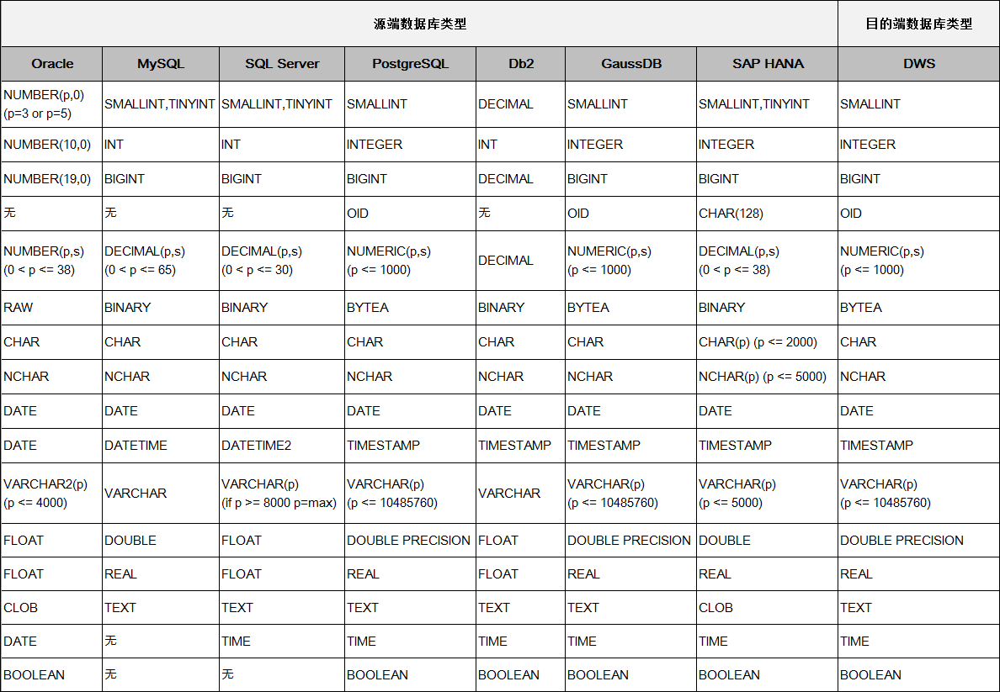

# 配置关系数据库目的端参数

作业中源连接为[配置关系数据库连接](配置关系数据库连接.md)，即将数据导入到以下数据源时，目的端作业参数如[表1](#zh-cn_topic_0108275472_table5046103815165)所示。

-   数据仓库（DWS）
-   云数据库 MySQL
-   云数据库 SQL Server
-   云数据库 PostgreSQL
-   分布式数据库中间件（DDM）

-   FusionInsight LibrA

-   MySQL

**表 1**  目的端为关系型数据库时的作业参数

<table><thead align="left"><tr id="zh-cn_topic_0108275472_row585315215165"><th class="cellrowborder" valign="top" width="25%" id="mcps1.2.4.1.1">
参数名

</th>
<th class="cellrowborder" valign="top" width="50%" id="mcps1.2.4.1.2">
说明

</th>
<th class="cellrowborder" valign="top" width="25%" id="mcps1.2.4.1.3">
取值样例

</th>
</tr>
</thead>
<tbody><tr id="zh-cn_topic_0108275472_row3619943316154"><td class="cellrowborder" valign="top" width="25%" headers="mcps1.2.4.1.1 ">
模式或表空间

</td>
<td class="cellrowborder" valign="top" width="50%" headers="mcps1.2.4.1.2 ">
待写入数据的数据库名称，支持自动创建Schema。单击输入框后面的按钮可选择模式或表空间。

</td>
<td class="cellrowborder" valign="top" width="25%" headers="mcps1.2.4.1.3 ">
schema

</td>
</tr>
<tr id="zh-cn_topic_0108275472_row3252957517235"><td class="cellrowborder" valign="top" width="25%" headers="mcps1.2.4.1.1 ">
自动创表

</td>
<td class="cellrowborder" valign="top" width="50%" headers="mcps1.2.4.1.2 ">
只有当源端和目的端都为关系数据库时，才有该参数。表示写入表数据时，用户选择的操作：<ul id="zh-cn_topic_0108275472_ul12109569172733"><li>不自动创建：不自动建表。</li><li>不存在时创建：当目的端的数据库没有“表名”参数中指定的表时，CDM会自动创建该表。如果“表名”参数配置的表已存在，则不创建，数据写入到已存在的表中。</li><li>先删除后创建：CDM先删除“表名”参数中指定的表，然后再重新创建该表。</li></ul>

当选择在DWS端自动创表时，DWS的表与源表的字段类型映射关系见<a href="#zh-cn_topic_0108275472_section1410713417473">在DWS端自动建表时的字段类型映射</a>。

</td>
<td class="cellrowborder" valign="top" width="25%" headers="mcps1.2.4.1.3 ">
不自动创建

</td>
</tr>
<tr id="zh-cn_topic_0108275472_row4012116315165"><td class="cellrowborder" valign="top" width="25%" headers="mcps1.2.4.1.1 ">
表名

</td>
<td class="cellrowborder" valign="top" width="50%" headers="mcps1.2.4.1.2 ">
写入数据的目标表名，单击输入框后面的按钮可进入表的选择界面。

该参数支持配置为时间宏变量，且一个路径名中可以有多个宏定义变量。使用时间宏变量和定时任务配合，可以实现定期同步新增数据，详细说明请参见<a href="使用时间宏变量完成增量同步.md">使用时间宏变量完成增量同步</a>。

</td>
<td class="cellrowborder" valign="top" width="25%" headers="mcps1.2.4.1.3 ">
table

</td>
</tr>
<tr id="zh-cn_topic_0108275472_row41161726145914"><td class="cellrowborder" valign="top" width="25%" headers="mcps1.2.4.1.1 ">
是否压缩

</td>
<td class="cellrowborder" valign="top" width="50%" headers="mcps1.2.4.1.2 ">
导入数据到DWS且选择自动创表时，用户可以指定是否压缩存储。

</td>
<td class="cellrowborder" valign="top" width="25%" headers="mcps1.2.4.1.3 ">
否

</td>
</tr>
<tr id="zh-cn_topic_0108275472_row15851636125910"><td class="cellrowborder" valign="top" width="25%" headers="mcps1.2.4.1.1 ">
存储模式

</td>
<td class="cellrowborder" valign="top" width="50%" headers="mcps1.2.4.1.2 ">
导入数据到DWS且选择自动创表时，用户可以指定存储模式：<ul id="zh-cn_topic_0108275472_ul8940124319413"><li>行模式：表的数据将以行式存储，适用于点查询（返回记录少，基于索引的简单查询），或者增删改比较多的场景。</li><li>列模式：表的数据将以列式存储，适用于统计分析类查询（group、join多的场景），或者即席查询（查询条件列不确定，行存无法确定索引）的场景。</li></ul>

</td>
<td class="cellrowborder" valign="top" width="25%" headers="mcps1.2.4.1.3 ">
行模式

</td>
</tr>
<tr id="zh-cn_topic_0108275472_row4729244132415"><td class="cellrowborder" valign="top" width="25%" headers="mcps1.2.4.1.1 ">
导入开始前

</td>
<td class="cellrowborder" valign="top" width="50%" headers="mcps1.2.4.1.2 ">
导入数据前，选择是否清除目的表的数据：<ul id="zh-cn_topic_0108275472_ul944616526261"><li>不清除：写入数据前不清除目标表中数据，数据追加写入。</li><li>清除全部数据：写入数据前会清除目标表中数据。</li><li>清除部分数据：需要配置“where条件”参数，CDM根据条件选择性删除目标表的数据。</li></ul>

</td>
<td class="cellrowborder" valign="top" width="25%" headers="mcps1.2.4.1.3 ">
清除部分数据

</td>
</tr>
<tr id="zh-cn_topic_0108275472_row355852742511"><td class="cellrowborder" valign="top" width="25%" headers="mcps1.2.4.1.1 ">
where条件

</td>
<td class="cellrowborder" valign="top" width="50%" headers="mcps1.2.4.1.2 ">
导入前根据where条件删除目的表的数据。

</td>
<td class="cellrowborder" valign="top" width="25%" headers="mcps1.2.4.1.3 ">
age &gt; 18 and age &lt;= 60

</td>
</tr>
<tr id="zh-cn_topic_0108275472_row1094865211712"><td class="cellrowborder" valign="top" width="25%" headers="mcps1.2.4.1.1 ">
先导入阶段表

</td>
<td class="cellrowborder" valign="top" width="50%" headers="mcps1.2.4.1.2 ">
如果选择“是”，则启用事务模式迁移，CDM会自动创建临时表，先将数据导入到该临时表，导入成功后再通过数据库的事务模式将数据迁移到目标表中，导入失败则将目的表回滚到作业开始之前的状态，具体请参见<a href="事务模式迁移.md">事务模式迁移</a>。

默认为“否”，CDM直接将数据导入到目的表。这种情况下如果作业执行失败，已经导入到目标表中的数据不会自动回滚。

 说明： 

如果“导入前清空数据”选择“是”，CDM的事务模式不会回滚已经删除的数据。

</td>
<td class="cellrowborder" valign="top" width="25%" headers="mcps1.2.4.1.3 ">
否

</td>
</tr>
<tr id="zh-cn_topic_0108275472_row9839022184517"><td class="cellrowborder" valign="top" width="25%" headers="mcps1.2.4.1.1 ">
扩大字符字段长度

</td>
<td class="cellrowborder" valign="top" width="50%" headers="mcps1.2.4.1.2 ">
选择自动创表时，迁移过程中可将字符类型的字段长度扩大为原来的3倍，再写入到目的表中。如果源端数据库与目的端数据库字符编码不一样，但目的表字符类型字段与源表一样，在迁移数据时，可能会有出现长度不足的错误。

应用场景主要是将有中文内容的字符字段导入到DWS时，需要自动将字符长度放大3倍。

在导入中文内容的字符到DWS时，如果作业执行失败，且日志中出现类似“value too long for type character varying”的错误，则可以通过启用该功能解决。

 说明： 

当启动该功能时，也会导致部分字段消耗用户相应的3倍存储空间。

</td>
<td class="cellrowborder" valign="top" width="25%" headers="mcps1.2.4.1.3 ">
否

</td>
</tr>
<tr id="zh-cn_topic_0108275472_row640517318403"><td class="cellrowborder" valign="top" width="25%" headers="mcps1.2.4.1.1 ">
使用非空约束

</td>
<td class="cellrowborder" valign="top" width="50%" headers="mcps1.2.4.1.2 ">
当选择自动创建目的表时，如果选择使用非空约束，则目的表字段的是否非空约束，与原表具有相应非空约束的字段保持一致。

</td>
<td class="cellrowborder" valign="top" width="25%" headers="mcps1.2.4.1.3 ">
是

</td>
</tr>
</tbody>
</table>

## 在DWS端自动建表时的字段类型映射

CDM在数据仓库服务（Data Warehouse Service，简称DWS）中自动建表时，DWS的表与源表的字段类型映射关系如[图1](#zh-cn_topic_0108275472_fig662181513539)所示。例如使用CDM将Oracle整库迁移到DWS，CDM在DWS上自动建表，会将Oracle的**NUMBER\(3,0\)**字段映射到DWS的**SMALLINT**。

**图 1**  DWS端自动建表时的字段映射  

