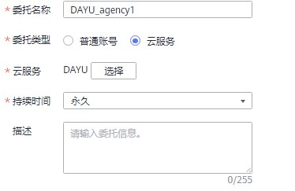
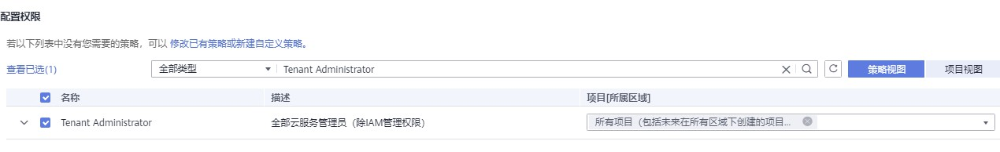
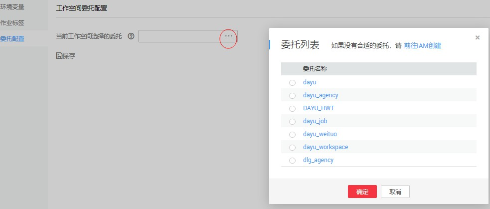
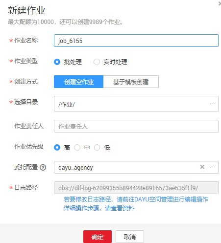

# 配置委托

数据开发模块的作业执行中会遇到如下问题：

-   数据开发模块的作业执行机制是以启动作业的用户身份执行该作业。对于按照周期调度方式执行的作业，当启动该作业的IAM帐号在调度周期内被删除后，系统无法获取用户身份认证信息，导致作业执行失败。
-   如果作业被低权限的用户启动，也会因为权限不足导致作业执行失败。

若需解决以上两个问题，则可配置委托。配置委托后，作业执行过程中，以委托的身份与其他服务交互，可以避免上述两种场景下作业执行失败。

## 委托的作用

由于云各服务之间存在业务交互关系，一些云服务需要与其他云服务协同工作，需要您创建云服务委托，将操作权限委托给该服务，让该服务以您的身份使用其他云服务，代替您进行一些资源运维工作。

## 委托的分类

委托分两类，工作空间委托和作业委托。

-   工作空间委托：工作空间级别的，全局委托。适用于该空间内的所有作业。
-   作业委托：适用于单个作业级别。

作业委托优先级高于工作空间委托，如果工作空间与作业级别的委托都没有配置，作业会以启动者的身份去执行。

## 约束限制

-   创建或修改委托需要用户具有Security Administrator权限。
-   配置工作空间级委托，需要用户具有DAYU Administrator或者Tenant Administrator权限。
-   配置作业级委托，具有查看列表委托权限的用户均可配置。

## 创建委托

1.  登录IAM服务控制台。
2.  选择“委托 \> 创建委托”。
3.  设置“委托名称”。例如：DGC\_agency。
4.  “委托类型”选择“云服务”，在“云服务”中选择“DGC”，将操作权限委托给DGC，让DGC以您的身份使用其他云服务，代替您进行一些资源运维工作。
5.  “持续时间”选择“永久”。

    **图 1**  创建委托  
    

6.  在“权限选择”区域中，单击“配置权限”。
7.  在弹出页面中搜索“Tenant Administrator”策略，勾选“Tenant Administrator”策略并单击“确定”，如[图2](#fig13792331596)所示。
    -   因Tenant Administrator策略具有除统一身份认证服务外，其他所有服务的所有执行权限。所以给委托服务DGC配置Tenant Administrator，可访问周边所有服务。
    -   若您想达到对权限较小化的安全管控要求，Tenant Administrator可不配置，仅配置OBS OperateAccess权限（因作业执行过程中，需要往obs写执行日志信息，因此需要添加 OBS OperateAccess权限。）。然后再根据作业中的节点类型，配置不同的委托权限。例如某作业仅包含Import GES节点，可配置GES Administrator权限和OBS OperateAccess权限即可。详细方案请参考[配置权限](#section1813152013116)。

        **图 2**  配置权限  
        

8.  单击“确定”完成委托创建。

## 配置权限

将帐号的操作权限委托给DGC服务后，需要配置委托身份的权限，才可与其他服务进行交互。

为实现对权限较小化的安全管控要求，可根据作业中的节点类型，以服务为粒度，参见[表1](#table18185359163814)配置相应的服务Admin权限。

也可精确到具体服务的操作、资源以及请求条件等。根据作业中的节点类型，以对应服务API接口为粒度进行权限拆分，满足企业对权限最小化的安全管控要求。参见[表2](#table116756441498)进行配置。例如包含Import GES节点的作业，您只需要创建自定义策略，并勾选ges:graph:getDetail（查看图详情），ges:jobs:getDetail（查询任务状态），ges:graph:access（使用图）这三个授权项即可。

> **须知：** 
>-   MRS相关的节点（MRS Presto SQL、MRS Spark、MRS Spark Python、MRS Flink Job、 MRS MapReduce），以及通过直连方式的（MRS Spark SQL、MRS Hive SQL）节点，由于部分MRS集群不支持委托方式提交作业，所以这类作业不能配置委托。
>-   支持委托方式提交作业的MRS集群如下：
>    -   非安全集群
>    -   安全集群，集群版本大于 2.1.0，并且安装了MRS 2.1.0.1以上的补丁。

-   配置服务级Admin权限

    因作业执行过程中，需要往obs写执行日志信息，因此粗粒度授权时，所有作业都需要添加 OBS OperateAccess权限。

**表 1**  配置相关节点的admin权限

<table><thead align="left"><tr id="row7185105916385"><th class="cellrowborder" valign="top" width="27.089999999999996%" id="mcps1.2.4.1.1">
节点名称

</th>
<th class="cellrowborder" valign="top" width="22.68%" id="mcps1.2.4.1.2">
系统权限

</th>
<th class="cellrowborder" valign="top" width="50.23%" id="mcps1.2.4.1.3">
权限描述

</th>
</tr>
</thead>
<tbody><tr id="row121861359123816"><td class="cellrowborder" valign="top" width="27.089999999999996%" headers="mcps1.2.4.1.1 ">
CDM Job、DIS Stream、DIS Dump、DIS Client

</td>
<td class="cellrowborder" valign="top" width="22.68%" headers="mcps1.2.4.1.2 ">
DAYU Administrator

</td>
<td class="cellrowborder" valign="top" width="50.23%" headers="mcps1.2.4.1.3 ">
数据湖治理中心服务的所有执行权限。

</td>
</tr>
<tr id="row2186559113815"><td class="cellrowborder" valign="top" width="27.089999999999996%" headers="mcps1.2.4.1.1 ">
Import GES

</td>
<td class="cellrowborder" valign="top" width="22.68%" headers="mcps1.2.4.1.2 ">
GES Administrator

</td>
<td class="cellrowborder" valign="top" width="50.23%" headers="mcps1.2.4.1.3 ">
图引擎服务的所有执行权限。该角色有依赖，需要在同项目中勾选依赖的角色：Tenant Guest、Server Administrator。

</td>
</tr>
<tr id="row1618615595381"><td class="cellrowborder" valign="top" width="27.089999999999996%" headers="mcps1.2.4.1.1 "><ul id="ul64961737858"><li>MRS Presto SQL、MRS Spark、MRS Spark Python、MRS Flink Job、 MRS MapReduce</li><li>MRS Spark SQL、MRS Hive SQL（通过MRS API方式连接MRS集群的）</li></ul>
</td>
<td class="cellrowborder" valign="top" width="22.68%" headers="mcps1.2.4.1.2 ">
MRS Administrator

KMS Administrator

</td>
<td class="cellrowborder" valign="top" width="50.23%" headers="mcps1.2.4.1.3 ">
MRS Administrator：MapReduce服务的所有执行权限。该角色有依赖，需要在同项目中勾选依赖的角色：Tenant Guest、Server Administrator。

KMS Administrator：数据加密服务加密密钥的管理员权限。

</td>
</tr>
<tr id="row518675913383"><td class="cellrowborder" valign="top" width="27.089999999999996%" headers="mcps1.2.4.1.1 ">
MRS Spark SQL、MRS Hive SQL、MRS Kafka、Kafka Client（通过代理方式连接集群）

</td>
<td class="cellrowborder" valign="top" width="22.68%" headers="mcps1.2.4.1.2 ">
DAYU Administrator

KMS Administrator

</td>
<td class="cellrowborder" valign="top" width="50.23%" headers="mcps1.2.4.1.3 ">
DAYU Administrator：数据湖治理中心服务的所有执行权限。

KMS Administrator：数据加密服务加密密钥的管理员权限。

</td>
</tr>
<tr id="row17186115916388"><td class="cellrowborder" valign="top" width="27.089999999999996%" headers="mcps1.2.4.1.1 ">
DLI Flink Job、DLI SQL、DLI Spark

</td>
<td class="cellrowborder" valign="top" width="22.68%" headers="mcps1.2.4.1.2 ">
DLI Service Admin

</td>
<td class="cellrowborder" valign="top" width="50.23%" headers="mcps1.2.4.1.3 ">
数据湖探索的所有执行权限。

</td>
</tr>
<tr id="row121861259173817"><td class="cellrowborder" valign="top" width="27.089999999999996%" headers="mcps1.2.4.1.1 ">
DWS SQL、Shell、RDS SQL（通过代理方式连接数据源）

</td>
<td class="cellrowborder" valign="top" width="22.68%" headers="mcps1.2.4.1.2 ">
DAYU Administrator

KMS Administrator

</td>
<td class="cellrowborder" valign="top" width="50.23%" headers="mcps1.2.4.1.3 ">
DAYU Administrator：数据湖治理中心服务的所有执行权限。

KMS Administrator：数据加密服务加密密钥的管理员权限。

</td>
</tr>
<tr id="row18186759113812"><td class="cellrowborder" valign="top" width="27.089999999999996%" headers="mcps1.2.4.1.1 ">
CSS

</td>
<td class="cellrowborder" valign="top" width="22.68%" headers="mcps1.2.4.1.2 ">
DAYU Administrator

Elasticsearch Administrator

</td>
<td class="cellrowborder" valign="top" width="50.23%" headers="mcps1.2.4.1.3 ">
DAYU Administrator：数据湖治理中心服务的所有执行权限。

Elasticsearch Administrator：云搜索服务的所有执行权限。该角色有依赖，需要在同项目中勾选依赖的角色：Tenant Guest、Server Administrator。

</td>
</tr>
<tr id="row9848017191714"><td class="cellrowborder" valign="top" width="27.089999999999996%" headers="mcps1.2.4.1.1 ">
Create OBS、Delete OBS、OBS Manager

</td>
<td class="cellrowborder" valign="top" width="22.68%" headers="mcps1.2.4.1.2 ">
OBS OperateAccess

</td>
<td class="cellrowborder" valign="top" width="50.23%" headers="mcps1.2.4.1.3 ">
查看桶、上传对象、获取对象、删除对象、获取对象ACL等对象基本操作权限

</td>
</tr>
<tr id="row11507113141714"><td class="cellrowborder" valign="top" width="27.089999999999996%" headers="mcps1.2.4.1.1 ">
SMN

</td>
<td class="cellrowborder" valign="top" width="22.68%" headers="mcps1.2.4.1.2 ">
SMN Administrator

</td>
<td class="cellrowborder" valign="top" width="50.23%" headers="mcps1.2.4.1.3 ">
消息通知服务的所有执行权限。

</td>
</tr>
</tbody>
</table>

-   配置细粒度权限（根据各服务支持的授权项，创建自定义策略。）

    创建自定义策略的详细操作请参见[创建自定义策略](https://support.huaweicloud.com/usermanual-iam/iam_01_0605.html)。

> **说明：** 
>-   作业执行过程中，需要向OBS中写入执行日志。当采取精细化授权方式时，任何类型的作业均需要添加OBS的如下授权项：
>    -   obs:bucket:GetBucketLocation
>    -   obs:object:GetObject
>    -   obs:bucket:CreateBucket
>    -   obs:object:PutObject
>    -   obs:bucket:ListAllMyBuckets
>    -   obs:bucket:ListBucket
>-   CDM Job、DIS Stream、DIS Dump、DIS Client节点隶属于DGC模块，DGC不支持细粒度授权。因此包含这几类节点的作业，给服务配置权限仅支持DGC Administarator。
>-   CSS不支持细粒度授权，且需要通过代理执行。因此包含这类节点的作业，需要配置DGC Administarator和Elasticsearch Administrator权限。
>-   SMN不支持细粒度授权，因此包含这类节点的作业，需要配置SMN Administarator权限。

**表 2**  自定义策略

<table><thead align="left"><tr id="row1767674416911"><th class="cellrowborder" valign="top" width="28.32%" id="mcps1.2.3.1.1">
节点名称

</th>
<th class="cellrowborder" valign="top" width="71.67999999999999%" id="mcps1.2.3.1.2">
授权项

</th>
</tr>
</thead>
<tbody><tr id="row1967615441992"><td class="cellrowborder" valign="top" width="28.32%" headers="mcps1.2.3.1.1 ">
Import GES

</td>
<td class="cellrowborder" valign="top" width="71.67999999999999%" headers="mcps1.2.3.1.2 "><ul id="ul1062164034420"><li>ges:graph:access</li><li>ges:graph:getDetail</li><li>ges:jobs:getDetail</li></ul>
</td>
</tr>
<tr id="row867694410919"><td class="cellrowborder" valign="top" width="28.32%" headers="mcps1.2.3.1.1 "><ul id="ul12953202074512"><li>MRS Presto SQL、MRS Spark、MRS Spark Python、MRS Flink Job、 MRS MapReduce</li><li>MRS Spark SQL、MRS Hive SQL（通过MRS API方式连接MRS集群的）</li></ul>
</td>
<td class="cellrowborder" valign="top" width="71.67999999999999%" headers="mcps1.2.3.1.2 "><ul id="ul156651573462"><li>mrs:job:delete</li><li>mrs:job:stop</li><li>mrs:job:submit</li><li>mrs:cluster:get</li><li>mrs:cluster:list</li><li>mrs:job:get</li><li>mrs:job:list</li><li>kms:dek:crypto</li><li>kms:cmk:get</li></ul>
</td>
</tr>
<tr id="row146777442093"><td class="cellrowborder" valign="top" width="28.32%" headers="mcps1.2.3.1.1 ">
MRS Spark SQL、MRS Hive SQL、MRS Kafka、Kafka Client（通过代理方式连接集群）

</td>
<td class="cellrowborder" valign="top" width="71.67999999999999%" headers="mcps1.2.3.1.2 "><ul id="ul523134534617"><li>kms:dek:crypto</li><li>kms:cmk:get</li><li>DGC Administarator(角色)</li></ul>
</td>
</tr>
<tr id="row867711441095"><td class="cellrowborder" valign="top" width="28.32%" headers="mcps1.2.3.1.1 ">
DLI Flink Job、DLI SQL、DLI Spark

</td>
<td class="cellrowborder" valign="top" width="71.67999999999999%" headers="mcps1.2.3.1.2 "><ul id="ul127530291471"><li>dli:jobs:get</li><li>dli:jobs:update</li><li>dli:jobs:create</li><li>dli:queue:submit_job</li><li>dli:jobs:list</li><li>dli:jobs:list_all</li></ul>
</td>
</tr>
<tr id="row767720442097"><td class="cellrowborder" valign="top" width="28.32%" headers="mcps1.2.3.1.1 ">
DWS SQL、Shell、RDS SQL（通过代理方式连接数据源）

</td>
<td class="cellrowborder" valign="top" width="71.67999999999999%" headers="mcps1.2.3.1.2 "><ul id="ul3260032114818"><li>kms:dek:crypto</li><li>kms:cmk:get</li><li>DGC Administarator(角色)</li></ul>
</td>
</tr>
<tr id="row1967711449910"><td class="cellrowborder" valign="top" width="28.32%" headers="mcps1.2.3.1.1 ">
Create OBS、Delete OBS、OBS Manager

</td>
<td class="cellrowborder" valign="top" width="71.67999999999999%" headers="mcps1.2.3.1.2 "><ul id="ul113439196493"><li>obs:bucket:GetBucketLocation</li><li>obs:bucket:ListBucketVersions</li><li>obs:object:GetObject</li><li>obs:bucket:CreateBucket</li><li>obs:bucket:DeleteBucket</li><li>obs:object:DeleteObject</li><li>obs:object:PutObject</li><li>obs:bucket:ListAllMyBuckets</li><li>obs:bucket:ListBucket</li></ul>
</td>
</tr>
</tbody>
</table>

## 配置工作空间级委托

> **注意：** 
>工作空间级别的委托影响所有的作业，请慎重配置。 特别是部分作业中包含 MRS相关的节点。

1.  登录DGC控制台。选择对应工作空间的“数据开发“模块，进入数据开发页面。

    **图 3**  选择数据开发  
    

2.  在数据开发主界面的左侧导航栏，选择“配置“。
3.  单击“委托配置“，在工作空间委托配置页面配置委托。
4.  在委托列表中选择合适的委托，也可重新创建委托。创建委托和配置权限，请参见[创建委托](#section17505112912402)。

    **图 4**  配置工作空间级委托  
    

5.  单击“确定“，回到工作空间委托配置页面，再单击，创建工作空间级委托成功。

## 配置作业级委托

> **说明：** 
>支持新建作业时，配置作业级委托。也支持修改已有作业的委托。

**新建作业时配置委托**

1.  登录DGC控制台。选择对应工作空间的“数据开发“模块，进入数据开发页面。

    **图 5**  选择数据开发  
    

2.  在数据开发主界面的左侧导航栏，选择“数据开发 \> 作业开发“。
3.  在作业目录处，单击右键，选择“新建作业“。系统弹出新建作业对话框，若已配置过工作空间级委托，则该作业默认使用工作空间级委托。您也可从委托列表中，选择其他已创建的委托。

    **图 6**  配置作业委托  
    

    **修改已有作业的委托**

1.  在数据开发主界面的左侧导航栏，选择“数据开发 \> 作业开发“。
2.  在作业目录处，双击选中已有作业。在节点编排页面右侧，选择“作业基本信息“。系统弹出作业信息基本配置对话框，若已配置过工作空间级委托，则该作业默认使用工作空间级委托。您也可从委托列表中，选择其他已创建的委托。

