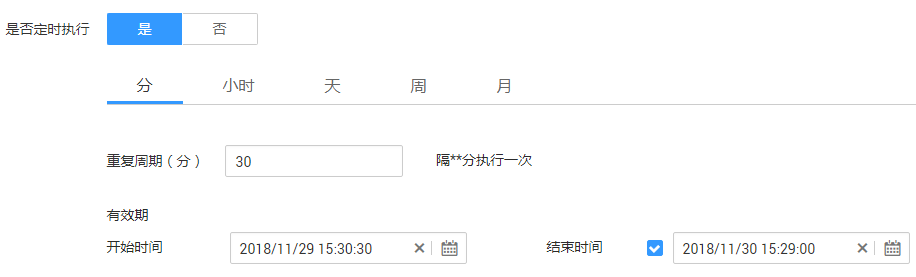
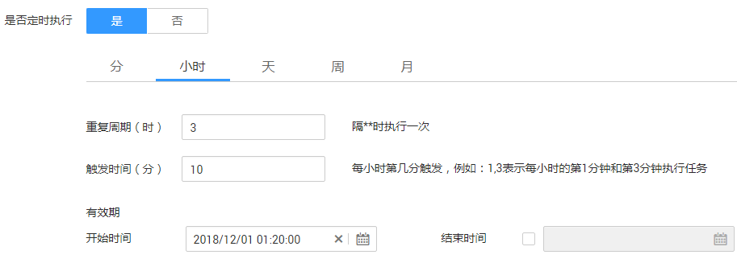
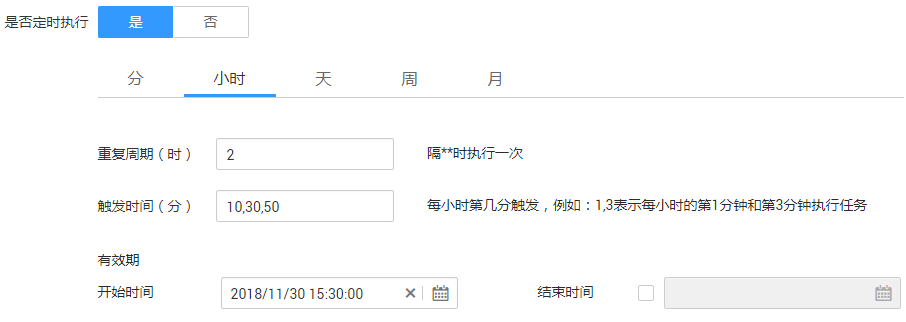
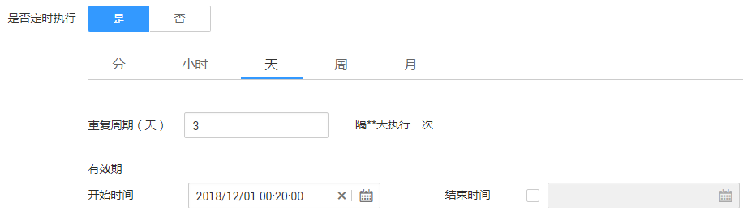
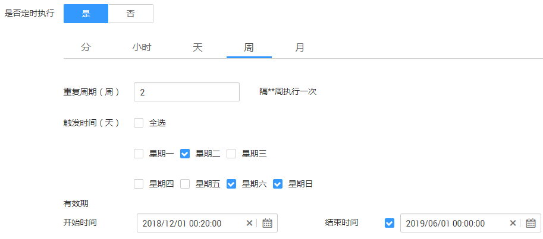
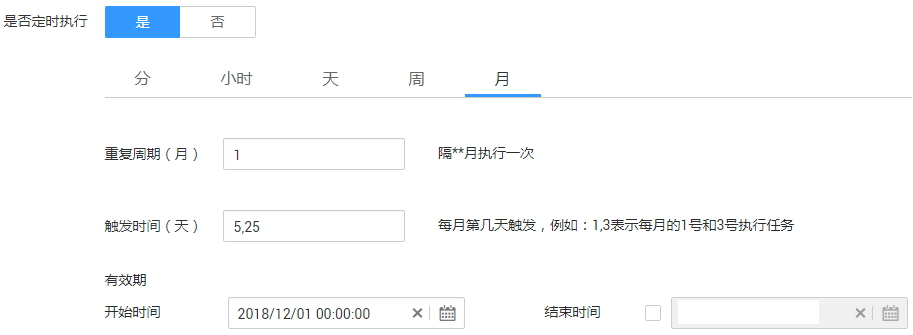

# 配置定时任务

在表/文件迁移的任务中，CDM支持定时执行作业，按重复周期分为：分钟、小时、天、周、月。

## 分钟

CDM支持配置每隔几分钟执行一次作业。

-   开始时间：表示定时配置生效的时间，也是第一次自动执行作业的时间。
-   重复周期（分）：从开始时间起，每隔多少分钟执行一次作业。
-   结束时间：该参数为可选参数，如果不配置则表示一直自动执行。如果配置了结束时间，则会在该时间停止自动执行作业。

**图 1**  重复周期为分钟  

例如[图1](#zh-cn_topic_0108275358_fig45769359171517)表示：从2018年11月29日15时30分30秒开始第一次自动执行作业，每隔30分钟自动执行一次，2018年11月30日15时29分之后不再自动执行。

## 小时

CDM支持配置每隔几小时执行一次作业。

-   重复周期（时）：表示每隔多少个小时自动执行一次定时任务。
-   触发时间（分）：表示每小时的第几分钟触发定时任务。该参数值取值范围是“0～59“，可配置多个值但不可重复，最多60个，中间使用“,“分隔。

    如果触发时间不在有效期内，则第一次自动执行的时间取有效期内最近的触发时间，例如：

    -   有效期的“开始时间“为“1:20“。
    -   “重复周期（时）“为“3“。
    -   “触发时间（分）“为“10“。

    如[图2](#zh-cn_topic_0108275358_fig60451219103517)所示，此时第一次自动执行的时间为“2:10“，第二次自动执行的时间为“5:10“。

    **图 2**  触发时间不在有效期内  
    

-   有效期：分为开始时间和结束时间。
    -   开始时间：表示定时配置生效的时间。
    -   结束时间：该参数是可选参数，表示停止自动执行的时间。如果不配置，则表示一直自动执行。

**图 3**  重复周期为小时  

例如[图3](#zh-cn_topic_0108275358_fig8450385154036)表示：定时配置从2018年11月30日15时30分生效，生效时开始第一次自动执行作业，15:50第二次，17:10第三次，以后每隔2小时重复三次，配置一直有效。

## 天

CDM支持配置每几天执行一次作业。

-   重复周期（天）：从开始时间起，每多少天执行一次作业。
-   有效期：分为开始时间和结束时间。
    -   开始时间：表示定时配置生效的时间，也是第一次自动执行作业的时间。
    -   结束时间：该参数是可选参数，表示停止自动执行的时间。如果不配置，则表示一直自动执行。

**图 4**  重复周期为天  

[图4](#zh-cn_topic_0108275358_fig5534404616272)表示：从2018年12月1日0时20分开始第一次自动执行，每3天自动执行一次，配置一直有效。

## 周

CDM支持配置每隔几周执行一次作业。

-   重复周期（周）：表示从开始时间起，每隔多少周执行一次定时任务。
-   触发时间（天）：选择每周几自动执行作业，可单选或多选。
-   有效期：分为开始时间和结束时间。
    -   开始时间：表示定时配置生效的时间。
    -   结束时间：该参数是可选参数，表示停止自动执行的时间。如果不配置，则表示一直自动执行。

**图 5**  重复周期为周  

例如[图5](#zh-cn_topic_0108275358_fig5547562112039)表示：在2018年12月1日0时20分以后，每隔2周的周二、周六、周日的0时20分，便自动执行作业，直到2019年6月1日0时0分不再自动执行。

## 月

CDM支持配置每隔几月执行一次作业。

-   重复周期（月）：从开始时间起，每隔多少个月自动执行定时任务。
-   触发时间（天）：选择每月的几号执行作业，该参数值取值范围是“1～31“，可配置多个值但不可重复，中间使用“,“分隔。
-   有效期：分为开始时间和结束时间。
    -   开始时间：表示定时配置生效的时间。其中的时、分、秒也是每次自动执行的时间。
    -   结束时间：该参数为可选参数，表示停止自动执行定时任务的时间。如果没有配置，则表示一直自动执行。

**图 6**  重复周期为月  

例如[图6](#zh-cn_topic_0108275358_fig7618175164026)表示：从2018年12月1日0点开始，每月5日、25日的0点自动执行作业，配置一直有效。

