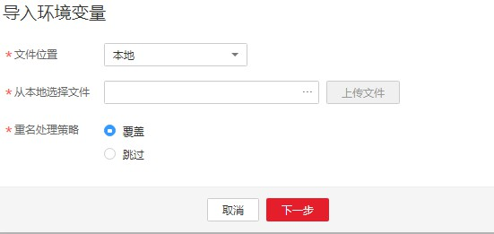
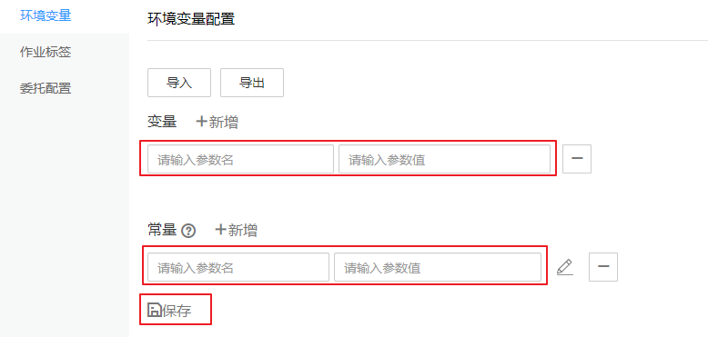
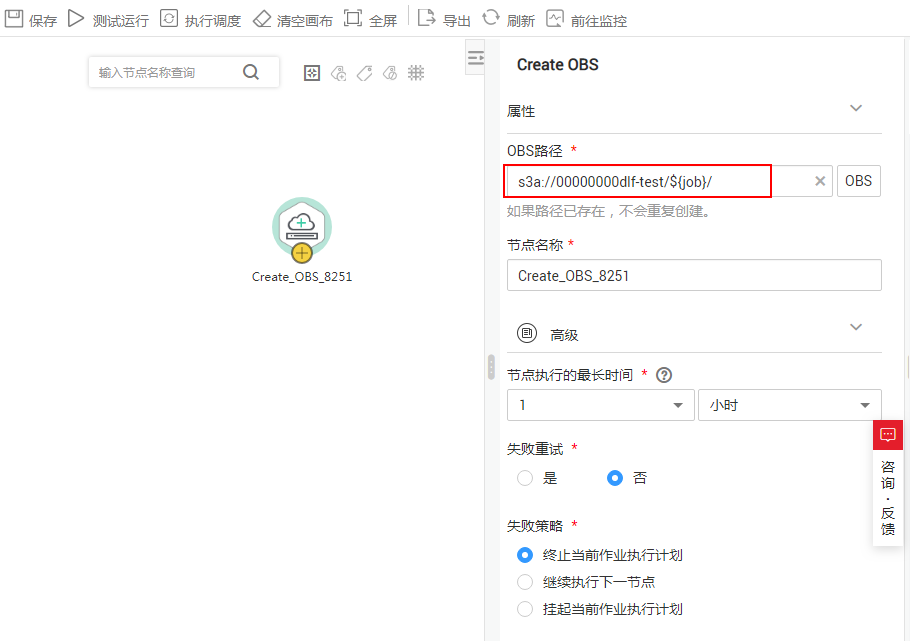

# 配置环境变量

本章节主要介绍环境变量的配置和使用。

## 使用场景

配置作业参数，当某参数隶属于多个作业，可将此参数提取出来作为环境变量，环境变量支持导入和导出。

## 导入环境变量

导入环境变量功能依赖于OBS服务，如无OBS服务，可从本地导入。

1.  登录DGC控制台。选择对应工作空间的“数据开发“模块，进入数据开发页面。

    **图 1**  选择数据开发  
    

2.  在数据开发主界面的左侧导航栏，选择“配置管理 \> 配置“。
3.  单击“环境变量“，在“环境变量配置“页面，选择“导入“。
4.  在导入环境变量对话框中，选择已上传至OBS或者本地的环境变量文件，以及重命名策略。

    **图 2**  导入环境变量（有OBS场景）  
    

## 配置方法

1.  登录DGC控制台。选择对应工作空间的“数据开发“模块，进入数据开发页面。

    **图 3**  选择数据开发  
    

2.  在数据开发主界面的左侧导航栏，选择“配置管理 \> 配置“。
3.  单击“环境变量“，在“环境变量配置“页面，配置如[表1](#table152451023155711)所示的变量或常量，单击“保存“。

    > **说明：** 
    >变量和常量的区别是其他工作空间或者项目导入的时候，是否需要重新配置值。
    >-   变量是指不同的空间下取值不同，需要重新配置值，比如“工作空间名称”变量，这个值在不同的空间下配置不一样，导出导入后需要重新进行配置。
    >-   常量是指在不同的空间下都是一样的，导入的时候，不需要重新配置值。

    **图 4**  环境变量配置  
    

    **表 1**  环境变量参数配置

    
    <table><thead align="left"><tr id="row72442234573"><th class="cellrowborder" valign="top" width="25%" id="mcps1.2.4.1.1">
参数

    </th>
    <th class="cellrowborder" valign="top" width="12%" id="mcps1.2.4.1.2">
是否必选

    </th>
    <th class="cellrowborder" valign="top" width="63%" id="mcps1.2.4.1.3">
说明

    </th>
    </tr>
    </thead>
    <tbody><tr id="row1824462335718"><td class="cellrowborder" valign="top" width="25%" headers="mcps1.2.4.1.1 ">
参数名称

    </td>
    <td class="cellrowborder" valign="top" width="12%" headers="mcps1.2.4.1.2 ">
是

    </td>
    <td class="cellrowborder" valign="top" width="63%" headers="mcps1.2.4.1.3 ">
只支持英文字母、数字、“-”、“_”，最大长度为64字符，且参数名称不允许重名。

    </td>
    </tr>
    <tr id="row1124512316572"><td class="cellrowborder" valign="top" width="25%" headers="mcps1.2.4.1.1 ">
参数值

    </td>
    <td class="cellrowborder" valign="top" width="12%" headers="mcps1.2.4.1.2 ">
是

    </td>
    <td class="cellrowborder" valign="top" width="63%" headers="mcps1.2.4.1.3 ">
参数值当前支持常量和EL表达式，不支持系统函数。例如支持123，abc。

    
关于EL表达式的使用，请参见<a href="表达式概述.md">表达式概述</a>。

    </td>
    </tr>
    </tbody>
    </table>

    配置完一个环境变量后，您还可以进行新增、修改或删除等操作。

    -   新增：单击“新增“配置新的环境变量。
    -   修改：参数值为常量时，直接在文本框中修改参数值；参数值为EL表达式时，可以单击文本框后方的编辑EL表达式，修改参数值。修改完成后，请“保存“。
    -   删除：在参数值文本框后方，单击删除环境变量。

## 使用方法

当前配置好的环境变量支持如下两种使用方法：

1.  $\{环境变量名\}
2.  \#\{Evn.get\(“环境变量名”\)\}

## 操作示例

背景信息：

-   在数据开发模块系统中已创建一个作业“test“。
-   在环境变量中已新增一个变量，“参数名“为“job“，“参数值“为“123“。

1.  打开作业“test“，从左侧节点库中拖拽一个“Create OBS“节点。
2.  在节点属性页签中配置属性。

    **图 5**  Create OBS  
    

3.  单击“保存“后，选择“前往监控“页面监控作业的运行情况。

