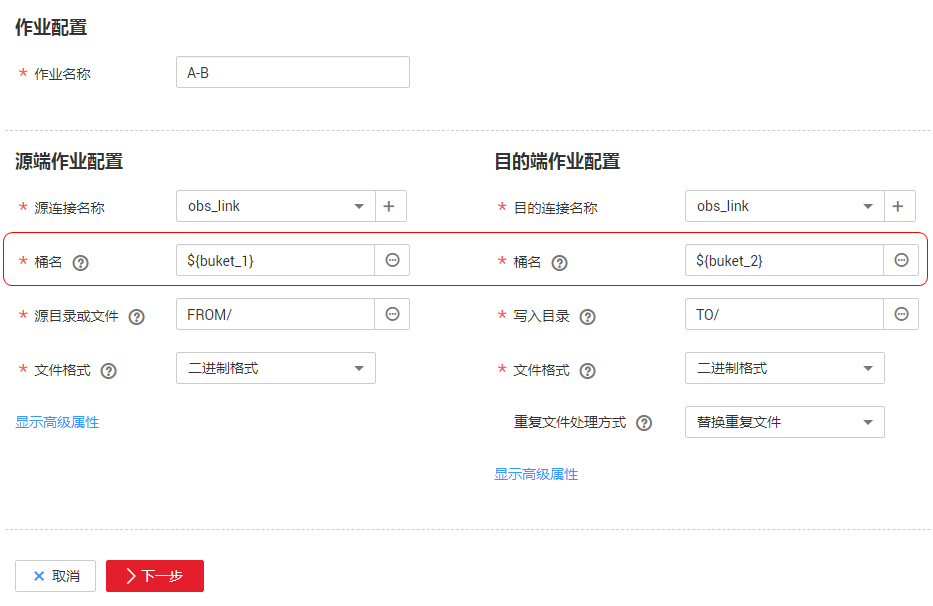

# 配置管理<a name="dayu_01_0083"></a>

CDM作业管理界面的“配置管理“页签，用来以下功能：

-   [CDM作业自动备份/恢复](#zh-cn_topic_0173586861_section11184152932110)
-   [CDM作业参数的全局变量](#zh-cn_topic_0173586861_section10589151615203)

## CDM作业自动备份/恢复<a name="zh-cn_topic_0173586861_section11184152932110"></a>

-   前提条件

    已创建[配置OBS连接](配置OBS连接.md#dayu_01_0045)。

-   自动备份

    在CDM作业管理界面，单击“配置管理“页签，配置自动备份的参数。

    **表 1**  自动备份参数

    <a name="zh-cn_topic_0173586861_table1171092714397"></a>
    <table><thead align="left"><tr id="zh-cn_topic_0173586861_row197111127123910"><th class="cellrowborder" valign="top" width="25%" id="mcps1.2.4.1.1"><p id="zh-cn_topic_0173586861_p571112276391"><a name="zh-cn_topic_0173586861_p571112276391"></a><a name="zh-cn_topic_0173586861_p571112276391"></a>参数</p>
    </th>
    <th class="cellrowborder" valign="top" width="60%" id="mcps1.2.4.1.2"><p id="zh-cn_topic_0173586861_p107111127113910"><a name="zh-cn_topic_0173586861_p107111127113910"></a><a name="zh-cn_topic_0173586861_p107111127113910"></a>说明</p>
    </th>
    <th class="cellrowborder" valign="top" width="15%" id="mcps1.2.4.1.3"><p id="zh-cn_topic_0173586861_p7711527133912"><a name="zh-cn_topic_0173586861_p7711527133912"></a><a name="zh-cn_topic_0173586861_p7711527133912"></a>配置样例</p>
    </th>
    </tr>
    </thead>
    <tbody><tr id="zh-cn_topic_0173586861_row1871112717396"><td class="cellrowborder" valign="top" width="25%" headers="mcps1.2.4.1.1 "><p id="zh-cn_topic_0173586861_p197111627143917"><a name="zh-cn_topic_0173586861_p197111627143917"></a><a name="zh-cn_topic_0173586861_p197111627143917"></a>定时备份</p>
    </td>
    <td class="cellrowborder" valign="top" width="60%" headers="mcps1.2.4.1.2 "><p id="zh-cn_topic_0173586861_p0711142714395"><a name="zh-cn_topic_0173586861_p0711142714395"></a><a name="zh-cn_topic_0173586861_p0711142714395"></a>自动备份功能的开关，该功能只备份作业，不会备份连接。</p>
    </td>
    <td class="cellrowborder" valign="top" width="15%" headers="mcps1.2.4.1.3 "><p id="zh-cn_topic_0173586861_p7711172783913"><a name="zh-cn_topic_0173586861_p7711172783913"></a><a name="zh-cn_topic_0173586861_p7711172783913"></a>开</p>
    </td>
    </tr>
    <tr id="zh-cn_topic_0173586861_row10711132712394"><td class="cellrowborder" valign="top" width="25%" headers="mcps1.2.4.1.1 "><p id="zh-cn_topic_0173586861_p1671117278391"><a name="zh-cn_topic_0173586861_p1671117278391"></a><a name="zh-cn_topic_0173586861_p1671117278391"></a>备份策略</p>
    </td>
    <td class="cellrowborder" valign="top" width="60%" headers="mcps1.2.4.1.2 "><a name="zh-cn_topic_0173586861_ul92471011164220"></a><a name="zh-cn_topic_0173586861_ul92471011164220"></a><ul id="zh-cn_topic_0173586861_ul92471011164220"><li>所有作业：不管作业处于什么状态，CDM会备份所有表/文件迁移作业、整库迁移的作业。不备份历史作业。</li><li>分组作业：选择备份某一个或多个分组下的作业。</li></ul>
    </td>
    <td class="cellrowborder" valign="top" width="15%" headers="mcps1.2.4.1.3 "><p id="zh-cn_topic_0173586861_p87115274391"><a name="zh-cn_topic_0173586861_p87115274391"></a><a name="zh-cn_topic_0173586861_p87115274391"></a>所有作业</p>
    </td>
    </tr>
    <tr id="zh-cn_topic_0173586861_row1071112714399"><td class="cellrowborder" valign="top" width="25%" headers="mcps1.2.4.1.1 "><p id="zh-cn_topic_0173586861_p15711172715393"><a name="zh-cn_topic_0173586861_p15711172715393"></a><a name="zh-cn_topic_0173586861_p15711172715393"></a>备份周期</p>
    </td>
    <td class="cellrowborder" valign="top" width="60%" headers="mcps1.2.4.1.2 "><p id="zh-cn_topic_0173586861_p81294539536"><a name="zh-cn_topic_0173586861_p81294539536"></a><a name="zh-cn_topic_0173586861_p81294539536"></a>选择备份周期：</p>
    <a name="zh-cn_topic_0173586861_ul1653311217541"></a><a name="zh-cn_topic_0173586861_ul1653311217541"></a><ul id="zh-cn_topic_0173586861_ul1653311217541"><li>日：每天零点执行一次。</li><li>周：每周一零点执行一次。</li><li>月：每月1号零点执行一次。</li></ul>
    </td>
    <td class="cellrowborder" valign="top" width="15%" headers="mcps1.2.4.1.3 "><p id="zh-cn_topic_0173586861_p571117272397"><a name="zh-cn_topic_0173586861_p571117272397"></a><a name="zh-cn_topic_0173586861_p571117272397"></a>日</p>
    </td>
    </tr>
    <tr id="zh-cn_topic_0173586861_row167111627113919"><td class="cellrowborder" valign="top" width="25%" headers="mcps1.2.4.1.1 "><p id="zh-cn_topic_0173586861_p47111527173910"><a name="zh-cn_topic_0173586861_p47111527173910"></a><a name="zh-cn_topic_0173586861_p47111527173910"></a>备份写入OBS连接</p>
    </td>
    <td class="cellrowborder" valign="top" width="60%" headers="mcps1.2.4.1.2 "><p id="zh-cn_topic_0173586861_p13711172703917"><a name="zh-cn_topic_0173586861_p13711172703917"></a><a name="zh-cn_topic_0173586861_p13711172703917"></a>CDM通过该连接，将作业备份到OBS。需要用户提前在<span class="wintitle" id="zh-cn_topic_0173586861_wintitle133211713347"><a name="zh-cn_topic_0173586861_wintitle133211713347"></a><a name="zh-cn_topic_0173586861_wintitle133211713347"></a>“连接管理”</span>界面创建好OBS连接。</p>
    </td>
    <td class="cellrowborder" valign="top" width="15%" headers="mcps1.2.4.1.3 "><p id="zh-cn_topic_0173586861_p13711427183914"><a name="zh-cn_topic_0173586861_p13711427183914"></a><a name="zh-cn_topic_0173586861_p13711427183914"></a>obslink</p>
    </td>
    </tr>
    <tr id="zh-cn_topic_0173586861_row157111827183917"><td class="cellrowborder" valign="top" width="25%" headers="mcps1.2.4.1.1 "><p id="zh-cn_topic_0173586861_p3711827153911"><a name="zh-cn_topic_0173586861_p3711827153911"></a><a name="zh-cn_topic_0173586861_p3711827153911"></a>OBS桶</p>
    </td>
    <td class="cellrowborder" valign="top" width="60%" headers="mcps1.2.4.1.2 "><p id="zh-cn_topic_0173586861_p117111127143910"><a name="zh-cn_topic_0173586861_p117111127143910"></a><a name="zh-cn_topic_0173586861_p117111127143910"></a>存储备份文件的OBS桶。</p>
    </td>
    <td class="cellrowborder" valign="top" width="15%" headers="mcps1.2.4.1.3 "><p id="zh-cn_topic_0173586861_p197111274394"><a name="zh-cn_topic_0173586861_p197111274394"></a><a name="zh-cn_topic_0173586861_p197111274394"></a>cdm</p>
    </td>
    </tr>
    <tr id="zh-cn_topic_0173586861_row1773141612417"><td class="cellrowborder" valign="top" width="25%" headers="mcps1.2.4.1.1 "><p id="zh-cn_topic_0173586861_p6774171614418"><a name="zh-cn_topic_0173586861_p6774171614418"></a><a name="zh-cn_topic_0173586861_p6774171614418"></a>备份数据目录</p>
    </td>
    <td class="cellrowborder" valign="top" width="60%" headers="mcps1.2.4.1.2 "><p id="zh-cn_topic_0173586861_p67741316154117"><a name="zh-cn_topic_0173586861_p67741316154117"></a><a name="zh-cn_topic_0173586861_p67741316154117"></a>存储备份文件的目录。</p>
    </td>
    <td class="cellrowborder" valign="top" width="15%" headers="mcps1.2.4.1.3 "><p id="zh-cn_topic_0173586861_p8732759143520"><a name="zh-cn_topic_0173586861_p8732759143520"></a><a name="zh-cn_topic_0173586861_p8732759143520"></a>/cdm-bk/</p>
    </td>
    </tr>
    </tbody>
    </table>

-   恢复作业

    如果之前执行过自动备份，“配置管理“页签下会显示备份列表：显示备份文件所在的OBS桶、路径、备份时间。

    您可以单击备份列表操作列的“恢复备份“来恢复CDM作业。


## CDM作业参数的全局变量<a name="zh-cn_topic_0173586861_section10589151615203"></a>

CDM在创建迁移作业时，可以手动输入的参数（例如OBS桶名、文件路径等）、参数中的某个字段、或者字段中的某个字符，都支持配置为一个全局变量，方便您批量更改作业中的参数值，以及作业导出/导入后进行批量替换。

这里以批量替换作业中OBS桶名为例进行介绍。

1.  在CDM作业管理界面，单击“配置管理“页签，配置环境变量。

    ```
    buket_1=A
    buket_2=B
    ```

    这里以变量“buket\_1“表示桶A，变量“buket\_2“表示桶B。

2.  在创建CDM迁移作业的界面，迁移桶A的数据到桶B。

    源端桶名配置为**$\{buket\_1\}**，目的端桶名配置为**$\{buket\_2\}**。

    **图 1**  桶名配置为环境变量<a name="zh-cn_topic_0173586861_fig183952182468"></a>  
    

3.  如果下次要迁移桶C数据到桶D，则无需更改作业参数，只需要在“配置管理“界面将环境变量改为如下即可：

    ```
    buket_1=C
    buket_2=D
    ```


