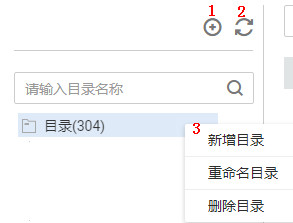

# 配置质量作业

## 入口说明

基于某个数据连接创建质量作业，需要选择作业归属目录，请参见[图1](#zh-cn_topic_0141836100_fig104618412258)创建归属目录。

**图 1**  新建规则的归属目录1  

**表 1**  导航栏按键说明

<table><thead align="left"><tr id="zh-cn_topic_0141836100_row352545110274"><th class="cellrowborder" valign="top" width="11.42%" id="mcps1.2.3.1.1">
序号

</th>
<th class="cellrowborder" valign="top" width="88.58%" id="mcps1.2.3.1.2">
说明

</th>
</tr>
</thead>
<tbody><tr id="zh-cn_topic_0141836100_row352525182710"><td class="cellrowborder" valign="top" width="11.42%" headers="mcps1.2.3.1.1 ">
1

</td>
<td class="cellrowborder" valign="top" width="88.58%" headers="mcps1.2.3.1.2 ">
新建目录

</td>
</tr>
<tr id="zh-cn_topic_0141836100_row55274511271"><td class="cellrowborder" valign="top" width="11.42%" headers="mcps1.2.3.1.1 ">
2

</td>
<td class="cellrowborder" valign="top" width="88.58%" headers="mcps1.2.3.1.2 ">
刷新目录

</td>
</tr>
<tr id="zh-cn_topic_0141836100_row205282051102719"><td class="cellrowborder" valign="top" width="11.42%" headers="mcps1.2.3.1.1 ">
3

</td>
<td class="cellrowborder" valign="top" width="88.58%" headers="mcps1.2.3.1.2 ">
选择目录 ，单击右键，可新建目录、删除目录并对目录重命名。

</td>
</tr>
</tbody>
</table>

## 配置流程

1.  [登录DAYU控制台](https://console.huaweicloud.com/dayu/)，找到所需要的DAYU实例，单击实例卡片上的“进入控制台”，进入概览页面。

    选择“空间管理”页签，完成工作空间的创建。

    在工作空间列表中，找到所需要的工作空间。

1.  单击相应工作空间的“数据质量“。

    系统跳转至数据质量页面。

1.  选择“数据质量监控  \>  质量作业“。
2.  单击“新建“，在弹出的对话框中，参见[表2](#zh-cn_topic_0141836100_table17370943112118)配置相关参数。

    **表 2**  配置作业参数

    
    <table><thead align="left"><tr id="zh-cn_topic_0141836100_row836964332120"><th class="cellrowborder" valign="top" width="21.08%" id="mcps1.2.3.1.1">
参数名

    </th>
    <th class="cellrowborder" valign="top" width="78.92%" id="mcps1.2.3.1.2">
说明

    </th>
    </tr>
    </thead>
    <tbody><tr id="zh-cn_topic_0141836100_row173692437211"><td class="cellrowborder" valign="top" width="21.08%" headers="mcps1.2.3.1.1 ">
作业名称

    </td>
    <td class="cellrowborder" valign="top" width="78.92%" headers="mcps1.2.3.1.2 ">
质量作业的名称，只能包含中文、英文字母、数字、“_”，且长度为1~64个字符。

    </td>
    </tr>
    <tr id="zh-cn_topic_0141836100_row16252121211388"><td class="cellrowborder" valign="top" width="21.08%" headers="mcps1.2.3.1.1 ">
描述

    </td>
    <td class="cellrowborder" valign="top" width="78.92%" headers="mcps1.2.3.1.2 ">
为更好的识别数据质量作业 ，此处加以描述信息。描述信息长度不能超过256个字符。

    </td>
    </tr>
    <tr id="zh-cn_topic_0141836100_row7610014183811"><td class="cellrowborder" valign="top" width="21.08%" headers="mcps1.2.3.1.1 ">
选择目录

    </td>
    <td class="cellrowborder" valign="top" width="78.92%" headers="mcps1.2.3.1.2 ">
数据质量作业的存储目录，可选择已创建的目录。目录创建请参见<a href="#zh-cn_topic_0141836100_fig104618412258">图1</a>。

    </td>
    </tr>
    <tr id="zh-cn_topic_0141836100_row175042052183919"><td class="cellrowborder" valign="top" width="21.08%" headers="mcps1.2.3.1.1 ">
作业级别

    </td>
    <td class="cellrowborder" valign="top" width="78.92%" headers="mcps1.2.3.1.2 ">
支持提示，一般，严重和致命四种级别，作业级别决定发出通知消息的模板样式。

    </td>
    </tr>
    </tbody>
    </table>

3.  单击“下一步“，参见[表3](#zh-cn_topic_0141836100_table7770194025911)配置数据质量规则。您也可选择添加监控规则，新建子规则。创建完成后单击批量保存，即可将创建的所有规则应用到已建好的表中。

    **表 3**  配置模板规则

    
    <table><thead align="left"><tr id="zh-cn_topic_0141836100_row277044035913"><th class="cellrowborder" valign="top" width="16.3%" id="mcps1.2.4.1.1">
添加方式

    </th>
    <th class="cellrowborder" valign="top" width="15.690000000000001%" id="mcps1.2.4.1.2">
配置

    </th>
    <th class="cellrowborder" valign="top" width="68.01%" id="mcps1.2.4.1.3">
说明

    </th>
    </tr>
    </thead>
    <tbody><tr id="zh-cn_topic_0141836100_row1677011403594"><td class="cellrowborder" rowspan="2" valign="top" width="16.3%" headers="mcps1.2.4.1.1 ">
基本信息

    

    </td>
    <td class="cellrowborder" valign="top" width="15.690000000000001%" headers="mcps1.2.4.1.2 ">
规则类型

    </td>
    <td class="cellrowborder" valign="top" width="68.01%" headers="mcps1.2.4.1.3 ">
包括库级规则，表级规则，字段级规则和跨字段级规则，字段级规则可针对表中的具体字段配置监控规则。此处选择为表级规则，页面中其他设置项对应为表级规则配置项。

    </td>
    </tr>
    <tr id="zh-cn_topic_0141836100_row1577014013598"><td class="cellrowborder" valign="top" headers="mcps1.2.4.1.1 ">
强弱

    </td>
    <td class="cellrowborder" valign="top" headers="mcps1.2.4.1.2 ">
配置规则的强弱。

    
 说明： 

对某数据配置了多条子规则：

    <ul id="zh-cn_topic_0141836100_ul844911556423"><li>若包含一条或以上强子规则。当该强子规则触发告警，无论其他子规则是否运行完成，将运行结束。</li><li>若均为弱规则，则所有子规则运行完成后结束。</li></ul>
    

    </td>
    </tr>
    <tr id="zh-cn_topic_0141836100_row112401355112013"><td class="cellrowborder" rowspan="5" valign="top" width="16.3%" headers="mcps1.2.4.1.1 ">
数据对象

    

    

    

    

    </td>
    <td class="cellrowborder" valign="top" width="15.690000000000001%" headers="mcps1.2.4.1.2 ">
数据源类型

    </td>
    <td class="cellrowborder" valign="top" width="68.01%" headers="mcps1.2.4.1.3 ">
支持的数据源类型：DWS，MRS Hive，DLI。

    </td>
    </tr>
    <tr id="zh-cn_topic_0141836100_row145216212112"><td class="cellrowborder" valign="top" headers="mcps1.2.4.1.1 ">
数据连接

    </td>
    <td class="cellrowborder" valign="top" headers="mcps1.2.4.1.2 ">
从下拉列表中选择已创建的数据连接。

    
 说明： 

规则都是基于数据连接的，所以在建立数据质量规则之前需要先到管理中心模块中建立数据连接。

    

    </td>
    </tr>
    <tr id="zh-cn_topic_0141836100_row132411806219"><td class="cellrowborder" valign="top" headers="mcps1.2.4.1.1 ">
数据库

    </td>
    <td class="cellrowborder" valign="top" headers="mcps1.2.4.1.2 ">
选择配置的数据质量规则所应用到的数据库。

    
 说明： 

数据库基于已建立的数据连接。

    

    </td>
    </tr>
    <tr id="zh-cn_topic_0141836100_row194615722013"><td class="cellrowborder" valign="top" headers="mcps1.2.4.1.1 ">
数据表

    </td>
    <td class="cellrowborder" valign="top" headers="mcps1.2.4.1.2 ">
选择配置的数据质量规则所应用到的表。

    
 说明： 

数据表与数据库强相关，基于已选择的数据库。

    

    </td>
    </tr>
    <tr id="zh-cn_topic_0141836100_row171461819144410"><td class="cellrowborder" valign="top" headers="mcps1.2.4.1.1 ">
选择字段

    </td>
    <td class="cellrowborder" valign="top" headers="mcps1.2.4.1.2 ">
选择配置额数据质量规则所应用的数据表中的字段。

    </td>
    </tr>
    <tr id="zh-cn_topic_0141836100_row1312417243450"><td class="cellrowborder" valign="top" width="16.3%" headers="mcps1.2.4.1.1 ">
规则模板

    </td>
    <td class="cellrowborder" valign="top" width="15.690000000000001%" headers="mcps1.2.4.1.2 ">
模板类型

    </td>
    <td class="cellrowborder" valign="top" width="68.01%" headers="mcps1.2.4.1.3 ">
选择系统内置的或者用户自定义的规则模板。

    
 说明： 

模板类型与规则类型强相关。

    <ul id="zh-cn_topic_0141836100_ul17382842105917"><li>当规则类型选择“库级规则”，当前系统已内置的模板类型为“数据库空值扫描”。</li><li>当规则类型选择“表级规则”，当前系统内置的模板类型为“表行数”和“数据表空值扫描”两种。</li><li>当规则类型选择“字段级规则”，当前系统已匹配内置多种模板类型，例如“电话号码合法性校验”、“IP地址合法性校验”、“邮箱合法性校验”等。</li><li>当规则类型选择“跨字段级规则”，当前系统已内置的模板类型为“字段一致性校验”。</li><li>除去系统内置规则模板外，您也可关联自定义的规则模板。自定义规则模板的方法请参见</li></ul>
    

    </td>
    </tr>
    <tr id="zh-cn_topic_0141836100_row1885215323298"><td class="cellrowborder" valign="top" width="16.3%" headers="mcps1.2.4.1.1 ">
参考数据对象

    </td>
    <td class="cellrowborder" valign="top" width="15.690000000000001%" headers="mcps1.2.4.1.2 ">
参考数据对象

    </td>
    <td class="cellrowborder" valign="top" width="68.01%" headers="mcps1.2.4.1.3 ">
某些规则模板需要配置参考数据，比如用于指定标准值等。当规则类型选择“跨字段级规则”，此参数有效。

    </td>
    </tr>
    <tr id="zh-cn_topic_0141836100_row27706404592"><td class="cellrowborder" valign="top" width="16.3%" headers="mcps1.2.4.1.1 ">
告警条件

    </td>
    <td class="cellrowborder" valign="top" width="15.690000000000001%" headers="mcps1.2.4.1.2 ">
表达式

    </td>
    <td class="cellrowborder" valign="top" width="68.01%" headers="mcps1.2.4.1.3 ">
使用实际值替换规则模板中定义的“结果说明”变量，计算出结果作为告警条件。

    </td>
    </tr>
    <tr id="zh-cn_topic_0141836100_row137708405593"><td class="cellrowborder" valign="top" width="16.3%" headers="mcps1.2.4.1.1 ">
计算引擎

    </td>
    <td class="cellrowborder" valign="top" width="15.690000000000001%" headers="mcps1.2.4.1.2 ">
集群类型

    </td>
    <td class="cellrowborder" valign="top" width="68.01%" headers="mcps1.2.4.1.3 ">
选择运行质量作业的引擎。

    </td>
    </tr>
    <tr id="zh-cn_topic_0141836100_row167991006566"><td class="cellrowborder" valign="top" width="16.3%" headers="mcps1.2.4.1.1 ">
对象范围

    </td>
    <td class="cellrowborder" valign="top" width="15.690000000000001%" headers="mcps1.2.4.1.2 ">
选择扫描区域

    </td>
    <td class="cellrowborder" valign="top" width="68.01%" headers="mcps1.2.4.1.3 ">
用来确定所配置的某条规则应检查的范围。

    <ul id="zh-cn_topic_0141836100_ul9808149112315"><li>勾选全表扫描，则遍历所有表。</li><li>勾选条件扫描，输入where条件后，精确定位分区查询数据，不需要全表扫描查询。</li></ul>
    </td>
    </tr>
    </tbody>
    </table>

4.  单击“下一步“，设置订阅配置信息，如果需要接收SMN通知，打开通知状态，选择通知类型和SMN服务主体。
5.  单击“下一步“，选择调度方式，支持单次调度和周期调度两种方式，周期调度的相关参数配置请参见[表4](#zh-cn_topic_0141836100_table75621469441)。

    > **说明：**   
    >1.  单次调度会产生手动任务的实例，手动任务的特点是没有调度依赖，只需要手动触发即可。  
    >2.  周期调度会产生周期实例，周期实例是周期任务达到启用调度所配置的周期性运行时间时，被自动调度起来的实例快照。  
    >3.  周期任务每调度一次，便生成一个实例工作流。您可以对已调度起的实例任务进行日常的运维管理，如查看运行状态，对任务进行终止、重跑等操作。  

    **表 4**  配置周期调度参数

    
    <table><thead align="left"><tr id="zh-cn_topic_0141836100_row1656214694416"><th class="cellrowborder" valign="top" width="27.58%" id="mcps1.2.3.1.1">
参数名

    </th>
    <th class="cellrowborder" valign="top" width="72.42%" id="mcps1.2.3.1.2">
说明

    </th>
    </tr>
    </thead>
    <tbody><tr id="zh-cn_topic_0141836100_row152800363813"><td class="cellrowborder" valign="top" width="27.58%" headers="mcps1.2.3.1.1 ">
调度日期

    </td>
    <td class="cellrowborder" valign="top" width="72.42%" headers="mcps1.2.3.1.2 ">
调度任务的生效日期。

    </td>
    </tr>
    <tr id="zh-cn_topic_0141836100_row65623466445"><td class="cellrowborder" valign="top" width="27.58%" headers="mcps1.2.3.1.1 ">
调度周期

    </td>
    <td class="cellrowborder" valign="top" width="72.42%" headers="mcps1.2.3.1.2 ">
选择调度任务的执行周期，并配置相关参数。

    <ul id="zh-cn_topic_0141836100_ul9562114610446"><li>分钟</li><li>小时</li><li>天</li><li>周
 说明： 
<ul id="zh-cn_topic_0141836100_ul75431855121011"><li>调度周期选择分钟/小时，需配置调度的开始时间、间隔时间和结束时间。</li><li>调度周期选择天，需要配置调度时间，即确定了调度任务于每天的几时几分启用。</li><li>调度周期选择周，需要配置生效时间和调度时间，即确定了调度任务于周几的几时几分启用。</li></ul>
    

    </li></ul>
    </td>
    </tr>
    <tr id="zh-cn_topic_0141836100_row95621046154413"><td class="cellrowborder" valign="top" width="27.58%" headers="mcps1.2.3.1.1 ">
启动调度

    </td>
    <td class="cellrowborder" valign="top" width="72.42%" headers="mcps1.2.3.1.2 ">
勾选复选框，规则创建成功后，调度状态为调度中。

    </td>
    </tr>
    </tbody>
    </table>

