# 配置资源权限

本章主要介绍如何通过创建权限策略来实现资源权限控制，按需为用户分配最小权限，从而降低企业数据信息安全风险。权限策略配置完成后1分钟左右生效。

## 前提条件

已在管理中心创建“数据连接类型”为“MapReduce服务（MRS Ranger）”并且MRS集群版本为3.0.0及以上的MRS Ranger数据连接。如何创建请参考[创建数据连接](https://support.huaweicloud.com/usermanual-dgc/dgc_01_0009.html)。

## 创建HDFS权限策略

1.  在DGC控制台首页，选择对应工作空间的“数据安全“模块，进入数据安全页面。

    **图 1**  选择数据安全  
    

2.  单击左侧导航树中的“资源权限配置“，进入资源权限配置页面。
3.  单击待创建权限策略HDFS组件下“hacluster”的“配置“  ，进入配置界面单击“创建“，新建权限策略。

    **图 2**  新建权限策略  
    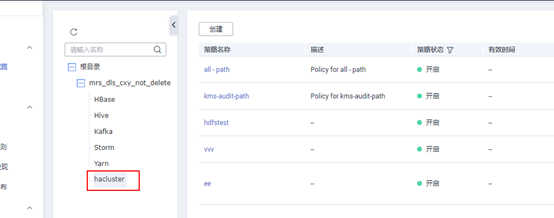

4.  在弹出的策略配置页配置相关参数，配置完成单击“确定“，策略配置完成。

    **图 3**  配置权限策略  
    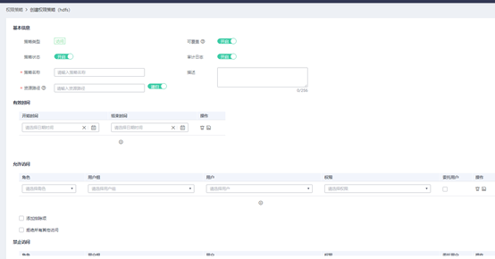

    **表 1**  配置HDFS权限策略参数说明

    
    <table><thead align="left"><tr id="row5661729615"><th class="cellrowborder" valign="top" width="20.49%" id="mcps1.2.3.1.1">
参数名

    </th>
    <th class="cellrowborder" valign="top" width="79.51%" id="mcps1.2.3.1.2">
参数描述

    </th>
    </tr>
    </thead>
    <tbody><tr id="row66610291118"><td class="cellrowborder" valign="top" width="20.49%" headers="mcps1.2.3.1.1 ">
策略类型

    </td>
    <td class="cellrowborder" valign="top" width="79.51%" headers="mcps1.2.3.1.2 ">
根据用户所选服务组件自动生成。包括访问、脱敏、行过滤器，其中脱敏和行过滤器类型是Hive特有的。

    </td>
    </tr>
    <tr id="row106702918115"><td class="cellrowborder" valign="top" width="20.49%" headers="mcps1.2.3.1.1 ">
策略状态

    </td>
    <td class="cellrowborder" valign="top" width="79.51%" headers="mcps1.2.3.1.2 ">
开启表示权限策略生效，关闭表示权限策略创建成功后不生效。默认开启。

    </td>
    </tr>
    <tr id="row166715297111"><td class="cellrowborder" valign="top" width="20.49%" headers="mcps1.2.3.1.1 ">
可覆盖

    </td>
    <td class="cellrowborder" valign="top" width="79.51%" headers="mcps1.2.3.1.2 ">
开启可覆盖时，新创建的策略将覆盖当前策略（新策略生效而旧策略不生效）。默认开启。

    
当用户需要创建一个临时访问策略时，“可覆盖”可以配合“有效时间”一起使用，那么即使临时访问策略超过有效期失效后，也不影响原有的权限策略继续生效。

    </td>
    </tr>
    <tr id="row166811294116"><td class="cellrowborder" valign="top" width="20.49%" headers="mcps1.2.3.1.1 ">
审计日志

    </td>
    <td class="cellrowborder" valign="top" width="79.51%" headers="mcps1.2.3.1.2 ">
开启表示记录日志，日志内容包括客户端访问时间、客户端IP、客户端用户、操作资源结果等信息。

    </td>
    </tr>
    <tr id="row12685293118"><td class="cellrowborder" valign="top" width="20.49%" headers="mcps1.2.3.1.1 ">
策略名称

    </td>
    <td class="cellrowborder" valign="top" width="79.51%" headers="mcps1.2.3.1.2 ">
名称为必填项，只能包含英文字母、数字、下划线和中划线，且长度为1~50个字符，且输入不能为空。

    </td>
    </tr>
    <tr id="row8688296113"><td class="cellrowborder" valign="top" width="20.49%" headers="mcps1.2.3.1.1 ">
描述

    </td>
    <td class="cellrowborder" valign="top" width="79.51%" headers="mcps1.2.3.1.2 ">
对策略的描述信息，长度限制在256个字符以内。

    </td>
    </tr>
    <tr id="row1758963641810"><td class="cellrowborder" valign="top" width="20.49%" headers="mcps1.2.3.1.1 ">
资源路径

    </td>
    <td class="cellrowborder" valign="top" width="79.51%" headers="mcps1.2.3.1.2 ">
访问权限控制的HDFS路径。

    </td>
    </tr>
    <tr id="row79531755142317"><td class="cellrowborder" valign="top" width="20.49%" headers="mcps1.2.3.1.1 ">
递归

    </td>
    <td class="cellrowborder" valign="top" width="79.51%" headers="mcps1.2.3.1.2 ">
开启表示资源路径为递归方式。关闭表示资源路径为非递归方式。默认开启。

    </td>
    </tr>
    <tr id="row187062918110"><td class="cellrowborder" valign="top" width="20.49%" headers="mcps1.2.3.1.1 ">
有效时间

    </td>
    <td class="cellrowborder" valign="top" width="79.51%" headers="mcps1.2.3.1.2 ">
用户通过设置开始时间和结束时间来控制策略的生效时间段，可配置多条。

    </td>
    </tr>
    <tr id="row170122910112"><td class="cellrowborder" valign="top" width="20.49%" headers="mcps1.2.3.1.1 ">
允许访问

    </td>
    <td class="cellrowborder" valign="top" width="79.51%" headers="mcps1.2.3.1.2 ">
定义允许访问的用户和用户组。

    <ul id="ul5194115385316"><li>用户：MRS服务的用户。</li><li>角色：MRS服务的角色。</li><li>用户组：MRS服务的用户组。</li><li>权限：定义允许访问的用户拥有的权限。权限和用户允许同时为空值，或者同时不为空值。服务相关权限详情请参考<a href="权限管理简介.md#table23037523175">表1</a>。</li><li>委托用户：当勾选此项时，管理权限将分配给适用的用户和组。受委托的管理员可以更新和删除策略，还可以基于原始策略创建子策略。</li></ul>
    </td>
    </tr>
    <tr id="row18701290113"><td class="cellrowborder" valign="top" width="20.49%" headers="mcps1.2.3.1.1 ">
添加排除项

    </td>
    <td class="cellrowborder" valign="top" width="79.51%" headers="mcps1.2.3.1.2 ">
允许访问勾选“添加排除项”意思是在允许访问的用户组里添加禁止访问的用户。

    
禁止访问勾选“添加排除项”意思是在禁止访问的用户组里添加允许访问的用户。

    </td>
    </tr>
    <tr id="row1570122913111"><td class="cellrowborder" valign="top" width="20.49%" headers="mcps1.2.3.1.1 ">
拒绝所有其他访问

    </td>
    <td class="cellrowborder" valign="top" width="79.51%" headers="mcps1.2.3.1.2 ">
勾选此项表示只有策略中“允许访问”指定的用户或用户组可以访问，其他用户均禁止访问。

    </td>
    </tr>
    <tr id="row18712029516"><td class="cellrowborder" valign="top" width="20.49%" headers="mcps1.2.3.1.1 ">
禁止访问

    </td>
    <td class="cellrowborder" valign="top" width="79.51%" headers="mcps1.2.3.1.2 ">
不勾选“拒绝所有其他访问”时显示此配置，该配置定义禁止访问的用户和用户组。

    <ul id="ul4679554449"><li>用户：MRS服务的用户。</li><li>角色：MRS服务的角色。</li><li>用户组：MRS服务的用户组。</li><li>权限：定义用户禁止的权限类型。权限和用户允许同时为空值，或者同时不为空值。服务相关权限详情请参考<a href="权限管理简介.md#table23037523175">表1</a>。</li><li>委托用户：当勾选此项时，管理权限将分配给适用的用户和组。受委托的管理员可以更新和删除策略，还可以基于原始策略创建子策略。</li></ul>
    </td>
    </tr>
    </tbody>
    </table>

## 创建Hive访问权限策略

1.  在DGC控制台首页，选择对应工作空间的“数据安全“模块，进入数据安全页面。

    **图 4**  选择数据安全  
    

2.  单击左侧导航树中的“资源权限配置“，进入资源权限配置页面。
3.  单击待创建权限策略Hive组件的“配置“  ，进入配置界面选择“访问“页签，单击“创建“，新建权限策略。

    **图 5**  新建权限策略入口  
    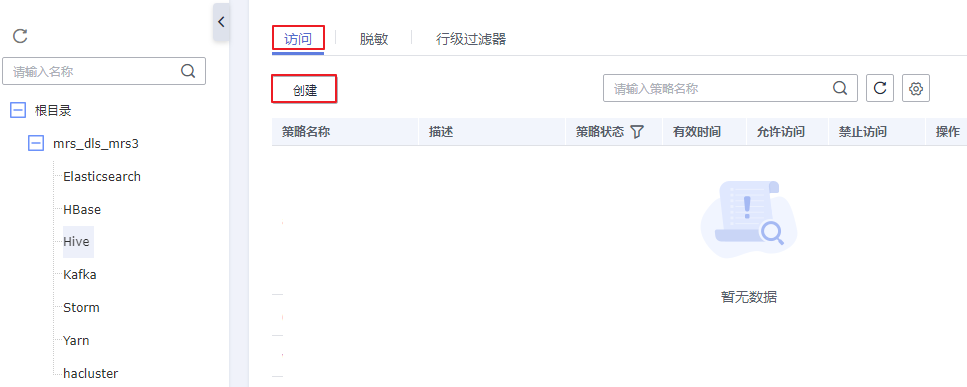

4.  在弹出的策略配置页配置相关参数，配置完成单击“确定“，策略配置完成。

    **图 6**  配置Hive权限策略  
    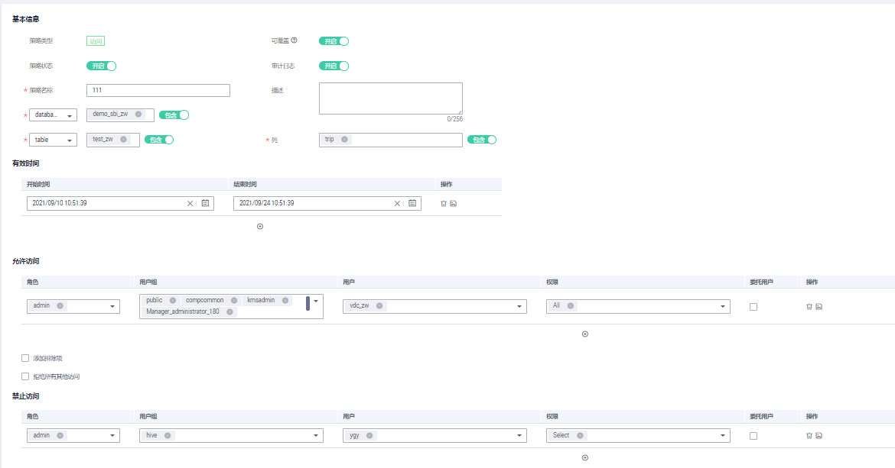

    权限策略参数说明表：

    **表 2**  Hive权限策略参数说明表

    
    <table><thead align="left"><tr id="row9693440496"><th class="cellrowborder" valign="top" width="20.49%" id="mcps1.2.3.1.1">
参数名

    </th>
    <th class="cellrowborder" valign="top" width="79.51%" id="mcps1.2.3.1.2">
参数描述

    </th>
    </tr>
    </thead>
    <tbody><tr id="row8694134114910"><td class="cellrowborder" valign="top" width="20.49%" headers="mcps1.2.3.1.1 ">
策略类型

    </td>
    <td class="cellrowborder" valign="top" width="79.51%" headers="mcps1.2.3.1.2 ">
根据用户所选服务组件自动生成。包括访问、脱敏、行过滤器，其中脱敏和行过滤器类型是Hive特有的。

    </td>
    </tr>
    <tr id="row2694147499"><td class="cellrowborder" valign="top" width="20.49%" headers="mcps1.2.3.1.1 ">
策略状态

    </td>
    <td class="cellrowborder" valign="top" width="79.51%" headers="mcps1.2.3.1.2 ">
开启表示权限策略生效，关闭表示权限策略创建成功后不生效。默认开启。

    </td>
    </tr>
    <tr id="row26941541493"><td class="cellrowborder" valign="top" width="20.49%" headers="mcps1.2.3.1.1 ">
可覆盖

    </td>
    <td class="cellrowborder" valign="top" width="79.51%" headers="mcps1.2.3.1.2 ">
开启可覆盖时，新创建的策略将覆盖当前策略（新策略生效而旧策略不生效）。默认开启。

    
当用户需要创建一个临时访问策略时，“可覆盖”可以配合“有效时间”一起使用，那么即使临时访问策略超过有效期失效后，也不影响原有的权限策略继续生效。

    </td>
    </tr>
    <tr id="row2069434114919"><td class="cellrowborder" valign="top" width="20.49%" headers="mcps1.2.3.1.1 ">
审计日志

    </td>
    <td class="cellrowborder" valign="top" width="79.51%" headers="mcps1.2.3.1.2 ">
开启表示记录日志，日志内容包括客户端访问时间、客户端IP、客户端用户、操作资源结果等信息。

    </td>
    </tr>
    <tr id="row96951646493"><td class="cellrowborder" valign="top" width="20.49%" headers="mcps1.2.3.1.1 ">
策略名称

    </td>
    <td class="cellrowborder" valign="top" width="79.51%" headers="mcps1.2.3.1.2 ">
名称为必填项，只能包含英文字母、数字、下划线和中划线，且长度为1~50个字符，且输入不能为空。

    </td>
    </tr>
    <tr id="row569512417495"><td class="cellrowborder" valign="top" width="20.49%" headers="mcps1.2.3.1.1 ">
描述

    </td>
    <td class="cellrowborder" valign="top" width="79.51%" headers="mcps1.2.3.1.2 ">
对策略的描述信息，长度限制在256个字符以内。

    </td>
    </tr>
    <tr id="row869544144912"><td class="cellrowborder" valign="top" width="20.49%" headers="mcps1.2.3.1.1 ">
数据库

    </td>
    <td class="cellrowborder" valign="top" width="79.51%" headers="mcps1.2.3.1.2 ">
必填项，此项表示需要进行权限控制的数据库，支持模糊搜索。

    </td>
    </tr>
    <tr id="row569594114913"><td class="cellrowborder" valign="top" width="20.49%" headers="mcps1.2.3.1.1 ">
数据表

    </td>
    <td class="cellrowborder" valign="top" width="79.51%" headers="mcps1.2.3.1.2 ">
必填项，此项表示需要进行权限控制的数据表，支持模糊搜索。

    </td>
    </tr>
    <tr id="row469513418494"><td class="cellrowborder" valign="top" width="20.49%" headers="mcps1.2.3.1.1 ">
列

    </td>
    <td class="cellrowborder" valign="top" width="79.51%" headers="mcps1.2.3.1.2 ">
必填项，此项表示需要进行权限控制的列，支持模糊搜索。

    </td>
    </tr>
    <tr id="row166961441497"><td class="cellrowborder" valign="top" width="20.49%" headers="mcps1.2.3.1.1 ">
有效时间

    </td>
    <td class="cellrowborder" valign="top" width="79.51%" headers="mcps1.2.3.1.2 ">
用户通过设置开始时间和结束时间来控制策略的生效时间段，可配置多条。

    </td>
    </tr>
    <tr id="row106965411493"><td class="cellrowborder" valign="top" width="20.49%" headers="mcps1.2.3.1.1 ">
允许访问

    </td>
    <td class="cellrowborder" valign="top" width="79.51%" headers="mcps1.2.3.1.2 ">
定义允许访问的用户和用户组。

    <ul id="ul169620424920"><li>用户：MRS服务的用户。</li><li>角色：MRS服务的角色。</li><li>用户组：MRS服务的用户组。</li><li>权限：定义允许访问的用户拥有的权限。权限和用户允许同时为空值，或者同时不为空值。服务相关权限详情请参考<a href="权限管理简介.md#table23037523175">表1</a>。</li><li>委托用户：当勾选此项时，管理权限将分配给适用的用户和组。受委托的管理员可以更新和删除策略，还可以基于原始策略创建子策略。</li></ul>
    </td>
    </tr>
    <tr id="row10696340498"><td class="cellrowborder" valign="top" width="20.49%" headers="mcps1.2.3.1.1 ">
添加排除项

    </td>
    <td class="cellrowborder" valign="top" width="79.51%" headers="mcps1.2.3.1.2 ">
允许访问勾选“添加排除项”意思是在允许访问的用户组里添加禁止访问的用户。

    
禁止访问勾选“添加排除项”意思是在禁止访问的用户组里添加允许访问的用户。

    </td>
    </tr>
    <tr id="row126971348492"><td class="cellrowborder" valign="top" width="20.49%" headers="mcps1.2.3.1.1 ">
拒绝所有其他访问

    </td>
    <td class="cellrowborder" valign="top" width="79.51%" headers="mcps1.2.3.1.2 ">
勾选此项表示只有策略中“允许访问”指定的用户或用户组可以访问，其他用户均禁止访问。

    </td>
    </tr>
    <tr id="row116975474911"><td class="cellrowborder" valign="top" width="20.49%" headers="mcps1.2.3.1.1 ">
禁止访问

    </td>
    <td class="cellrowborder" valign="top" width="79.51%" headers="mcps1.2.3.1.2 ">
不勾选“拒绝所有其他访问”时显示此配置，该配置定义禁止访问的用户和用户组。

    <ul id="ul17937129194515"><li>用户：MRS服务的用户。</li><li>角色：MRS服务的角色。</li><li>用户组：MRS服务的用户组。</li><li>权限：定义用户禁止的权限类型。权限和用户允许同时为空值，或者同时不为空值。服务相关权限详情请参考<a href="权限管理简介.md#table23037523175">表1</a>。</li><li>委托用户：当勾选此项时，管理权限将分配给适用的用户和组。受委托的管理员可以更新和删除策略，还可以基于原始策略创建子策略。</li></ul>
    </td>
    </tr>
    </tbody>
    </table>

## 创建Hive脱敏权限策略

1.  在DGC控制台首页，选择对应工作空间的“数据安全“模块，进入数据安全页面。

    **图 7**  选择数据安全  
    

2.  单击左侧导航树中的“资源权限配置“，进入资源权限配置页面。
3.  单击待创建权限策略Hive组件的“配置“  ，进入配置界面选择“脱敏“页签，单击“创建“，新建权限策略。

    **图 8**  新建权限策略界面  
    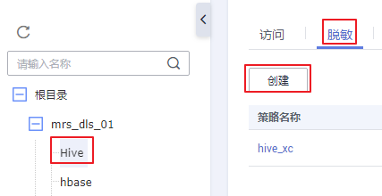

4.  在弹出的策略配置页配置相关参数，配置完成单击“确定“，策略配置完成。

    **图 9**  配置Hive权限策略界面  
    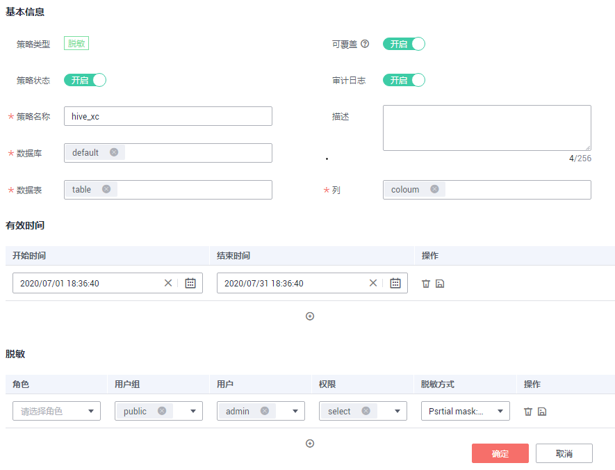

    **表 3**  Hive权限策略参数说明表

    
    <table><thead align="left"><tr id="row371093382714"><th class="cellrowborder" valign="top" width="20.49%" id="mcps1.2.3.1.1">
参数名

    </th>
    <th class="cellrowborder" valign="top" width="79.51%" id="mcps1.2.3.1.2">
参数描述

    </th>
    </tr>
    </thead>
    <tbody><tr id="row371133312711"><td class="cellrowborder" valign="top" width="20.49%" headers="mcps1.2.3.1.1 ">
策略类型

    </td>
    <td class="cellrowborder" valign="top" width="79.51%" headers="mcps1.2.3.1.2 ">
根据用户所选服务组件自动生成。包括访问、脱敏、行过滤器，其中脱敏和行过滤器类型是Hive特有的。

    </td>
    </tr>
    <tr id="row137111233152715"><td class="cellrowborder" valign="top" width="20.49%" headers="mcps1.2.3.1.1 ">
策略状态

    </td>
    <td class="cellrowborder" valign="top" width="79.51%" headers="mcps1.2.3.1.2 ">
开启表示权限策略生效，关闭表示权限策略创建成功后不生效。默认开启。

    </td>
    </tr>
    <tr id="row10711183316270"><td class="cellrowborder" valign="top" width="20.49%" headers="mcps1.2.3.1.1 ">
可覆盖

    </td>
    <td class="cellrowborder" valign="top" width="79.51%" headers="mcps1.2.3.1.2 ">
开启可覆盖时，新创建的策略将覆盖当前策略（新策略生效而旧策略不生效）。默认开启。

    
当用户需要创建一个临时访问策略时，“可覆盖”可以配合“有效时间”一起使用，那么即使临时访问策略超过有效期失效后，也不影响原有的权限策略继续生效。

    </td>
    </tr>
    <tr id="row1971193392710"><td class="cellrowborder" valign="top" width="20.49%" headers="mcps1.2.3.1.1 ">
审计日志

    </td>
    <td class="cellrowborder" valign="top" width="79.51%" headers="mcps1.2.3.1.2 ">
开启表示记录日志，日志内容包括客户端访问时间、客户端IP、客户端用户、操作资源结果等信息。

    </td>
    </tr>
    <tr id="row771216331272"><td class="cellrowborder" valign="top" width="20.49%" headers="mcps1.2.3.1.1 ">
策略名称

    </td>
    <td class="cellrowborder" valign="top" width="79.51%" headers="mcps1.2.3.1.2 ">
名称为必填项，只能包含英文字母、数字、下划线和中划线，且长度为1~50个字符，且输入不能为空。

    </td>
    </tr>
    <tr id="row471215331277"><td class="cellrowborder" valign="top" width="20.49%" headers="mcps1.2.3.1.1 ">
描述

    </td>
    <td class="cellrowborder" valign="top" width="79.51%" headers="mcps1.2.3.1.2 ">
对策略的描述信息，长度限制在256个字符以内。

    </td>
    </tr>
    <tr id="row11712333162719"><td class="cellrowborder" valign="top" width="20.49%" headers="mcps1.2.3.1.1 ">
数据库

    </td>
    <td class="cellrowborder" valign="top" width="79.51%" headers="mcps1.2.3.1.2 ">
必填项，此项表示需要进行权限控制的数据库，支持模糊搜索。

    </td>
    </tr>
    <tr id="row371212339277"><td class="cellrowborder" valign="top" width="20.49%" headers="mcps1.2.3.1.1 ">
数据表

    </td>
    <td class="cellrowborder" valign="top" width="79.51%" headers="mcps1.2.3.1.2 ">
必填项，此项表示需要进行权限控制的数据表，支持模糊搜索。

    </td>
    </tr>
    <tr id="row1871219333271"><td class="cellrowborder" valign="top" width="20.49%" headers="mcps1.2.3.1.1 ">
列

    </td>
    <td class="cellrowborder" valign="top" width="79.51%" headers="mcps1.2.3.1.2 ">
必填项，此项表示需要进行权限控制的列，支持模糊搜索。

    </td>
    </tr>
    <tr id="row1371393342717"><td class="cellrowborder" valign="top" width="20.49%" headers="mcps1.2.3.1.1 ">
有效时间

    </td>
    <td class="cellrowborder" valign="top" width="79.51%" headers="mcps1.2.3.1.2 ">
用户通过设置开始时间和结束时间来控制策略的生效时间段，可配置多条。

    </td>
    </tr>
    <tr id="row1271314333272"><td class="cellrowborder" valign="top" width="20.49%" headers="mcps1.2.3.1.1 ">
脱敏

    </td>
    <td class="cellrowborder" valign="top" width="79.51%" headers="mcps1.2.3.1.2 ">
定义用户或用户组访问数据的脱敏方式。

    <ul id="ul13713163352720"><li>用户：MRS服务的用户。</li><li>角色：MRS服务的角色。</li><li>用户组：MRS服务的用户组。</li><li>权限：定义允许访问的用户拥有的权限。权限和用户允许同时为空值，或者同时不为空值。服务相关权限详情请参考<a href="权限管理简介.md#table23037523175">表1</a>。</li><li>脱敏方式：按照该参数选定的指对Hive表中需要进行权限控制的列进行脱敏。</li></ul>
    </td>
    </tr>
    </tbody>
    </table>

## 创建Hive行级过滤器权限策略

1.  在DGC控制台首页，选择对应工作空间的“数据安全“模块，进入数据安全页面。

    **图 10**  选择数据安全  
    

2.  单击左侧导航树中的“资源权限配置“，进入资源权限配置页面。
3.  单击待创建权限策略Hive组件的“配置“  ，进入配置界面选择“行级过滤器“页签，单击“创建“，新建权限策略。

    **图 11**  创建Hive行级过滤器权限策略  
    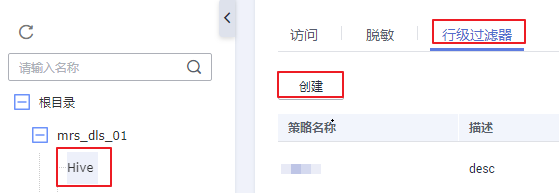

4.  在弹出的策略配置页配置相关参数，配置完成单击“确定“，策略配置完成。

    **图 12**  配置Hive权限策略参数  
    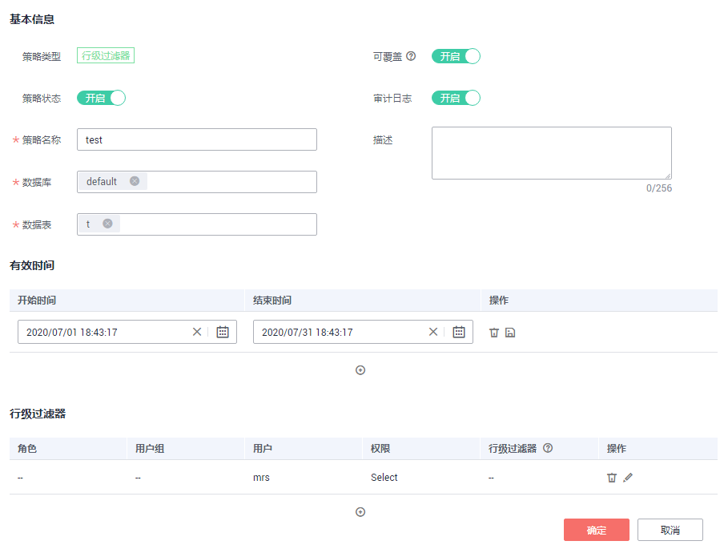

    **表 4**  Hive权限策略参数说明表

    
    <table><thead align="left"><tr id="row951935719273"><th class="cellrowborder" valign="top" width="20.49%" id="mcps1.2.3.1.1">
参数名

    </th>
    <th class="cellrowborder" valign="top" width="79.51%" id="mcps1.2.3.1.2">
参数描述

    </th>
    </tr>
    </thead>
    <tbody><tr id="row16519145712279"><td class="cellrowborder" valign="top" width="20.49%" headers="mcps1.2.3.1.1 ">
策略类型

    </td>
    <td class="cellrowborder" valign="top" width="79.51%" headers="mcps1.2.3.1.2 ">
根据用户所选服务组件自动生成。包括访问、脱敏、行过滤器，其中脱敏和行过滤器类型是Hive特有的。

    </td>
    </tr>
    <tr id="row1951916578273"><td class="cellrowborder" valign="top" width="20.49%" headers="mcps1.2.3.1.1 ">
策略状态

    </td>
    <td class="cellrowborder" valign="top" width="79.51%" headers="mcps1.2.3.1.2 ">
开启表示权限策略生效，关闭表示权限策略创建成功后不生效。默认开启。

    </td>
    </tr>
    <tr id="row14519155722714"><td class="cellrowborder" valign="top" width="20.49%" headers="mcps1.2.3.1.1 ">
可覆盖

    </td>
    <td class="cellrowborder" valign="top" width="79.51%" headers="mcps1.2.3.1.2 ">
开启可覆盖时，新创建的策略将覆盖当前策略（新策略生效而旧策略不生效）。默认开启。

    
当用户需要创建一个临时访问策略时，“可覆盖”可以配合“有效时间”一起使用，那么即使临时访问策略超过有效期失效后，也不影响原有的权限策略继续生效。

    </td>
    </tr>
    <tr id="row205208576272"><td class="cellrowborder" valign="top" width="20.49%" headers="mcps1.2.3.1.1 ">
审计日志

    </td>
    <td class="cellrowborder" valign="top" width="79.51%" headers="mcps1.2.3.1.2 ">
开启表示记录日志，日志内容包括客户端访问时间、客户端IP、客户端用户、操作资源结果等信息。

    </td>
    </tr>
    <tr id="row1752016572279"><td class="cellrowborder" valign="top" width="20.49%" headers="mcps1.2.3.1.1 ">
策略名称

    </td>
    <td class="cellrowborder" valign="top" width="79.51%" headers="mcps1.2.3.1.2 ">
名称为必填项，只能包含英文字母、数字、下划线和中划线，且长度为1~50个字符，且输入不能为空。

    </td>
    </tr>
    <tr id="row115201157162710"><td class="cellrowborder" valign="top" width="20.49%" headers="mcps1.2.3.1.1 ">
描述

    </td>
    <td class="cellrowborder" valign="top" width="79.51%" headers="mcps1.2.3.1.2 ">
对策略的描述信息，长度限制在256个字符以内。

    </td>
    </tr>
    <tr id="row15202572277"><td class="cellrowborder" valign="top" width="20.49%" headers="mcps1.2.3.1.1 ">
数据库

    </td>
    <td class="cellrowborder" valign="top" width="79.51%" headers="mcps1.2.3.1.2 ">
必填项，此项表示需要进行权限控制的数据库，支持模糊搜索。

    </td>
    </tr>
    <tr id="row195201657192715"><td class="cellrowborder" valign="top" width="20.49%" headers="mcps1.2.3.1.1 ">
数据表

    </td>
    <td class="cellrowborder" valign="top" width="79.51%" headers="mcps1.2.3.1.2 ">
必填项，此项表示需要进行权限控制的数据表，支持模糊搜索。

    </td>
    </tr>
    <tr id="row452095742712"><td class="cellrowborder" valign="top" width="20.49%" headers="mcps1.2.3.1.1 ">
列

    </td>
    <td class="cellrowborder" valign="top" width="79.51%" headers="mcps1.2.3.1.2 ">
必填项，此项表示需要进行权限控制的列，支持模糊搜索。

    </td>
    </tr>
    <tr id="row155201857172720"><td class="cellrowborder" valign="top" width="20.49%" headers="mcps1.2.3.1.1 ">
有效时间

    </td>
    <td class="cellrowborder" valign="top" width="79.51%" headers="mcps1.2.3.1.2 ">
用户通过设置开始时间和结束时间来控制策略的生效时间段，可配置多条。

    </td>
    </tr>
    <tr id="row16520145722712"><td class="cellrowborder" valign="top" width="20.49%" headers="mcps1.2.3.1.1 ">
行级过滤器

    </td>
    <td class="cellrowborder" valign="top" width="79.51%" headers="mcps1.2.3.1.2 ">
定义允许访问的用户和用户组。

    <ul id="ul1752015722719"><li>用户：MRS服务的用户。</li><li>角色：MRS服务的角色。</li><li>用户组：MRS服务的用户组。</li><li>权限：定义允许访问的用户拥有的权限。权限和用户允许同时为空值，或者同时不为空值。服务相关权限详情请参考<a href="权限管理简介.md#table23037523175">表1</a>。</li><li>行级过滤器：根据字段内容进行过滤，格式一般为：属性=属性值。例如：state=1。</li></ul>
    </td>
    </tr>
    </tbody>
    </table>

## 创建HBase权限策略

1.  在DGC控制台首页，选择对应工作空间的“数据安全“模块，进入数据安全页面。

    **图 13**  选择数据安全  
    

2.  单击左侧导航树中的“资源权限配置“，进入资源权限配置页面。
3.  单击待创建权限策略HBase组件的“配置“  ，进入配置界面单击“创建“，新建权限策略。

    **图 14**  创建HBase权限策略  
    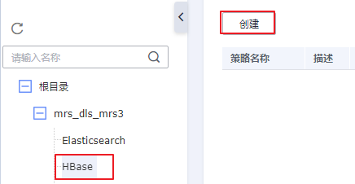

4.  在弹出的策略配置页配置相关参数，配置完成单击“确定“，策略配置完成。

    **图 15**  配置HBase权限策略  
    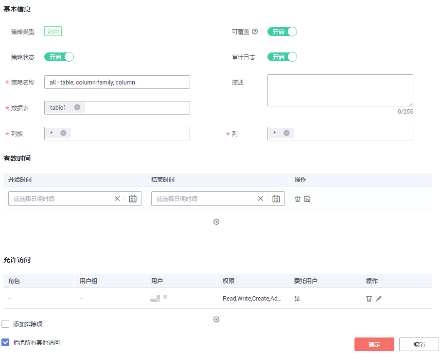

    **表 5**  HBase权限策略参数表

    
    <table><thead align="left"><tr id="row446705574512"><th class="cellrowborder" valign="top" width="20.49%" id="mcps1.2.3.1.1">
参数名

    </th>
    <th class="cellrowborder" valign="top" width="79.51%" id="mcps1.2.3.1.2">
参数描述

    </th>
    </tr>
    </thead>
    <tbody><tr id="row546716552453"><td class="cellrowborder" valign="top" width="20.49%" headers="mcps1.2.3.1.1 ">
策略类型

    </td>
    <td class="cellrowborder" valign="top" width="79.51%" headers="mcps1.2.3.1.2 ">
根据用户所选服务组件自动生成。包括访问、脱敏、行过滤器，其中脱敏和行过滤器类型是Hive特有的。

    </td>
    </tr>
    <tr id="row1146715553457"><td class="cellrowborder" valign="top" width="20.49%" headers="mcps1.2.3.1.1 ">
策略状态

    </td>
    <td class="cellrowborder" valign="top" width="79.51%" headers="mcps1.2.3.1.2 ">
开启表示权限策略生效，关闭表示权限策略创建成功后不生效。默认开启。

    </td>
    </tr>
    <tr id="row9467255124510"><td class="cellrowborder" valign="top" width="20.49%" headers="mcps1.2.3.1.1 ">
可覆盖

    </td>
    <td class="cellrowborder" valign="top" width="79.51%" headers="mcps1.2.3.1.2 ">
开启可覆盖时，新创建的策略将覆盖当前策略（新策略生效而旧策略不生效）。默认开启。

    
当用户需要创建一个临时访问策略时，“可覆盖”可以配合“有效时间”一起使用，那么即使临时访问策略超过有效期失效后，也不影响原有的权限策略继续生效。

    </td>
    </tr>
    <tr id="row17467145510459"><td class="cellrowborder" valign="top" width="20.49%" headers="mcps1.2.3.1.1 ">
审计日志

    </td>
    <td class="cellrowborder" valign="top" width="79.51%" headers="mcps1.2.3.1.2 ">
开启表示记录日志，日志内容包括客户端访问时间、客户端IP、客户端用户、操作资源结果等信息。

    </td>
    </tr>
    <tr id="row7468855104518"><td class="cellrowborder" valign="top" width="20.49%" headers="mcps1.2.3.1.1 ">
策略名称

    </td>
    <td class="cellrowborder" valign="top" width="79.51%" headers="mcps1.2.3.1.2 ">
名称为必填项，只能包含英文字母、数字、下划线和中划线，且长度为1~50个字符，且输入不能为空。

    </td>
    </tr>
    <tr id="row346875524520"><td class="cellrowborder" valign="top" width="20.49%" headers="mcps1.2.3.1.1 ">
描述

    </td>
    <td class="cellrowborder" valign="top" width="79.51%" headers="mcps1.2.3.1.2 ">
对策略的描述信息，长度限制在256个字符以内。

    </td>
    </tr>
    <tr id="row1468145514511"><td class="cellrowborder" valign="top" width="20.49%" headers="mcps1.2.3.1.1 ">
数据表

    </td>
    <td class="cellrowborder" valign="top" width="79.51%" headers="mcps1.2.3.1.2 ">
必填项，此项表示需要进行权限控制的数据表，支持模糊搜索。

    </td>
    </tr>
    <tr id="row18468145517451"><td class="cellrowborder" valign="top" width="20.49%" headers="mcps1.2.3.1.1 ">
列

    </td>
    <td class="cellrowborder" valign="top" width="79.51%" headers="mcps1.2.3.1.2 ">
必填项，此项表示需要进行权限控制的列，支持模糊搜索。

    </td>
    </tr>
    <tr id="row20468125517450"><td class="cellrowborder" valign="top" width="20.49%" headers="mcps1.2.3.1.1 ">
列族

    </td>
    <td class="cellrowborder" valign="top" width="79.51%" headers="mcps1.2.3.1.2 ">
必填项，此项表示HBase中Column Family，多列的集合。

    </td>
    </tr>
    <tr id="row13468175594513"><td class="cellrowborder" valign="top" width="20.49%" headers="mcps1.2.3.1.1 ">
有效时间

    </td>
    <td class="cellrowborder" valign="top" width="79.51%" headers="mcps1.2.3.1.2 ">
用户通过设置开始时间和结束时间来控制策略的生效时间段，可配置多条。

    </td>
    </tr>
    <tr id="row1146810555455"><td class="cellrowborder" valign="top" width="20.49%" headers="mcps1.2.3.1.1 ">
允许访问

    </td>
    <td class="cellrowborder" valign="top" width="79.51%" headers="mcps1.2.3.1.2 ">
定义允许访问的用户和用户组。

    <ul id="ul146914556456"><li>用户：MRS服务的用户。</li><li>角色：MRS服务的角色。</li><li>用户组：MRS服务的用户组。</li><li>权限：定义允许访问的用户拥有的权限。权限和用户允许同时为空值，或者同时不为空值。服务相关权限详情请参考<a href="权限管理简介.md#table23037523175">表1</a>。</li><li>委托用户：当勾选此项时，管理权限将分配给适用的用户和组。受委托的管理员可以更新和删除策略，还可以基于原始策略创建子策略。</li></ul>
    </td>
    </tr>
    <tr id="row14691955164517"><td class="cellrowborder" valign="top" width="20.49%" headers="mcps1.2.3.1.1 ">
添加排除项

    </td>
    <td class="cellrowborder" valign="top" width="79.51%" headers="mcps1.2.3.1.2 ">
允许访问勾选“添加排除项”意思是在允许访问的用户组里添加禁止访问的用户。

    
禁止访问勾选“添加排除项”意思是在禁止访问的用户组里添加允许访问的用户。

    </td>
    </tr>
    <tr id="row164691255144511"><td class="cellrowborder" valign="top" width="20.49%" headers="mcps1.2.3.1.1 ">
拒绝所有其他访问

    </td>
    <td class="cellrowborder" valign="top" width="79.51%" headers="mcps1.2.3.1.2 ">
勾选此项表示只有策略中“允许访问”指定的用户或用户组可以访问，其他用户均禁止访问。

    </td>
    </tr>
    <tr id="row6469125544511"><td class="cellrowborder" valign="top" width="20.49%" headers="mcps1.2.3.1.1 ">
禁止访问

    </td>
    <td class="cellrowborder" valign="top" width="79.51%" headers="mcps1.2.3.1.2 ">
不勾选“拒绝所有其他访问”时显示此配置，该配置定义禁止访问的用户和用户组。

    <ul id="ul1377911474455"><li>用户：MRS服务的用户。</li><li>角色：MRS服务的角色。</li><li>用户组：MRS服务的用户组。</li><li>权限：定义用户禁止的权限类型。权限和用户允许同时为空值，或者同时不为空值。服务相关权限详情请参考<a href="权限管理简介.md#table23037523175">表1</a>。</li><li>委托用户：当勾选此项时，管理权限将分配给适用的用户和组。受委托的管理员可以更新和删除策略，还可以基于原始策略创建子策略。</li></ul>
    </td>
    </tr>
    </tbody>
    </table>

## 创建Yarn权限策略

1.  在DGC控制台首页，选择对应工作空间的“数据安全“模块，进入数据安全页面。

    **图 16**  选择数据安全  
    

2.  单击左侧导航树中的“资源权限配置“，进入资源权限配置页面。
3.  单击待创建权限策略Yarn组件的“配置“  ，进入配置界面单击“创建“，新建权限策略。

    **图 17**  新建Yarn权限策略  
    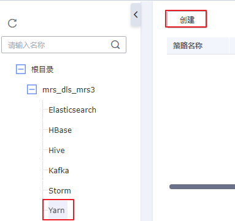

4.  在弹出的策略配置页配置相关参数，配置完成单击“确定“，完成策略配置。

    **图 18**  配置Yarn权限策略  
    

    **表 6**  Yarn权限策略参数表

    
    <table><thead align="left"><tr id="row36001143182010"><th class="cellrowborder" valign="top" width="20.49%" id="mcps1.2.3.1.1">
参数名

    </th>
    <th class="cellrowborder" valign="top" width="79.51%" id="mcps1.2.3.1.2">
参数描述

    </th>
    </tr>
    </thead>
    <tbody><tr id="row1660064342012"><td class="cellrowborder" valign="top" width="20.49%" headers="mcps1.2.3.1.1 ">
策略类型

    </td>
    <td class="cellrowborder" valign="top" width="79.51%" headers="mcps1.2.3.1.2 ">
根据用户所选服务组件自动生成。包括访问、脱敏、行过滤器，其中脱敏和行过滤器类型是Hive特有的。

    </td>
    </tr>
    <tr id="row5600443142011"><td class="cellrowborder" valign="top" width="20.49%" headers="mcps1.2.3.1.1 ">
策略状态

    </td>
    <td class="cellrowborder" valign="top" width="79.51%" headers="mcps1.2.3.1.2 ">
开启表示权限策略生效，关闭表示权限策略创建成功后不生效。默认开启。

    </td>
    </tr>
    <tr id="row1760010436205"><td class="cellrowborder" valign="top" width="20.49%" headers="mcps1.2.3.1.1 ">
可覆盖

    </td>
    <td class="cellrowborder" valign="top" width="79.51%" headers="mcps1.2.3.1.2 ">
开启可覆盖时，新创建的策略将覆盖当前策略（新策略生效而旧策略不生效）。默认开启。

    
当用户需要创建一个临时访问策略时，“可覆盖”可以配合“有效时间”一起使用，那么即使临时访问策略超过有效期失效后，也不影响原有的权限策略继续生效。

    </td>
    </tr>
    <tr id="row560012433200"><td class="cellrowborder" valign="top" width="20.49%" headers="mcps1.2.3.1.1 ">
审计日志

    </td>
    <td class="cellrowborder" valign="top" width="79.51%" headers="mcps1.2.3.1.2 ">
开启表示记录日志，日志内容包括客户端访问时间、客户端IP、客户端用户、操作资源结果等信息。

    </td>
    </tr>
    <tr id="row260111436203"><td class="cellrowborder" valign="top" width="20.49%" headers="mcps1.2.3.1.1 ">
策略名称

    </td>
    <td class="cellrowborder" valign="top" width="79.51%" headers="mcps1.2.3.1.2 ">
名称为必填项，只能包含英文字母、数字、下划线和中划线，且长度为1~50个字符，且输入不能为空。

    </td>
    </tr>
    <tr id="row13601343152018"><td class="cellrowborder" valign="top" width="20.49%" headers="mcps1.2.3.1.1 ">
描述

    </td>
    <td class="cellrowborder" valign="top" width="79.51%" headers="mcps1.2.3.1.2 ">
对策略的描述信息，长度限制在256个字符以内。

    </td>
    </tr>
    <tr id="row260344318204"><td class="cellrowborder" valign="top" width="20.49%" headers="mcps1.2.3.1.1 ">
队列

    </td>
    <td class="cellrowborder" valign="top" width="79.51%" headers="mcps1.2.3.1.2 ">
Yarn服务中的资源调度队列。

    </td>
    </tr>
    <tr id="row14603043132015"><td class="cellrowborder" valign="top" width="20.49%" headers="mcps1.2.3.1.1 ">
有效时间

    </td>
    <td class="cellrowborder" valign="top" width="79.51%" headers="mcps1.2.3.1.2 ">
用户通过设置开始时间和结束时间来控制策略的生效时间段，可配置多条。

    </td>
    </tr>
    <tr id="row13603743102014"><td class="cellrowborder" valign="top" width="20.49%" headers="mcps1.2.3.1.1 ">
允许访问

    </td>
    <td class="cellrowborder" valign="top" width="79.51%" headers="mcps1.2.3.1.2 ">
定义允许访问的用户和用户组。

    <ul id="ul2060394310209"><li>用户：MRS服务的用户。</li><li>角色：MRS服务的角色。</li><li>用户组：MRS服务的用户组。</li><li>权限：定义允许访问的用户拥有的权限。权限和用户允许同时为空值，或者同时不为空值。服务相关权限详情请参考<a href="权限管理简介.md#table23037523175">表1</a>。</li><li>委托用户：当勾选此项时，管理权限将分配给适用的用户和组。受委托的管理员可以更新和删除策略，还可以基于原始策略创建子策略。</li></ul>
    </td>
    </tr>
    <tr id="row66041143152018"><td class="cellrowborder" valign="top" width="20.49%" headers="mcps1.2.3.1.1 ">
添加排除项

    </td>
    <td class="cellrowborder" valign="top" width="79.51%" headers="mcps1.2.3.1.2 ">
允许访问勾选“添加排除项”意思是在允许访问的用户组里添加禁止访问的用户。

    
禁止访问勾选“添加排除项”意思是在禁止访问的用户组里添加允许访问的用户。

    </td>
    </tr>
    <tr id="row1660404318204"><td class="cellrowborder" valign="top" width="20.49%" headers="mcps1.2.3.1.1 ">
拒绝所有其他访问

    </td>
    <td class="cellrowborder" valign="top" width="79.51%" headers="mcps1.2.3.1.2 ">
勾选此项表示只有策略中“允许访问”指定的用户或用户组可以访问，其他用户均禁止访问。

    </td>
    </tr>
    <tr id="row1360434319209"><td class="cellrowborder" valign="top" width="20.49%" headers="mcps1.2.3.1.1 ">
禁止访问

    </td>
    <td class="cellrowborder" valign="top" width="79.51%" headers="mcps1.2.3.1.2 ">
不勾选“拒绝所有其他访问”时显示此配置，该配置定义禁止访问的用户和用户组。

    <ul id="ul3247185718457"><li>用户：MRS服务的用户。</li><li>角色：MRS服务的角色。</li><li>用户组：MRS服务的用户组。</li><li>权限：定义用户禁止的权限类型。权限和用户允许同时为空值，或者同时不为空值。服务相关权限详情请参考<a href="权限管理简介.md#table23037523175">表1</a>。</li><li>委托用户：当勾选此项时，管理权限将分配给适用的用户和组。受委托的管理员可以更新和删除策略，还可以基于原始策略创建子策略。</li></ul>
    </td>
    </tr>
    </tbody>
    </table>

## 创建Kafka权限策略

1.  在DGC控制台首页，选择对应工作空间的“数据安全“模块，进入数据安全页面。

    **图 19**  选择数据安全  
    

2.  单击左侧导航树中的“资源权限配置“，进入资源权限配置页面。
3.  单击待创建权限策略Kafka组件的“配置“  ，进入配置界面单击“创建“，新建权限策略。

    **图 20**  新建kafka权限策略  
    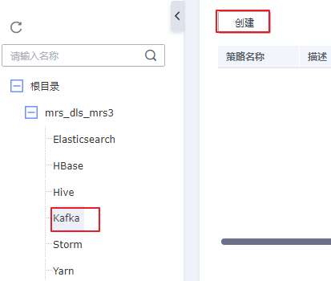

4.  在弹出的策略配置页配置相关参数，配置完成单击“确定“，策略配置完成。

    **图 21**  配置Kafka权限策略  
    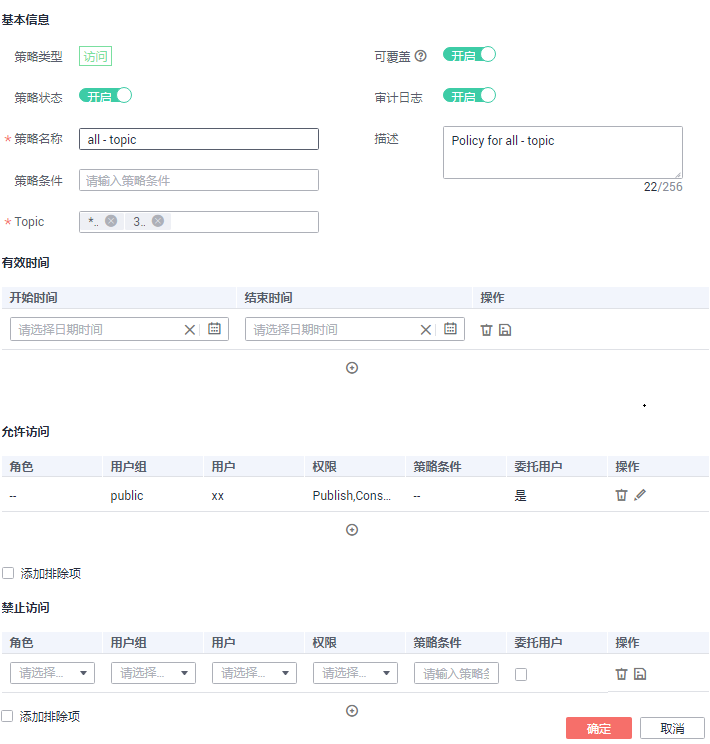

    **表 7**  Kafka权限策略参数表

    
    <table><thead align="left"><tr id="row147315162210"><th class="cellrowborder" valign="top" width="20.49%" id="mcps1.2.3.1.1">
参数名

    </th>
    <th class="cellrowborder" valign="top" width="79.51%" id="mcps1.2.3.1.2">
参数描述

    </th>
    </tr>
    </thead>
    <tbody><tr id="row747385202212"><td class="cellrowborder" valign="top" width="20.49%" headers="mcps1.2.3.1.1 ">
策略类型

    </td>
    <td class="cellrowborder" valign="top" width="79.51%" headers="mcps1.2.3.1.2 ">
根据用户所选服务组件自动生成。包括访问、脱敏、行过滤器，其中脱敏和行过滤器类型是Hive特有的。

    </td>
    </tr>
    <tr id="row7473751225"><td class="cellrowborder" valign="top" width="20.49%" headers="mcps1.2.3.1.1 ">
策略状态

    </td>
    <td class="cellrowborder" valign="top" width="79.51%" headers="mcps1.2.3.1.2 ">
开启表示权限策略生效，关闭表示权限策略创建成功后不生效。默认开启。

    </td>
    </tr>
    <tr id="row154741054226"><td class="cellrowborder" valign="top" width="20.49%" headers="mcps1.2.3.1.1 ">
可覆盖

    </td>
    <td class="cellrowborder" valign="top" width="79.51%" headers="mcps1.2.3.1.2 ">
开启可覆盖时，新创建的策略将覆盖当前策略（新策略生效而旧策略不生效）。默认开启。

    
当用户需要创建一个临时访问策略时，“可覆盖”可以配合“有效时间”一起使用，那么即使临时访问策略超过有效期失效后，也不影响原有的权限策略继续生效。

    </td>
    </tr>
    <tr id="row184741750222"><td class="cellrowborder" valign="top" width="20.49%" headers="mcps1.2.3.1.1 ">
审计日志

    </td>
    <td class="cellrowborder" valign="top" width="79.51%" headers="mcps1.2.3.1.2 ">
开启表示记录日志，日志内容包括客户端访问时间、客户端IP、客户端用户、操作资源结果等信息。

    </td>
    </tr>
    <tr id="row10474156229"><td class="cellrowborder" valign="top" width="20.49%" headers="mcps1.2.3.1.1 ">
策略名称

    </td>
    <td class="cellrowborder" valign="top" width="79.51%" headers="mcps1.2.3.1.2 ">
名称为必填项，只能包含英文字母、数字、下划线和中划线，且长度为1~50个字符，且输入不能为空。

    </td>
    </tr>
    <tr id="row204748513226"><td class="cellrowborder" valign="top" width="20.49%" headers="mcps1.2.3.1.1 ">
描述

    </td>
    <td class="cellrowborder" valign="top" width="79.51%" headers="mcps1.2.3.1.2 ">
对策略的描述信息，长度限制在256个字符以内。

    </td>
    </tr>
    <tr id="row1247555112212"><td class="cellrowborder" valign="top" width="20.49%" headers="mcps1.2.3.1.1 ">
策略条件

    </td>
    <td class="cellrowborder" valign="top" width="79.51%" headers="mcps1.2.3.1.2 ">
指定可访问Kafka主题的IP地址范围。

    </td>
    </tr>
    <tr id="row1947515516221"><td class="cellrowborder" valign="top" width="20.49%" headers="mcps1.2.3.1.1 ">
Topic

    </td>
    <td class="cellrowborder" valign="top" width="79.51%" headers="mcps1.2.3.1.2 ">
Kafka集群的消息主题。

    </td>
    </tr>
    <tr id="row94751155221"><td class="cellrowborder" valign="top" width="20.49%" headers="mcps1.2.3.1.1 ">
有效时间

    </td>
    <td class="cellrowborder" valign="top" width="79.51%" headers="mcps1.2.3.1.2 ">
用户通过设置开始时间和结束时间来控制策略的生效时间段，可配置多条。

    </td>
    </tr>
    <tr id="row147617552211"><td class="cellrowborder" valign="top" width="20.49%" headers="mcps1.2.3.1.1 ">
允许访问

    </td>
    <td class="cellrowborder" valign="top" width="79.51%" headers="mcps1.2.3.1.2 ">
定义允许访问的用户和用户组。

    <ul id="ul194763582218"><li>用户：MRS服务的用户。</li><li>角色：MRS服务的角色。</li><li>用户组：MRS服务的用户组。</li><li>权限：定义允许访问的用户拥有的权限。权限和用户允许同时为空值，或者同时不为空值。服务相关权限详情请参考<a href="权限管理简介.md#table23037523175">表1</a>。</li><li>策略条件：指定可访问Kafka主题的IP地址范围。</li><li>委托用户：当勾选此项时，管理权限将分配给适用的用户和组。受委托的管理员可以更新和删除策略，还可以基于原始策略创建子策略。</li></ul>
    </td>
    </tr>
    <tr id="row447665192214"><td class="cellrowborder" valign="top" width="20.49%" headers="mcps1.2.3.1.1 ">
添加排除项

    </td>
    <td class="cellrowborder" valign="top" width="79.51%" headers="mcps1.2.3.1.2 ">
允许访问勾选“添加排除项”意思是在允许访问的用户组里添加禁止访问的用户。

    
禁止访问勾选“添加排除项”意思是在禁止访问的用户组里添加允许访问的用户。

    </td>
    </tr>
    <tr id="row104773572211"><td class="cellrowborder" valign="top" width="20.49%" headers="mcps1.2.3.1.1 ">
禁止访问

    </td>
    <td class="cellrowborder" valign="top" width="79.51%" headers="mcps1.2.3.1.2 ">
不勾选“拒绝所有其他访问”时显示此配置，该配置定义禁止访问的用户和用户组。

    <ul id="ul13736143114616"><li>用户：MRS服务的用户。</li><li>角色：MRS服务的角色。</li><li>用户组：MRS服务的用户组。</li><li>权限：定义用户禁止的权限类型。权限和用户允许同时为空值，或者同时不为空值。服务相关权限详情请参考<a href="权限管理简介.md#table23037523175">表1</a>。</li><li>策略条件：指定可访问Kafka主题的IP地址范围。</li><li>委托用户：当勾选此项时，管理权限将分配给适用的用户和组。受委托的管理员可以更新和删除策略，还可以基于原始策略创建子策略。</li></ul>
    </td>
    </tr>
    </tbody>
    </table>

## 创建Storm权限策略

1.  在DGC控制台首页，选择对应工作空间的“数据安全“模块，进入数据安全页面。

    **图 22**  选择数据安全  
    

2.  单击左侧导航树中的“资源权限配置“，进入资源权限配置页面。
3.  单击待创建权限策略Storm组件的“配置“  ，进入配置界面单击“创建“，新建权限策略。

    **图 23**  新建Storm权限策略  
    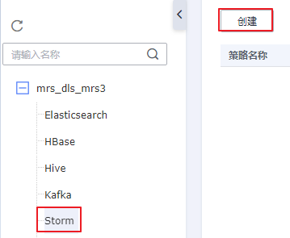

4.  在弹出的策略配置页配置相关参数，配置完成单击“确定“，策略配置完成。

    **图 24**  配置Storm权限策略  
    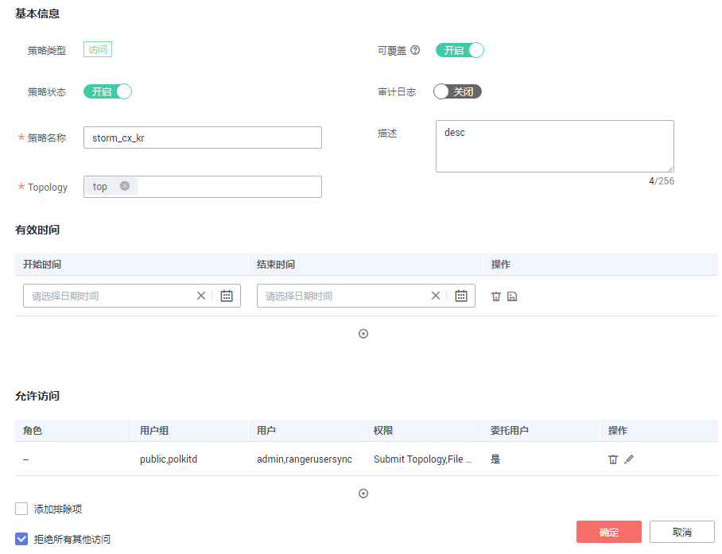

    **表 8**  Storm权限策略参数表

    
    <table><thead align="left"><tr id="row4173436172314"><th class="cellrowborder" valign="top" width="20.49%" id="mcps1.2.3.1.1">
参数名

    </th>
    <th class="cellrowborder" valign="top" width="79.51%" id="mcps1.2.3.1.2">
参数描述

    </th>
    </tr>
    </thead>
    <tbody><tr id="row2173203682312"><td class="cellrowborder" valign="top" width="20.49%" headers="mcps1.2.3.1.1 ">
策略类型

    </td>
    <td class="cellrowborder" valign="top" width="79.51%" headers="mcps1.2.3.1.2 ">
根据用户所选服务组件自动生成。包括访问、脱敏、行过滤器，其中脱敏和行过滤器类型是Hive特有的。

    </td>
    </tr>
    <tr id="row1017373619231"><td class="cellrowborder" valign="top" width="20.49%" headers="mcps1.2.3.1.1 ">
策略状态

    </td>
    <td class="cellrowborder" valign="top" width="79.51%" headers="mcps1.2.3.1.2 ">
开启表示权限策略生效，关闭表示权限策略创建成功后不生效。默认开启。

    </td>
    </tr>
    <tr id="row161737368231"><td class="cellrowborder" valign="top" width="20.49%" headers="mcps1.2.3.1.1 ">
可覆盖

    </td>
    <td class="cellrowborder" valign="top" width="79.51%" headers="mcps1.2.3.1.2 ">
开启可覆盖时，新创建的策略将覆盖当前策略（新策略生效而旧策略不生效）。默认开启。

    
当用户需要创建一个临时访问策略时，“可覆盖”可以配合“有效时间”一起使用，那么即使临时访问策略超过有效期失效后，也不影响原有的权限策略继续生效。

    </td>
    </tr>
    <tr id="row31747362231"><td class="cellrowborder" valign="top" width="20.49%" headers="mcps1.2.3.1.1 ">
审计日志

    </td>
    <td class="cellrowborder" valign="top" width="79.51%" headers="mcps1.2.3.1.2 ">
开启表示记录日志，日志内容包括客户端访问时间、客户端IP、客户端用户、操作资源结果等信息。

    </td>
    </tr>
    <tr id="row217463618232"><td class="cellrowborder" valign="top" width="20.49%" headers="mcps1.2.3.1.1 ">
策略名称

    </td>
    <td class="cellrowborder" valign="top" width="79.51%" headers="mcps1.2.3.1.2 ">
名称为必填项，只能包含英文字母、数字、下划线和中划线，且长度为1~50个字符，且输入不能为空。

    </td>
    </tr>
    <tr id="row14174436132315"><td class="cellrowborder" valign="top" width="20.49%" headers="mcps1.2.3.1.1 ">
描述

    </td>
    <td class="cellrowborder" valign="top" width="79.51%" headers="mcps1.2.3.1.2 ">
对策略的描述信息，长度限制在256个字符以内。

    </td>
    </tr>
    <tr id="row2175143632315"><td class="cellrowborder" valign="top" width="20.49%" headers="mcps1.2.3.1.1 ">
Topology

    </td>
    <td class="cellrowborder" valign="top" width="79.51%" headers="mcps1.2.3.1.2 ">
该参数表示Storm集群中的任务。

    </td>
    </tr>
    <tr id="row151751136172316"><td class="cellrowborder" valign="top" width="20.49%" headers="mcps1.2.3.1.1 ">
有效时间

    </td>
    <td class="cellrowborder" valign="top" width="79.51%" headers="mcps1.2.3.1.2 ">
用户通过设置开始时间和结束时间来控制策略的生效时间段，可配置多条。

    </td>
    </tr>
    <tr id="row14176143611234"><td class="cellrowborder" valign="top" width="20.49%" headers="mcps1.2.3.1.1 ">
允许访问

    </td>
    <td class="cellrowborder" valign="top" width="79.51%" headers="mcps1.2.3.1.2 ">
定义允许访问的用户和用户组。

    <ul id="ul1817616364239"><li>用户：MRS服务的用户。</li><li>角色：MRS服务的角色。</li><li>用户组：MRS服务的用户组。</li><li>权限：定义允许访问的用户拥有的权限。权限和用户允许同时为空值，或者同时不为空值。服务相关权限详情请参考<a href="权限管理简介.md#table23037523175">表1</a>。</li><li>委托用户：当勾选此项时，管理权限将分配给适用的用户和组。受委托的管理员可以更新和删除策略，还可以基于原始策略创建子策略。</li></ul>
    </td>
    </tr>
    <tr id="row3176436142314"><td class="cellrowborder" valign="top" width="20.49%" headers="mcps1.2.3.1.1 ">
添加排除项

    </td>
    <td class="cellrowborder" valign="top" width="79.51%" headers="mcps1.2.3.1.2 ">
允许访问勾选“添加排除项”意思是在允许访问的用户组里添加禁止访问的用户。

    
禁止访问勾选“添加排除项”意思是在禁止访问的用户组里添加允许访问的用户。

    </td>
    </tr>
    <tr id="row201761536192318"><td class="cellrowborder" valign="top" width="20.49%" headers="mcps1.2.3.1.1 ">
拒绝所有其他访问

    </td>
    <td class="cellrowborder" valign="top" width="79.51%" headers="mcps1.2.3.1.2 ">
勾选此项表示只有策略中“允许访问”指定的用户或用户组可以访问，其他用户均禁止访问。

    </td>
    </tr>
    <tr id="row4177103620239"><td class="cellrowborder" valign="top" width="20.49%" headers="mcps1.2.3.1.1 ">
禁止访问

    </td>
    <td class="cellrowborder" valign="top" width="79.51%" headers="mcps1.2.3.1.2 ">
不勾选“拒绝所有其他访问”时显示此配置，该配置定义禁止访问的用户和用户组。

    <ul id="ul208819279449"><li>用户：MRS服务的用户。</li><li>角色：MRS服务的角色。</li><li>用户组：MRS服务的用户组。</li><li>权限：定义用户禁止的权限类型。权限和用户允许同时为空值，或者同时不为空值。服务相关权限详情请参考<a href="权限管理简介.md#table23037523175">表1</a>。</li><li>委托用户：当勾选此项时，管理权限将分配给适用的用户和组。受委托的管理员可以更新和删除策略，还可以基于原始策略创建子策略。</li></ul>
    </td>
    </tr>
    </tbody>
    </table>

